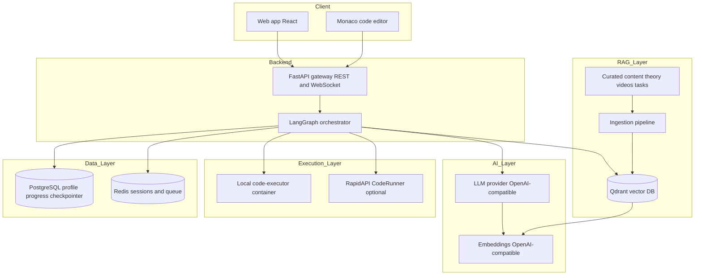
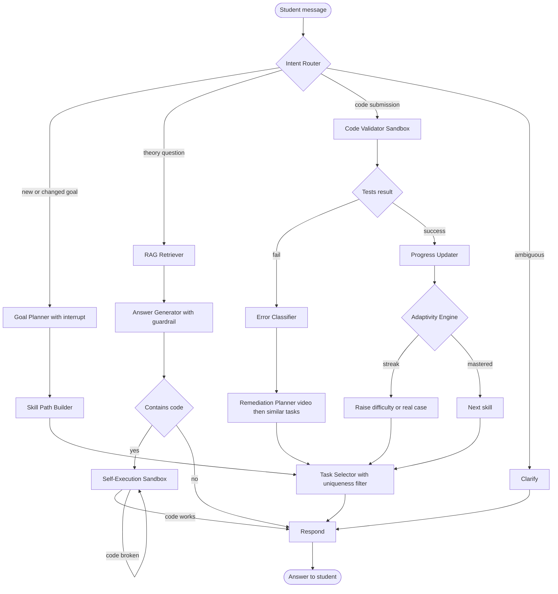
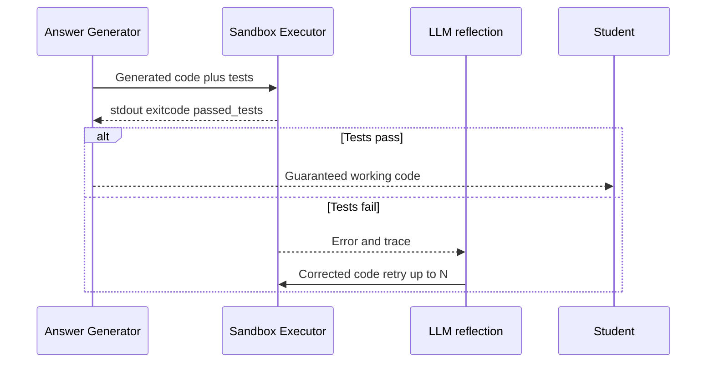
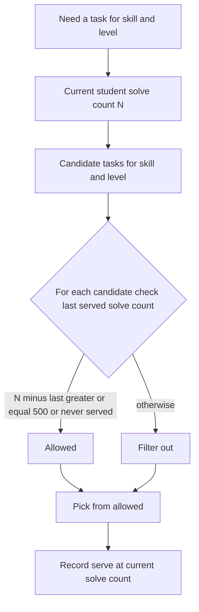
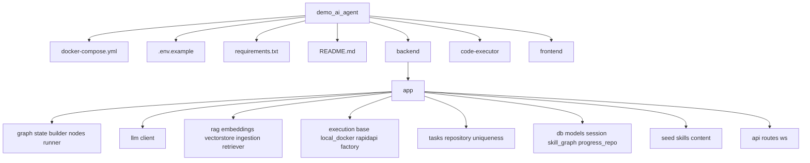

# 🎓 Adaptive AI Coding Tutor

> Русская версия: [README_RU.md](README_RU.md)

> A personal programming mentor built on **LangGraph** + **RAG** + **sandbox code execution**. The student states a learning goal in natural language, picks a language (MVP: **Python** and **JavaScript**), and the agent builds a personalised skill trajectory that **adapts in real time**: on a mistake it routes to a targeted video review and similar practice tasks; on success it raises difficulty and serves real-world cases. **Every** piece of code the tutor shows — and every student submission — is verified by **actually running it in an isolated sandbox**, eliminating hallucinated, non-working code.

---

## 1. What the agent does

### Short version
An AI tutor that teaches programming, **adapting to each student's errors and successes**, and **guarantees that all code works** by executing it in a sandbox before showing it.

### Detailed version
1. **Takes a goal in natural language** — e.g. *I want to learn Python to automate routine work*. If the goal is incomplete, the agent asks clarifying questions (human-in-the-loop) instead of guessing.
2. **Builds a personal trajectory** of atomic skills from a Skill Graph (variables → conditions → loops → functions → collections → … → mini project). Skills carry a shared **concept** key, so when a student switches language, already-mastered concepts are reused and only the syntax delta is taught.
3. **Adapts in real time** — the core learning loop:
   - The student solves a task; their code runs against visible **and** hidden tests in the sandbox.
   - On **failure**, an Error Classifier diagnoses the error type (off-by-one, type error, logic, timeout, …); the agent retrieves a **targeted video review** for that error and serves **similar practice tasks**. Two successes in a row are required to move on.
   - On **success**, difficulty rises; a sustained streak escalates to **real-world cases** (refactoring, bug-fixing, features).
4. **Guarantees working code** — any code the agent generates is run in the sandbox first; if it fails, the error is fed back to the LLM for a regeneration attempt (reflection loop) before the student ever sees it.

---

## 2. Project description, structure and diagrams

### 2.1 High-level architecture



### 2.2 LangGraph control flow



### 2.3 Code execution flow (anti-hallucination guarantee)



### 2.4 Task-uniqueness cooldown



### 2.5 Directory tree



```
demo_ai_agent/
├── docker-compose.yml          # Brings up the whole stack
├── .env.example                # Environment template
├── requirements.txt            # Python dependencies
├── README.md
├── backend/
│   ├── Dockerfile
│   └── app/
│       ├── main.py             # FastAPI entry (REST + WebSocket) + startup seeding
│       ├── config.py           # Settings from .env
│       ├── api/                # routes.py, ws.py
│       ├── graph/              # state.py, builder.py, runner.py, nodes/
│       ├── llm/                # client.py (OpenAI-compatible)
│       ├── rag/                # embeddings, vectorstore (Qdrant), ingestion, retriever
│       ├── execution/          # base, local_docker, rapidapi, factory (Strategy)
│       ├── tasks/              # repository.py, uniqueness.py (cooldown 500)
│       ├── db/                 # models, session, skill_graph, progress_repo
│       └── seed/               # skills.py, content/curated.py
├── code-executor/              # Isolated sandbox HTTP service (Python + Node)
│   ├── Dockerfile
│   └── runner.py
└── frontend/                   # React + Monaco editor
    ├── Dockerfile, nginx.conf, vite.config.js, package.json
    └── src/ (App.jsx, api.js, main.jsx, styles.css)
```

---

## 3. Who is this agent for (hypotheses and assumptions)

- **Beginners** who need a personal pace and active gap-filling. *Hypothesis: dropout on static courses is high because there is no adaptation to individual mistakes.*
- **Developers switching to a new language.** *Hypothesis: reusing already-mastered concepts (loops, functions) across languages materially speeds up learning, so we only teach the syntax delta.*
- **Bootcamps and schools as a white-label B2B product.** *Hypothesis: B2B buyers will pay to reduce mentor load while keeping quality, because objective sandbox grading scales where human review does not.*
- **Self-learners burned by hallucinating chatbots.** *Hypothesis: a hard guarantee that all shown code runs is a decisive trust differentiator versus generic LLM tutors.*

---

## 4. How to run

Prerequisites: **Docker** and **Docker Compose**.

1. Copy the environment template and fill in your LLM provider:
   ```bash
   copy .env.example .env
   ```
   Set at least:
   ```
   OPENAI_API_KEY=sk-...
   OPENAI_BASE_URL=https://api.openai.com/v1   # or your provider / local vLLM/Ollama
   LLM_MODEL=gpt-4o-mini
   EMBEDDING_MODEL=text-embedding-3-small
   EMBEDDING_DIM=1536
   ```
   Optionally enable online code execution via RapidAPI by also setting `RAPIDAPI_KEY` and `RAPIDAPI_CODERUNNER_HOST` (otherwise the local `code-executor` container is used automatically).

2. Build the images and bring up the stack. The verified build path works around the **EAI_AGAIN** DNS issue in the Docker build sandbox (where `npm`/`PyPI` cannot resolve registries) by using a DNS-enabled BuildKit builder (config in [`buildkitd.toml`](buildkitd.toml:1)):

   ```bash
   copy .env.example .env

   # One-time: create a DNS-enabled BuildKit builder to work around the
   # EAI_AGAIN DNS issue in the Docker build sandbox (npm/PyPI cannot resolve)
   docker buildx create --name dnsbuilder --driver docker-container --config buildkitd.toml

   # Build images via the DNS-enabled builder
   docker buildx --builder dnsbuilder build --load -t demo_ai_agent-frontend:latest ./frontend
   docker buildx --builder dnsbuilder build --load -f backend/Dockerfile -t demo_ai_agent-backend:latest .
   docker buildx --builder dnsbuilder build --load -t demo_ai_agent-code-executor:latest ./code-executor

   # Start the whole stack
   docker compose up -d
   ```

   This starts: `postgres`, `qdrant`, `redis`, `code-executor`, `backend`, `frontend`, with healthchecks and ordered `depends_on`. On first start the backend creates tables, seeds the Skill Graph (Python + JavaScript) and ingests the curated RAG content.

3. Access the services:
   - **Frontend:** http://localhost:3000
   - **API docs:** http://localhost:8000/docs
   - **Health:** http://localhost:8000/health

4. Try the end-to-end flow: type *I want to learn Python loops*, receive a task, write a solution in the Monaco editor, click **Run & Check**. A wrong answer triggers a video review + similar tasks; two correct answers advance you to the next skill.

> **Note:** On hosts where the Docker build sandbox resolves DNS normally (npm/PyPI), the standard `docker compose up --build` is sufficient (the DNS builder is not needed). `docker-compose.yml` pins the `image:` names that the buildx step produces, so once the images are built they are reused by `docker compose up` without rebuilding.

> **Note:** The adaptive loop and the sandbox code guarantee work end-to-end even without a real LLM key (graceful degradation — a placeholder key triggers the local embeddings fallback, and the graph does not crash).

> The system degrades gracefully: if the embeddings endpoint is unreachable it uses a deterministic local fallback, and if the Postgres checkpointer cannot initialise it falls back to an in-memory checkpointer, so the demo still runs.

---

## 5. Edge cases and how they are handled

1. **Incomplete goal data** — student writes *I want to learn*. The **Goal Planner** uses LangGraph `interrupt` (human-in-the-loop) to ask which language and goal, instead of guessing. The UI surfaces the question and the answer resumes the graph.
2. **External API errors** — LLM/embeddings/RapidAPI calls are wrapped in **retry with exponential backoff** (`tenacity`). If **RapidAPI** fails at runtime, the executor factory transparently **falls back to the local executor**. If the **LLM** is down, the agent returns a friendly message and the session state is preserved for later resumption.
3. **Ambiguous request** — the **Intent Router** returns a confidence score; below threshold it routes to the **Clarify** node and asks the student to specify, rather than picking a path at random.
4. **Student code timeout (infinite loop)** — the sandbox enforces a **hard wall-clock timeout** and a memory cap; the result is reported as `timed_out` and the tutor responds *execution timed out — check your loop exit condition* and routes to remediation.
5. **Conflicting instructions** — student asks *just give me the answer* during an active task. A **guardrail** in the Answer Generator refuses the full solution and returns **hints** instead, explaining the pedagogical reason.

---

## 6. Why a plain deterministic workflow is not enough

- **The trajectory is not fixed.** The next step depends on the **type of error**, the student's history and goal — this is a **cyclic graph with branching**, not a linear pipeline.
- **Feedback loops are essential.** Code regeneration until tests pass (Self-Execution) and remediation until mastery are natural **loops** in LangGraph but awkward and brittle in a static workflow.
- **Routing depends on semantics.** Intent classification and error classification require **LLM semantic analysis** whose outcome changes the route — non-deterministic branching that a fixed DAG cannot express.
- **Human-in-the-loop interrupts.** Pausing to ask the student for goal clarification (and resuming exactly where it stopped) needs a **checkpointed, interruptible** state machine, which a single-pass deterministic pipeline cannot provide.

---

## 7. Effectiveness criteria and acceptable thresholds

| Criterion | What it measures | Acceptable threshold |
|-----------|------------------|----------------------|
| **Correctness of served code** | Share of agent-shown code that passed sandbox tests before being shown | **100% by design** (broken code is never shown); regeneration succeeds in **≥ 95%** of cases within **≤ 3** attempts |
| **Error-diagnosis accuracy** | Share of student errors classified correctly | **≥ 85%** on a labelled sample |
| **Task uniqueness** | Share of serves that violate the 500-solve cooldown | **0%** violations |
| **Response latency** | Median agent response time without video | **≤ 5 s** median, **≤ 10 s** p95 |

The uniqueness criterion is directly auditable via `GET /api/uniqueness/audit?user_id=...&task_id=...`.

---

## 8. Data sources and integrations

- **LLM API** — OpenAI-compatible, provider configured in `.env` (`OPENAI_BASE_URL`, `OPENAI_API_KEY`, `LLM_MODEL`). Used for intent classification, goal extraction, answer generation, error classification and code regeneration.
- **Embeddings API** — OpenAI-compatible (`EMBEDDING_MODEL`) for vectorising content and queries, with a deterministic offline fallback.
- **Qdrant** — vector DB storing curated theory, video reviews and task prompts with metadata filters (language, concept, doc_type, error_type).
- **PostgreSQL** — user profile, skill progress, attempts, **`task_serve_history`** (uniqueness cooldown) and the **LangGraph checkpointer**.
- **Redis** — sessions, sandbox queue and rate limiting (infrastructure service in the stack).
- **code-executor container** — isolated local sandbox (Python + Node) with timeout/memory limits and an ephemeral filesystem.
- **RapidAPI CodeRunner** (optional) — online code execution when configured; the factory falls back to local on failure.
- **Curated documents** — theory notes, coding tasks (prompt + visible/hidden tests + sandbox-verified reference solution), and video reviews (with URLs and time-codes), seeded in [`backend/app/seed/content/curated.py`](backend/app/seed/content/curated.py:1).

---

## Key requirement mapping

| # | Requirement | Where |
|---|-------------|-------|
| 1 | One-command `docker compose up` with healthchecks + depends_on | [`docker-compose.yml`](docker-compose.yml:1) |
| 2 | `requirements.txt` with all Python deps | [`requirements.txt`](requirements.txt:1) |
| 3 | README with all sections | this file |
| 4 | LLM via OpenAI-compatible protocol, provider in `.env` | [`backend/app/llm/client.py`](backend/app/llm/client.py:1), [`.env.example`](.env.example:1) |
| 5 | Task uniqueness, cooldown 500 + `task_serve_history` | [`backend/app/tasks/uniqueness.py`](backend/app/tasks/uniqueness.py:1), [`backend/app/db/models.py`](backend/app/db/models.py:1) |
| 6 | Optional RapidAPI CodeRunner via Strategy pattern | [`backend/app/execution/`](backend/app/execution/base.py:1) (base/local_docker/rapidapi/factory) |
