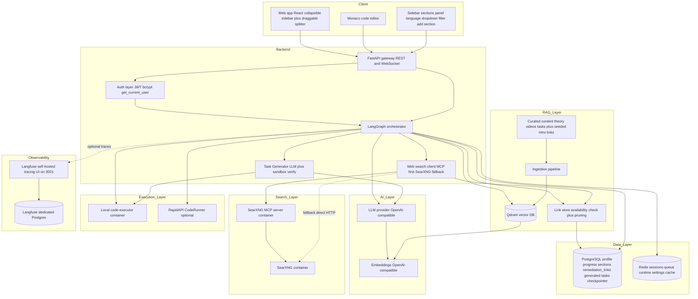
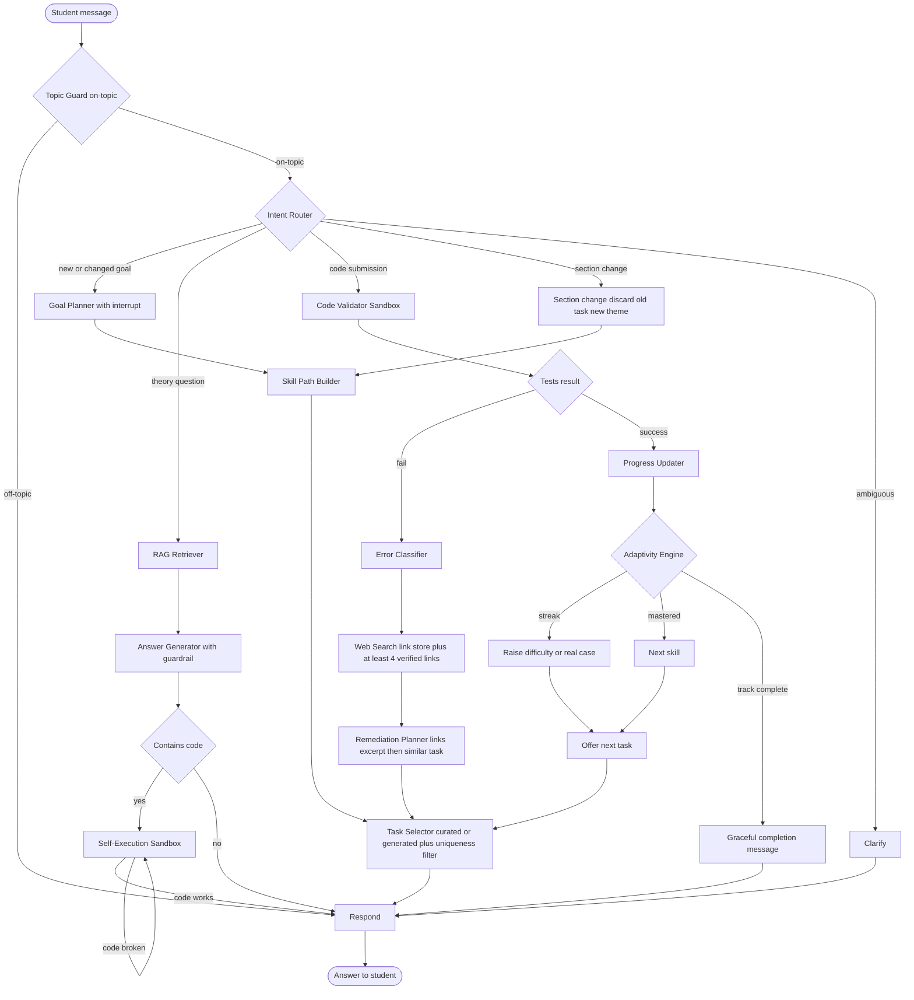
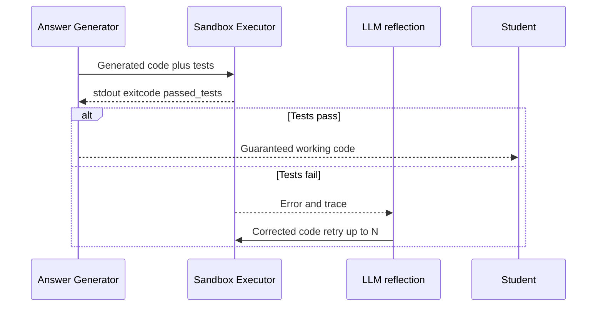
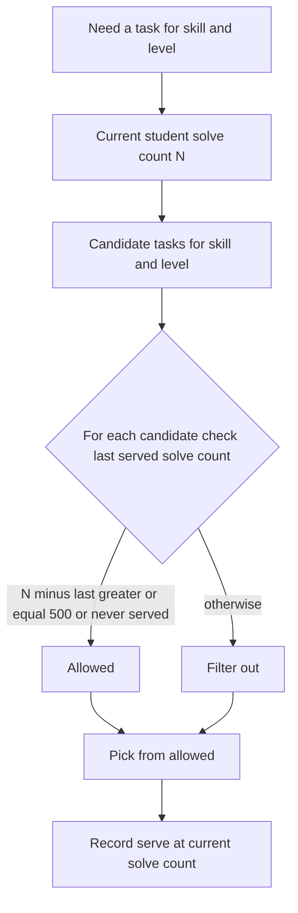
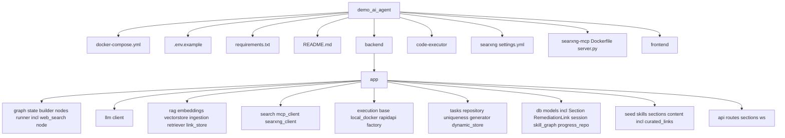

# 🎓 Adaptive AI Coding Tutor

> Русская версия: [README_RU.md](README_RU.md)

> A personal programming mentor built on **LangGraph** + **RAG** + **sandbox code execution**. The student states a learning goal in natural language, picks a language (MVP: **Python** and **JavaScript**), picks a **human-readable section/theme** from a collapsible sidebar (or adds their own), and the agent builds a personalised skill trajectory that **adapts in real time**: on a mistake it routes to a targeted video review, **≥4 availability-verified web-search remediation links + a concise explanation**, and similar practice tasks; on success it confirms (without re-stating the just-solved task) and explicitly **offers the next task**, raising difficulty and serving real-world cases. Tasks can be **served from curated content or generated on demand by the LLM and grounded with web search** — and **every** piece of code the tutor shows, every generated task's reference solution, and every student submission is verified by **actually running it in an isolated sandbox**, eliminating hallucinated, non-working code. Generated/found links are **persisted in a link store** that verifies availability at serve-time, replaces dead links and prunes chronically-broken ones.

---

## 1. What the agent does

### Short version
An AI tutor that teaches programming, **adapting to each student's errors and successes**, and **guarantees that all code works** by executing it in a sandbox before showing it.

### Detailed version
1. **Takes a goal in natural language** — e.g. *I want to learn Python to automate routine work*. If the goal is incomplete, the agent asks clarifying questions (human-in-the-loop) instead of guessing.
2. **Builds a personal trajectory** of atomic skills from a Skill Graph (variables → conditions → loops → functions → collections → … → mini project). Skills carry a shared **concept** key, so when a student switches language, already-mastered concepts are reused and only the syntax delta is taught. **Every seeded skill in both languages (Python and JavaScript) has at least one sandbox-verified practice task**, and skill selection is **content-aware** — the agent picks the earliest unmastered skill that actually has tasks, so a new student always receives a real task instead of a dead-end. **Tasks differ not only in wording but in essence** — an `exercise_type` taxonomy (`implement_return`, `predict_output`, `trace_value`, `find_the_bug`, `fill_in_the_blank`, `refactor`, `conditions_branching`, `loops_accumulate`, `io_transform`) is introduced, and the selector **rotates the type**, biasing away from the type served last time so consecutive exercises aren't the same kind. For answer-types (`predict_output`/`trace_value`) the student **types the expected value/output** rather than writing a function — the answer is checked via `check_typed_answer` with a deterministic comparison.
3. **Adapts in real time** — the core learning loop:
   - The student solves a task; their code runs against visible **and** hidden tests in the sandbox.
   - On **failure**, the analysis is **grounded in the student's actually-submitted code/input and the real sandbox error** (not generic theory): per-test `ERROR:`/`FAIL:` diagnostics and the top-level traceback are extracted from the harness output, and there is a **"is this even code?" detector** — empty submission, `SyntaxError` (with the offending line/column and characters), or prose-instead-of-code. An Error Classifier diagnoses the error type (off-by-one, type error, logic, timeout, …) from the **real signal**; a `web_search` node builds a code-grounded explanation and fetches **links targeted at the concrete error symbol** (e.g. `TypeError`). **Every error explanation is guaranteed to carry ≥4 availability-verified links** (drawn from a persisted link store, topped up by live search, with an offline seeded floor). The resulting **single message** follows the order: **(a) simplified trace → (b) an `Explanation` block with embedded links + an example of a correct solution (from `reference_solution`) → (c) a similar task** (the failed task is not re-stated). Two successes in a row are required to move on.
   - For **theory/programming questions**, the agent returns the requested information **plus a follow-up practice exercise** so learning stays hands-on rather than ending at a plain answer.
   - On **success**, the agent confirms the pass **without re-stating the just-solved task** and explicitly **offers the next task** (`➡️ Next task`); difficulty rises, a sustained streak escalates to **real-world cases** (refactoring, bug-fixing, features), and a graceful completion message is shown when the trajectory is exhausted.
4. **Sources tasks from curated content or the live internet** — beyond curated tasks, the tutor can **generate a fresh task on demand with the LLM**, grounded by **web search**, with **auto-generated tests that are sandbox-verified** (reflection/regeneration loop reusing the `code-executor`) before the task is ever served. Generated tasks obey the same 500-solve uniqueness cooldown + `task_serve_history` and are addressable by `task_id` (ids like `gen_<uuid>`). The whole path is **fail-open**: if search/LLM are unavailable it falls back to curated content and never crashes a turn. Gated by `INTERNET_TASKS_ENABLED` (default `true`).
5. **Switches section/theme from the sidebar** — the left sidebar shows **human-readable sections** (themes) instead of raw `skill_id` strings: **20 seeded sections per language** (Python and JavaScript) plus user-creatable ones, with a language dropdown, a live filter, clickable cards and the current section pinned and highlighted at the top. Selecting a section sets the user's free-form `topic` (orthogonal to language/skill; it does **not** corrupt skill-graph progress) **and runs a fresh themed turn** that cancels the previously-served task and mints a brand-new themed task — so the same skill (e.g. loops) can be practised in the student's chosen domain (data analysis, web scraping, game dev, finance, …). Each section also has a **"?" pictogram** that pushes ≥4 verified intro articles + ≥1 video for the section's concept into the chat. Empty topic = exactly today's neutral behaviour.
6. **Guarantees working code** — any code the agent generates, and the reference solution of every generated task, is run in the sandbox first; if it fails, the error is fed back to the LLM for a regeneration attempt (reflection loop) before the student ever sees it.

---

## 2. Project description, structure and diagrams

### 2.1 High-level architecture



> **Web search + internet-sourced tasks (fail-open).** A `web_search` node and a Task Generator extend the AI layer. The backend search client ([`backend/app/search/`](backend/app/search/__init__.py:1)) tries the **SearXNG MCP server** first (`web_search` tool over Streamable HTTP at `http://searxng-mcp:8077/mcp`), falls back to **direct SearXNG JSON**, then to an empty result — **never raising**. The Task Generator ([`backend/app/tasks/generator.py`](backend/app/tasks/generator.py:1)) mints LLM tasks whose reference solution is **sandbox-verified** before serving. Every new dependency degrades gracefully: search failure → curated/no-link remediation; generation failure → curated task; MCP down → direct SearXNG HTTP; SearXNG down → skip links, keep an LLM-written explanation. Gated by `INTERNET_TASKS_ENABLED` and the `search_enabled` config property.

> **Link store (persistence + availability + pruning + ≥4-link guarantee).** A pragmatic relational **link store** ([`backend/app/rag/link_store.py`](backend/app/rag/link_store.py:1)) persists generated/found remediation and intro links into the `remediation_links` table so they are **reused across students**. At serve-time the links about to be shown are **availability-verified** (concurrent HTTP `HEAD`, ≤4s timeout, fail-open); dead links are dropped and **replaced via web search** (the real `web_search` is injected at startup via `set_replacement_search(...)` in [`backend/app/main.py`](backend/app/main.py:1)), and newly-found links are saved back. A link that **fails to open more than 50 times within a rolling 3-day window** (`FAIL_THRESHOLD=50`, `FAIL_WINDOW=3 days`, `record_failure`) is **pruned** from the store. **Every error explanation is guaranteed to carry ≥4 verified links** (`get_verified_links(..., min_links=4)`), with an offline **seeded floor** (≥4 articles + ≥1 video per concept/language in [`backend/app/seed/content/curated_links.py`](backend/app/seed/content/curated_links.py:1)) so the guarantee holds even with no egress.

> **Runtime graph settings.** The adaptive knobs (`COOLDOWN_SOLVES`, `MAX_REGEN_ATTEMPTS`, `MASTERY_SUCCESS_STREAK`, `ADVANCED_SUCCESS_STREAK`) **and the on-topic guardrail toggle `TOPIC_GUARD_ENABLED`** are editable at runtime via `GET/PUT /api/graph/settings` and the **Graph Settings** UI tab — applied **without a backend restart**. Postgres is the source of truth; Redis (`graph:settings`) is a write-through cache.

> **On-topic guardrail.** A `topic_guard` node runs first (right after entry, before the Intent Router) and keeps the conversation about programming and the current learning process. It uses a **hybrid classifier**: a fast deterministic heuristic (programming keywords + the student's active `language`/`current_skill`/`learning_goal`) and, only for ambiguous cases, an LLM classifier (`chat_json`). Behaviour is **fail-open**: if the LLM is unavailable it defaults to on-topic (logged) so a transient outage never blocks learning. Code submissions (intent=code) are always on-topic. Off-topic messages are politely declined (no RAG / no execution). The guard is gated by `TOPIC_GUARD_ENABLED` (default `true`); set it to `false` (env seed or the Graph Settings UI / PUT settings) to disable it at runtime.

> **Observability (enabled out of the box).** LangGraph runs (nodes + LLM calls) are traced into a **self-hosted Langfuse** (its own dedicated Postgres `langfuse-db`, UI on http://localhost:3001) via a Langfuse `CallbackHandler`. `docker-compose` auto-provisions a Langfuse org, project and a **default admin user**, and passes the **same project keys** to the backend, so tracing works without any manual setup. The Langfuse release/update check is disabled (`LANGFUSE_UI_RELEASE_CHECK_ENABLED=false`) so noisy, non-fatal `checkUpdate` errors do not appear in offline/egress-blocked environments. It remains best-effort: if Langfuse is down the backend runs normally. Backend aggregate metrics (users, attempts, success rate, average mastery, …) are exposed at `GET /api/metrics/summary` and shown in the **Graph Settings → Observability** tab.

### 2.2 LangGraph control flow



> **Content-aware skill selection.** The Skill Path Builder ([`backend/app/graph/nodes/skill_path.py`](backend/app/graph/nodes/skill_path.py:1)) picks the earliest unmastered skill that actually has tasks (with graceful fallback), so a new student is never routed to a skill with no content. The Task Selector ([`backend/app/graph/nodes/task_selector.py`](backend/app/graph/nodes/task_selector.py:1)) walks the skill-graph trajectory to the next skill that has tasks before giving up, and emits a clearer, actionable message instead of the old `No tasks available for this skill yet.` dead-end.

> **Code-grounded failure path + block order.** On a failed submission `code_validator` ([`backend/app/graph/nodes/code_validator.py`](backend/app/graph/nodes/code_validator.py:1)) extracts the **real** error signal (`extract_student_error`: `ERROR:`/`FAIL:` from stdout + the stderr traceback) and runs a **non-code detector** (`detect_input_issue`: empty / `SyntaxError` with line-column / prose-instead-of-code; skipped for answer-types where a value is typed). The `web_search` node ([`backend/app/graph/nodes/web_search.py`](backend/app/graph/nodes/web_search.py:1)) runs **between** `error_classifier` and the Remediation Planner (`error_classifier → web_search → remediation`); the query is enriched with the **concrete error symbol** (e.g. `TypeError`), and the `Explanation` is built **from the student's real code + the real error** (LLM, with a deterministic code-grounded fallback). Links are sourced through the **link store** via `get_verified_links(..., min_links=4)` so **every explanation carries ≥4 availability-verified links** (persisted reuse + live top-up + seeded floor). The Remediation Planner ([`backend/app/graph/nodes/remediation.py`](backend/app/graph/nodes/remediation.py:1)) assembles **one message in strict order: (a) simplified trace → (b) an `Explanation` block with embedded links + an example of a correct solution (from `reference_solution`)**; the Task Selector ([`backend/app/graph/nodes/task_selector.py`](backend/app/graph/nodes/task_selector.py:1)) then **appends (c) the `🔁 similar task`** via `remediation_prefix`, **never clobbering the analysis**. Fully **fail-open**: empty search → links fall back to the seeded floor, the code-grounded explanation is kept; if no similar task is available the analysis is still never lost.

> **Section-change path (new themed task, old task cancelled).** Selecting a sidebar section calls `run_turn` with `section_change=True`/`section_title` ([`backend/app/graph/runner.py`](backend/app/graph/runner.py:1)); the new state channels `section_change`, `section_title` and `cancelled_task_id` live in [`backend/app/graph/state.py`](backend/app/graph/state.py:1). The Intent Router ([`backend/app/graph/nodes/router.py`](backend/app/graph/nodes/router.py:1)) routes the turn to `intent="section"` → Skill Path Builder → Task Selector. The Task Selector ([`backend/app/graph/nodes/task_selector.py`](backend/app/graph/nodes/task_selector.py:1)) **discards the previously-served task** (recorded as `cancelled_task_id`, never re-served) and mints a **fresh themed task**, prepending a `🎨 Theme set to "…"` line — fixing the prior bug where switching theme printed a message but produced no new task.

> **Generated-task path + next-task offer.** When a `topic` is set, the cooldown filter leaves nothing fresh, or `INTERNET_TASKS_ENABLED` is on, the Task Selector invokes the Task Generator ([`backend/app/tasks/generator.py`](backend/app/tasks/generator.py:1)) to mint a sandbox-verified task (`task_source="generated"`, id `gen_<uuid>`), excluding the just-solved id. On success the Adaptivity Engine ([`backend/app/graph/nodes/adaptivity.py`](backend/app/graph/nodes/adaptivity.py:1)) sets `offer_next_task=True` and the selector prefixes an explicit **➡️ Next task**; when the trajectory is exhausted it returns a graceful completion message instead.

> **Theory answers include practice.** The Answer Generator ([`backend/app/graph/nodes/answer_generator.py`](backend/app/graph/nodes/answer_generator.py:1)) appends a skill-aware follow-up practice exercise after a theory answer, so a theory/programming question returns information **plus** a concrete exercise to try next.

> **Task variety by type (`exercise_type`).** `Task` ([`backend/app/tasks/repository.py`](backend/app/tasks/repository.py:1)) and `GeneratedTask` ([`backend/app/db/models.py`](backend/app/db/models.py:1)) carry an `exercise_type` field (in-place migration at startup in [`backend/app/main.py`](backend/app/main.py:1)). Curated content ([`backend/app/seed/content/curated.py`](backend/app/seed/content/curated.py:1)) is diversified — early skills (`py_variables`, `py_io`, `py_loops`, `js_variables`, …) carry ≥3 different types. Types: `implement_return`, `predict_output`, `trace_value`, `find_the_bug`, `fill_in_the_blank`, `refactor`, `conditions_branching`, `loops_accumulate`, `io_transform`. **Answer-types** (`predict_output`/`trace_value`) require no function — the student types the expected value/output, checked via `check_typed_answer()` ([`backend/app/execution/base.py`](backend/app/execution/base.py:1)) with tolerant comparison; code-producing types use the regular harness. The Task Selector **rotates the type** via `last_exercise_type` in state (biasing away from the previous type; a preference, not a hard constraint — it never dead-ends), and the generator is parametrised by the target type. Prompt rendering is type-conditional (answer-types ask for a value, `fill_in_the_blank` shows a `___` template, `find_the_bug`/`refactor` show the given code). The frontend ([`frontend/src/App.jsx`](frontend/src/App.jsx:1)) learns the type via `last_exercise_type` in state and, for answer-types, switches the label/button to "submit answer" — the same text input is sent as the submission and the backend interprets it correctly.

### 2.3 Code execution flow (anti-hallucination guarantee)



> **Self-describing submissions.** A code submission carries its own `task_id`: `CodeRequest` ([`backend/app/api/routes.py`](backend/app/api/routes.py:1)) accepts an optional `task_id` (plus optional `skill`/`language`), `run_turn` ([`backend/app/graph/runner.py`](backend/app/graph/runner.py:1)) threads it into state as `current_task_id`, and the frontend `submitCode` ([`frontend/src/api.js`](frontend/src/api.js:1)) / [`frontend/src/App.jsx`](frontend/src/App.jsx:1) send the current `task_id` with every **Run & Check**. The submission therefore validates against the correct task even when checkpoint state is missing. Generated task ids (`gen_<uuid>`) resolve through the dynamic store ([`backend/app/tasks/dynamic_store.py`](backend/app/tasks/dynamic_store.py:1)), so a **Run & Check** against an internet-sourced task validates exactly like a curated one.

> **Generated tasks are sandbox-verified too.** The Task Generator ([`backend/app/tasks/generator.py`](backend/app/tasks/generator.py:1)) reuses this exact reflection loop: a generated task is only served once its auto-generated **reference solution passes all visible + hidden tests** in the `code-executor`; if it does not, the failure is fed back to the LLM (bounded by `MAX_REGEN_ATTEMPTS`) to regenerate, and if verification still fails the system falls back to curated content. The anti-hallucination guarantee therefore extends to internet-sourced tasks.

### 2.4 Task-uniqueness cooldown



> **Full task coverage.** Curated content now includes a `practice` task for **every** seeded skill in **both** languages — `py_variables, py_io, py_conditions, py_loops, py_functions, py_collections, py_dicts, py_strings, py_errors, py_oop, py_comprehensions, py_recursion, py_modules, py_api, py_project` and the JavaScript equivalents (`js_*`) — all defined in [`backend/app/seed/content/curated.py`](backend/app/seed/content/curated.py:1) with every reference solution sandbox-verified (34/34 tasks pass their own visible + hidden tests). Combined with content-aware skill selection, the uniqueness filter always has a real candidate to draw from.

> **Generated tasks share the same cooldown.** Internet-sourced (`gen_<uuid>`) tasks flow through the **same** `task_serve_history` + uniqueness filter + `record_serve` machinery unchanged (it operates on any `.id`). Because generated tasks are typically unique per request they naturally pass the 500-solve cooldown, and serves are still recorded for auditability — so the "0% cooldown violations" effectiveness criterion holds for curated and generated tasks alike.

### 2.5 Directory tree



```
demo_ai_agent/
├── docker-compose.yml          # Brings up the whole stack
├── .env.example                # Environment template
├── requirements.txt            # Python dependencies (incl. mcp==1.12.4)
├── README.md
├── searxng/                    # SearXNG meta-search config (JSON output enabled)
│   └── settings.yml
├── searxng-mcp/                # In-repo SearXNG MCP server (web_search tool, Streamable HTTP)
│   ├── Dockerfile
│   ├── requirements.txt
│   └── server.py
├── backend/
│   ├── Dockerfile
│   └── app/
│       ├── main.py             # FastAPI entry (REST + WebSocket) + startup seeding/migration
│       ├── config.py           # Settings from .env (incl. SEARXNG_*, INTERNET_TASKS_ENABLED)
│       ├── api/                # routes.py, sections.py (sections/links/intro), ws.py
│       ├── graph/              # state.py, builder.py, runner.py, nodes/ (incl. web_search.py)
│       ├── llm/                # client.py (OpenAI-compatible)
│       ├── rag/                # embeddings, vectorstore (Qdrant), ingestion, retriever, link_store.py (availability + pruning)
│       ├── search/             # __init__.py (fail-open orchestrator), mcp_client.py, searxng_client.py
│       ├── execution/          # base, local_docker, rapidapi, factory (Strategy)
│       ├── tasks/              # repository.py, uniqueness.py (cooldown 500), generator.py, dynamic_store.py
│       ├── db/                 # models (incl. GeneratedTask, Section, RemediationLink + users.topic/current_section_id), session, skill_graph, progress_repo
│       └── seed/               # skills.py, sections.py (20 sections/lang), content/curated.py, content/curated_links.py (intro/remediation floor)
├── code-executor/              # Isolated sandbox HTTP service (Python + Node)
│   ├── Dockerfile
│   └── runner.py
└── frontend/                   # React + Monaco editor
    ├── Dockerfile, nginx.conf, vite.config.js, package.json
    └── src/ (App.jsx, api.js, main.jsx, styles.css)
```

---

## 3. Who is this agent for (hypotheses and assumptions)

- **Beginners** who need a personal pace and active gap-filling. *Hypothesis: dropout on static courses is high because there is no adaptation to individual mistakes.*
- **Developers switching to a new language.** *Hypothesis: reusing already-mastered concepts (loops, functions) across languages materially speeds up learning, so we only teach the syntax delta.*
- **Bootcamps and schools as a white-label B2B product.** *Hypothesis: B2B buyers will pay to reduce mentor load while keeping quality, because objective sandbox grading scales where human review does not.*
- **Self-learners burned by hallucinating chatbots.** *Hypothesis: a hard guarantee that all shown code runs is a decisive trust differentiator versus generic LLM tutors.*

---

## 4. How to run

Prerequisites: **Docker** and **Docker Compose**.

1. Copy the environment template and fill in your LLM provider:
   ```bash
   copy .env.example .env
   ```
   Set at least:
   ```
   OPENAI_API_KEY=sk-...
   OPENAI_BASE_URL=https://api.openai.com/v1   # or your provider / local vLLM/Ollama
   LLM_MODEL=gpt-4o-mini
   EMBEDDING_MODEL=text-embedding-3-small
   EMBEDDING_DIM=2560 
   ```
   Optionally enable online code execution via RapidAPI by also setting `RAPIDAPI_KEY` and `RAPIDAPI_CODERUNNER_HOST` (otherwise the local `code-executor` container is used automatically).

   On-topic guardrail (seeds the initial default; also runtime-editable):
   ```
   TOPIC_GUARD_ENABLED=true      # politely decline off-topic chat; fail-open without LLM
   ```

   **Web search + internet-sourced tasks (optional, fail-open).** These power the failure-path remediation links/excerpt and live LLM task generation. The defaults work out of the box on the compose network; the tutor stays healthy even if these services are unreachable:
   ```
   SEARXNG_URL=http://searxng:8080            # internal SearXNG service URL
   SEARXNG_MCP_URL=http://searxng-mcp:8077    # internal SearXNG MCP server URL
   SEARXNG_MCP_PORT=8077                       # port the MCP server binds to
   SEARXNG_SECRET=changeme-searxng-secret      # SearXNG server.secret_key
   INTERNET_TASKS_ENABLED=true                 # master switch for LLM task generation (false = curated only)
   ```

   **Langfuse tracing is enabled out of the box.** Leave the keys empty to use
   the built-in compose defaults (`pk-lf-tutor-public-key` / `sk-lf-tutor-secret-key`),
   which are also used to provision the Langfuse project; set your own to override:
   ```
   LANGFUSE_PUBLIC_KEY=          # empty → compose default (pk-lf-tutor-public-key)
   LANGFUSE_SECRET_KEY=          # empty → compose default (sk-lf-tutor-secret-key)
   LANGFUSE_HOST=http://langfuse:3000   # internal compose network address
   # Default Langfuse admin (override to change). UI login: http://localhost:3001
   LANGFUSE_INIT_USER_EMAIL=admin@example.com
   LANGFUSE_INIT_USER_NAME=admin
   LANGFUSE_INIT_USER_PASSWORD=qwerty123456
   ```

   **Application authentication (JWT)** — the tutor app has its OWN login, separate from the Langfuse admin account. Defaults work out of the box; override in `.env`:
   ```
   JWT_SECRET=dev-insecure-change-me-in-production   # CHANGE in production
   JWT_EXPIRE_MINUTES=10080                           # access-token TTL (7 days)
   # Default application user, seeded at backend startup (login for the tutor app):
   APP_DEFAULT_USER_EMAIL=admin@example.com
   APP_DEFAULT_USER_PASSWORD=qwerty123456
   APP_DEFAULT_USER_NAME=admin
   APP_DEFAULT_USER_LANGUAGE=python
   ```

2. Build the images and bring up the stack. The verified build path works around the **EAI_AGAIN** DNS issue in the Docker build sandbox (where `npm`/`PyPI` cannot resolve registries) by using a DNS-enabled BuildKit builder (config in [`buildkitd.toml`](buildkitd.toml:1)):

   ```bash
   copy .env.example .env

   # One-time: create a DNS-enabled BuildKit builder to work around the
   # EAI_AGAIN DNS issue in the Docker build sandbox (npm/PyPI cannot resolve)
   docker buildx create --name dnsbuilder --driver docker-container --config buildkitd.toml

   # Build images via the DNS-enabled builder
   docker buildx --builder dnsbuilder build --load -t demo_ai_agent-frontend:latest ./frontend
   docker buildx --builder dnsbuilder build --load -f backend/Dockerfile -t demo_ai_agent-backend:latest .
   docker buildx --builder dnsbuilder build --load -t demo_ai_agent-code-executor:latest ./code-executor
   docker buildx --builder dnsbuilder build --load -t demo_ai_agent-searxng-mcp:latest ./searxng-mcp

   # Start the whole stack
   docker compose up -d
   ```

   This starts: `postgres`, `qdrant`, `redis`, `code-executor`, **`searxng`** and the in-repo **`searxng-mcp`** server, `backend`, `frontend`, plus **`langfuse`** and its dedicated **`langfuse-db`** Postgres, all with healthchecks and ordered `depends_on`. On first start the backend creates tables (including the new `sections` and `remediation_links` tables), runs idempotent `ALTER TABLE … ADD COLUMN IF NOT EXISTS` migrations for `users.topic` and `users.current_section_id` (for in-place upgrades), seeds the Skill Graph (Python + JavaScript), seeds **20 human-readable sections per language** + the intro/remediation **link floor** into the link store, seeds the runtime graph-settings row and ingests the curated RAG content. The Langfuse and Langfuse-Postgres images are pulled ready-made, and the **`searxng`** image (**`searxng/searxng:2026.5.31-7159b8aed`**) is pulled too — only `searxng-mcp` (alongside backend/frontend/code-executor) is built. The backend `depends_on` `searxng`/`searxng-mcp` with `condition: service_started` (non-blocking) so the stack still boots when search is down (fail-open); `searxng-mcp` depends on `searxng: service_healthy`.

   > **SearXNG image tag.** The image is pinned to a **dated tag** (`searxng/searxng:2026.5.31-7159b8aed`), not `:latest`, for reproducible offline builds. The originally-planned `2024.12.10-cc59cf0` tag was no longer published on Docker Hub (manifest unknown) and was repinned to the closest reachable recent stable dated release verified during the rebuild/verification step — this is the tag currently in [`docker-compose.yml`](docker-compose.yml:70).

3. Access the services:
   - **Frontend:** http://localhost:3000 — opens the **authentication screen first** (login / register). Sign in with the default app user `admin@example.com` / `qwerty123456`, then the learning UI appears.
   - **API docs:** http://localhost:8000/docs
   - **Health:** http://localhost:8000/health
   - **Search health:** http://localhost:8000/api/search/health → `{"mcp":bool,"searxng":bool}` (diagnostic; best-effort). On the verified rebuild this returns `{"mcp":true,"searxng":true}`.
   - **Langfuse (tracing UI):** http://localhost:3001
   - **SearXNG JSON API (debug, optional):** internal only by default; uncomment the `8080:8080` port mapping in [`docker-compose.yml`](docker-compose.yml:79) to query `http://localhost:8080/search?q=python+loops&format=json` directly.

### Authentication (application login)

The tutor application has its **own** JWT-based authentication, completely **separate from the Langfuse admin account** (which has its own login and is not touched here).

- **Open registration, no email verification.** Anyone can create an account via `POST /api/auth/register` (email, password, optional name + preferred language). Passwords are hashed with **bcrypt** (passlib); a signed **JWT** is returned.
- **Endpoints:**
  - `POST /api/auth/register` → creates the user, **initialises the learning profile immediately**, returns a JWT + user. `409` if the email is taken.
  - `POST /api/auth/login` → email + password → JWT + user. `401` on bad credentials.
  - `GET /api/auth/me` → returns the current user (requires `Authorization: Bearer <token>`). `401` without/with an invalid token.
- **Protected endpoints.** `/api/goal`, `/api/chat`, `/api/submit_code`, `/api/resume`, `/api/progress/*` and the `/ws` WebSocket all require a valid token. The `user_id` is always taken from the token (the request body `user_id` is ignored), so a client cannot act as another user. The WebSocket accepts the token via a `?token=` query param or an initial `{type:"auth",token}` message.
- **Default application user.** At startup the backend seeds a default user from `APP_DEFAULT_USER_*` (defaults `admin@example.com` / `qwerty123456`, name `admin`, language `python`) with an initialised profile. This is both a ready login and a safeguard guaranteeing a valid `users` row exists. Override via `.env`. The login form pre-fills the email placeholder and shows the demo credentials as a hint (the password is **not** hard-coded in JS).
- **Profile initialisation fixes the skill-progress FK.** Registration/login (and the start of every graph turn) call `ensure_user_profile(user_id, language)`, which get-or-creates the `users` row and seeds the first skill-progress rows. Combined with get-or-create semantics in the progress repository, this means a chat/code turn works **immediately after login**, even before `/api/goal` — the previous `skill_progress` foreign-key error can no longer occur.
- **Frontend flow.** The app shows a **Login / Register** screen before the main UI. On success the JWT is stored in `localStorage` and attached as `Authorization: Bearer <token>` to every API call. On startup an existing token is validated via `GET /api/auth/me`. A **Log out** button clears the token; any `401` automatically logs the user out and returns to the auth screen.

### Runtime graph settings (no restart)

The adaptive parameters can be changed live:

- **UI:** open the **Graph Settings** tab in the frontend, edit the values (including the **On-topic guard** checkbox) and Save. The same tab shows the **Observability** section: a link to the Langfuse tracing UI plus a live backend metrics summary.
- **API:**
  - `GET /api/graph/settings` → current values (including `TOPIC_GUARD_ENABLED`).
  - `PUT /api/graph/settings` with a JSON body of any subset of `COOLDOWN_SOLVES`, `MAX_REGEN_ATTEMPTS`, `MASTERY_SUCCESS_STREAK`, `ADVANCED_SUCCESS_STREAK` (positive integers, validated) and/or `TOPIC_GUARD_ENABLED` (boolean) → persists to Postgres, refreshes the Redis cache and returns the updated set. Changes take effect immediately on the next graph turn — e.g. flipping `TOPIC_GUARD_ENABLED` toggles the guard at runtime without a restart.

### On-topic guardrail (configurable at runtime)

The `topic_guard` node ([`backend/app/graph/nodes/topic_guard.py`](backend/app/graph/nodes/topic_guard.py:1)) keeps the chat about programming and the current learning process. It combines a fast keyword/context heuristic with an LLM classifier for ambiguous cases and is **fail-open**: if the LLM is unavailable it defaults to on-topic (logged) so learning is never blocked. Off-topic messages get a polite refusal (no RAG / no execution); code submissions are always on-topic. Disable it by setting `TOPIC_GUARD_ENABLED=false` (env seed) or via the Graph Settings UI / `PUT /api/graph/settings` at runtime.

### Sections / themes (sidebar)

The left sidebar shows **human-readable sections (themes)** instead of raw `skill_id` strings. The seed populates **20 human-readable sections per language** (Python and JavaScript) — the first 15 mirror the skill-graph concepts (variables, IO, conditions, loops, functions, …), plus 5 domain themes (data analysis, web scraping, async, …) — and students can **add their own**. Selecting a section is the new way to set the **topic/theme**: it is a **NEW axis, orthogonal to `language` and complementary to `skill`/`concept`**:

- `language` (python | javascript) — still the executable target. Unchanged.
- `current_skill` / `concept` — still the pedagogical axis the adaptive loop walks. Unchanged.
- **section → `topic`** — selecting a section sets the per-user `topic` (the section's `topic`/title), which changes the *flavour* of generated tasks + search queries. Switching section **does not reset progress** and does **not** corrupt the skill graph. An empty topic = exactly today's neutral behaviour.

Backend: `Section` and `RemediationLink` SQLAlchemy models live in [`backend/app/db/models.py`](backend/app/db/models.py:1); a `users.current_section_id` column is added via the idempotent startup `ALTER TABLE … ADD COLUMN IF NOT EXISTS` pattern in [`backend/app/main.py`](backend/app/main.py:1). Seeding is done by [`backend/app/seed/sections.py`](backend/app/seed/sections.py:1) (`seed_sections()`, `seed_links()`) with the link floor in [`backend/app/seed/content/curated_links.py`](backend/app/seed/content/curated_links.py:1). The per-user `topic` (`users.topic`) is still persisted and threaded through `run_turn`.

- **UI:** the sidebar **Sections panel** — a language `<select>` dropdown (switching it dynamically reloads that language's sections and drives the editor language), a **dynamic filter input**, **clickable section cards**, the **current section pinned at the top and color-highlighted**, a per-card **"?" pictogram** that pushes intro articles/videos into the chat, and an **"+ Add section/theme"** form with inline 400/409 validation. The old **"Theme" row was removed** from the code-editor toolbar (theme is now driven by the sidebar).
- **API** ([`backend/app/api/sections.py`](backend/app/api/sections.py:1), all auth-protected, `user_id` from JWT):
  - `GET /api/languages` → `{"languages":[{"id":"python","label":"Python"},{"id":"javascript","label":"JavaScript"}]}`.
  - `GET /api/sections?language=...` → the list (global seeded + the user's own) with `is_current` flags + `current_section_id`.
  - `POST /api/sections` → create a user section (title ≤120 chars; **400** invalid, **409** duplicate).
  - `POST /api/sections/select` → sets the user's topic from the section, persists `current_section_id`, and **runs a fresh graph turn that cancels the previously-served task and produces a NEW themed task** (mirrors the `/api/chat` response shape with `state.current_task_id`, `state.cancelled_task_id`, `state.topic`, `state.current_section_id`). This fixes the prior bug where switching theme printed a message but produced no new task.
  - `POST /api/sections/{id}/intro` (the "?" pictogram) → returns ≥4 verified intro links (articles) + ≥1 video for the section's concept and selected language.
- **WebSocket parity** ([`backend/app/api/ws.py`](backend/app/api/ws.py:1)): `{type:"select_section"}` and `{type:"section_intro"}` mirror the REST calls.

The previous free-form **topic API** remains available (now primarily driven by section selection): `GET /api/topic` → `{ "topic": str }`; `PUT /api/topic` → set/clear (auth; persists `users.topic`; **400** if longer than 120 chars); `GET /api/topics` → `{ "topics": [str] }` (suggested themes). WebSocket turns still accept an optional `topic` and the convenience `{type:"topic", topic}` message replies `{type:"topic_ok"}`.

### Internet-sourced tasks (LLM generation + sandbox verification)

Beyond curated content, the tutor can **generate a fresh task on demand** with the LLM ([`backend/app/tasks/generator.py`](backend/app/tasks/generator.py:1)):

1. **(Optional) web grounding:** when a `topic` is set, a web search gathers 2–3 snippets so the task feels current/real-world (fail-open — skipped if empty).
2. **LLM generation:** `chat_json` returns a strict task payload (prompt, `entry_point`, `reference_solution`, visible + hidden tests, difficulty, concept) — a pure function, no I/O, themed by `topic`.
3. **Sandbox verification:** the generated **reference solution is run against all tests** in the `code-executor`; on failure the error is fed back to the LLM (reflection loop bounded by `MAX_REGEN_ATTEMPTS`) until it passes — the same anti-hallucination guarantee curated tasks get.
4. **Persist + serve:** the verified task is stored in the dynamic store ([`backend/app/tasks/dynamic_store.py`](backend/app/tasks/dynamic_store.py:1)) (in-process cache **plus** the `GeneratedTask` Postgres table for durability across restarts/workers), tagged `task_source="generated"` with id `gen_<uuid>`, and made resolvable by `get_task(task_id)` for the next **Run & Check**.

Generation is always **scoped to the current skill/concept** chosen by the adaptive loop, so the trajectory is preserved; `topic` only changes the flavour. The whole path is **fail-open** — if generation/verification fails after retries it returns `None` and the tutor falls back to curated `tasks_for_skill(...)`. Gated by the **`INTERNET_TASKS_ENABLED`** master switch (default `true`; set `false` for curated-only behaviour) and the `search_enabled` config property.

### Web search (SearXNG + MCP server)

Web search powers both the failure-path remediation links/excerpt and the (optional) grounding of generated tasks. Two dedicated containers provide it, both fully **optional / fail-open**:

- **`searxng`** — a self-hosted [SearXNG](https://github.com/searxng/searxng) meta-search instance, image **`searxng/searxng:2026.5.31-7159b8aed`**. Configured by [`searxng/settings.yml`](searxng/settings.yml:1) with the **JSON output format enabled** (required for programmatic parsing) and a small curated set of no-API-key engines (duckduckgo, bing, brave, wikipedia). Internal-only on the compose network (no published host port by default); uses the `searxngdata` volume.
- **`searxng-mcp`** — a tiny **in-repo** Python MCP server ([`searxng-mcp/server.py`](searxng-mcp/server.py:1), image `demo_ai_agent-searxng-mcp:latest`) exposing a single **`web_search`** tool over **Streamable HTTP** at `http://searxng-mcp:8077/mcp` (health at `/health`). It reads `SEARXNG_URL` and normalises results into `{title, url, snippet}`. It depends on `searxng: service_healthy`.

The backend search client ([`backend/app/search/`](backend/app/search/__init__.py:1)) tries **MCP first** ([`mcp_client.py`](backend/app/search/mcp_client.py:1)), falls back to **direct SearXNG JSON** ([`searxng_client.py`](backend/app/search/searxng_client.py:1)), then to an empty result — and **never raises** to callers. `GET /api/search/health` reports `{mcp, searxng}` reachability for diagnostics. A new `mcp==1.12.4` dependency (in [`requirements.txt`](requirements.txt:1)) powers the backend MCP client and the MCP server image.

> **Live web results require outbound egress** to upstream engines (bing / duckduckgo / brave / wikipedia). In egress-blocked environments SearXNG may return empty results — the system stays **healthy** and degrades gracefully (the link store's seeded floor still supplies ≥4 links, an LLM-only explanation, curated tasks). This mirrors the existing Langfuse-offline note.

### RAG link store (persistence, availability, pruning, ≥4-link guarantee)

A pragmatic relational **link store** ([`backend/app/rag/link_store.py`](backend/app/rag/link_store.py:1)) persists generated/found remediation and intro links into the `remediation_links` table so they are **reused across students** rather than re-fetched on every turn.

- **Persistence.** The `web_search` node ([`backend/app/graph/nodes/web_search.py`](backend/app/graph/nodes/web_search.py:1)) and the "?" intro flow save each link (url, title, snippet, language, `error_type`/`concept`, `kind` = `remediation`|`intro`) into the store on a `(url, error_type, language)` unique key.
- **Availability verification.** At serve-time the links about to be shown are verified with a concurrent HTTP **`HEAD`** request (≤4s timeout, redirects allowed, **fail-open**): a network error marks the link dead for this serve and bumps its fail counter, but never raises into the graph turn.
- **Dead-link replacement.** A link that fails verification is dropped from the response and **replaced via web search**; the real `web_search` is injected at startup via `set_replacement_search(...)` in [`backend/app/main.py`](backend/app/main.py:1), and newly-found links are saved back to the store.
- **Pruning rule.** A link that **fails to open more than 50 times within a rolling 3-day window** is **deleted** from the store (`record_failure`, `FAIL_THRESHOLD=50`, `FAIL_WINDOW=3 days`). Pruning runs lazily on failed checks — no background job needed.
- **≥4-link guarantee.** `get_verified_links(..., min_links=4)` guarantees **every error explanation carries ≥4 verified links** by combining persisted + live + seeded sources. An offline **seeded floor** (≥4 articles + ≥1 video per concept/language in [`backend/app/seed/content/curated_links.py`](backend/app/seed/content/curated_links.py:1), seeded via `seed_links()`) holds the guarantee even with no egress.
- **Reuse / re-ingestion.** Tasks generated or searched are persisted for reuse, and the existing per-student `task_serve_history` + uniqueness cooldown ensure a student never sees the same task twice. RAG re-ingestion is now possible — `ingest_all` no longer hard early-returns; it is gated by `force`/`RAG_REINGEST` ([`backend/app/rag/ingestion.py`](backend/app/rag/ingestion.py:1)) — so the new sections and intro/remediation links can be seeded into the RAG/link store at startup.

### Frontend UX (sidebar, splitter, chat)

- **Collapsible sidebar** — a ◀/▶ toggle (`.sidebar-toggle`, `.sidebar.collapsed`) whose state is persisted in `localStorage`.
- **Sections panel** — language `<select>` dropdown (drives the editor language), a **dynamic filter input**, **clickable section cards** (`.sections-panel`, `.section-card`), the **current section pinned at the top and color-highlighted** (`.section-card.current`), a per-card **"?" pictogram** (`.section-help`) that pushes intro articles/videos into the chat, and an **"+ Add section/theme"** form with inline 400/409 validation. The old editor-toolbar **"Theme" row was removed**.
- **Chat scrolling** — the chat **no longer auto-scrolls** on new assistant/system messages; instead an **unread-count badge + a floating down-arrow scroll-to-bottom button** (`.scroll-bottom-btn`, `.unread-badge`) appears, and clicking it smooth-scrolls to the latest message. The user's own sent messages still follow down.
- **No "Sandbox" status messages** — the `🧪 Sandbox: …` status messages are no longer shown in the chat (pass/fail already surfaces via the assistant response).
- **Draggable splitter** — a `.splitter` (`col-resize`) between the chat and the code-editor panels lets the user resize them; the split is clamped (25–70%) and persisted in `localStorage`.
- **New `api.js` functions** — `getLanguages`, `getSections`, `createSection`, `selectSection`, `getSectionIntro` ([`frontend/src/api.js`](frontend/src/api.js:1)).

### Langfuse tracing (enabled out of the box)

Tracing works with no manual setup: `docker-compose` auto-provisions a Langfuse org, project, a default **admin** user and project API keys, and passes the **same keys** to the backend (`LANGFUSE_PUBLIC_KEY` / `LANGFUSE_SECRET_KEY`), so `langfuse_enabled=True` from the first boot. Graph runs (nodes incl. `topic_guard`, plus LLM calls) appear in the Langfuse UI under the **tutor-project** project.

The `langfuse` service also sets `LANGFUSE_UI_RELEASE_CHECK_ENABLED=false` (alongside `TELEMETRY_ENABLED=false`) in `docker-compose.yml` to disable Langfuse's built-in release/update check. In an offline/egress-blocked environment that check cannot reach external GitHub releases and logs repeated non-fatal `tRPC route failed on public.checkUpdate: Internal error` / `Failed to fetch or json parse the latest releases` errors; disabling it keeps the logs clean without affecting tracing.

- **Langfuse UI / admin login:** http://localhost:3001 — email `admin@example.com`, password `qwerty123456` (username `admin`). Override via the `LANGFUSE_INIT_USER_*` variables in `.env`.
  > **If the admin login does not work** (e.g. after changing the `LANGFUSE_INIT_*` variables): these variables are applied by Langfuse **only on the first boot against an empty `langfuse-db`**. On an already-initialised volume they are ignored. Run `docker compose down -v` (removes the `langfusedbdata` volume) then `docker compose up -d` — INIT runs against a clean DB and the admin user is re-created.
- **Disable tracing:** set the backend `LANGFUSE_PUBLIC_KEY` / `LANGFUSE_SECRET_KEY` to empty (and clear the compose defaults). The backend then runs normally and never fails because of Langfuse.

### Backend metrics

`GET /api/metrics/summary` returns live aggregates from the application database: number of users, total solves, attempts, success/failure counts, success rate, average mastery, tasks served, skill-state distribution and error-type distribution, plus the Langfuse status/UI link. These complement the per-trace latency/volume/error metrics that Langfuse already provides. The summary is rendered in the frontend **Graph Settings → Observability** tab.

4. Try the end-to-end flow: type *I want to learn Python loops*, receive a task, write a solution in the Monaco editor, click **Run & Check**. Each submission carries its `task_id`, so it validates against the correct task even if checkpoint state is missing. A wrong answer triggers a video review + **≥4 verified web-search links and a short explanation** + a *similar* task (the failed task is **not** re-stated); a pass is confirmed without re-stating the solved task and explicitly **offers the next task** (`➡️ Next task`). Pick a **section/theme** from the sidebar to immediately get a fresh themed, internet-sourced task (and click its **"?"** for intro material). A plain theory question returns an explanation plus a follow-up practice exercise.

### Clean rebuild (`docker compose down -v`)

To rebuild from scratch (the verified path): `docker compose down -v` removes the named volumes — now including the new **`searxngdata`** alongside `pgdata`, `qdrantdata` and `langfusedbdata` — then rebuild the images via the `dnsbuilder` buildx builder (which now also builds **`demo_ai_agent-searxng-mcp:latest`**) and `docker compose up -d`. This was the verified rebuild: all services came up Up/healthy and `curl http://localhost:8000/api/search/health` returned `{"mcp":true,"searxng":true}`.

> **Note:** On hosts where the Docker build sandbox resolves DNS normally (npm/PyPI), the standard `docker compose up --build` is sufficient (the DNS builder is not needed). `docker-compose.yml` pins the `image:` names that the buildx step produces, so once the images are built they are reused by `docker compose up` without rebuilding.

> **Note:** The adaptive loop and the sandbox code guarantee work end-to-end even without a real LLM key (graceful degradation — a placeholder key triggers the local embeddings fallback, and the graph does not crash).

> The system degrades gracefully: if the embeddings endpoint is unreachable it uses a deterministic local fallback, and if the Postgres checkpointer cannot initialise it falls back to an in-memory checkpointer, so the demo still runs.

---

## 5. Edge cases and how they are handled

1. **Incomplete goal data** — student writes *I want to learn*. The **Goal Planner** uses LangGraph `interrupt` (human-in-the-loop) to ask which language and goal, instead of guessing. The UI surfaces the question and the answer resumes the graph.
2. **External API errors** — LLM/embeddings/RapidAPI calls are wrapped in **retry with exponential backoff** (`tenacity`). If **RapidAPI** fails at runtime, the executor factory transparently **falls back to the local executor**. If the **LLM** is down, the agent returns a friendly message and the session state is preserved for later resumption.
3. **Ambiguous request** — the **Intent Router** returns a confidence score; below threshold it routes to the **Clarify** node and asks the student to specify, rather than picking a path at random.
4. **Student code timeout (infinite loop)** — the sandbox enforces a **hard wall-clock timeout** and a memory cap; the result is reported as `timed_out`, the simplified trace explains the likely infinite loop, and the tutor routes to remediation in the same block order (trace → Explanation+links → similar task).
5. **Conflicting instructions** — student asks *just give me the answer* during an active task. A **guardrail** in the Answer Generator refuses the full solution and returns **hints** instead, explaining the pedagogical reason.
6. **Web search / MCP unavailable** — the search client is **fail-open**: if the **MCP server** is down it falls back to **direct SearXNG JSON**; if **SearXNG** is down (or egress is blocked and it returns nothing) it falls back to the link store's **seeded floor** so ≥4 links are still shown alongside an LLM-only explanation. The backend `depends_on` search only with `condition: service_started`, so the whole stack still boots and runs without search.
7. **Task generation fails verification** — if a freshly generated task's reference solution does not pass all sandbox tests within `MAX_REGEN_ATTEMPTS`, generation returns nothing and the tutor transparently **falls back to a curated task** for the same skill — so a broken generated task is never served.
8. **Non-code / garbage / syntactically invalid submission** — `detect_input_issue` ([`backend/app/graph/nodes/_error_utils.py`](backend/app/graph/nodes/_error_utils.py:1)) recognises an empty submission, a `SyntaxError` (Python — via `compile()`, with the precise line/column and offending characters), and prose instead of code; the analysis explicitly says "this isn't {language} code / you submitted nothing" and points at the offending spot, while still going through remediation (links + correct example + similar task). For answer-types (`predict_output`/`trace_value`) the detector is skipped — a typed value, not code, is legitimately expected.
9. **Dead / chronically-broken remediation links** — at serve-time the link store ([`backend/app/rag/link_store.py`](backend/app/rag/link_store.py:1)) verifies each link's availability (concurrent HTTP `HEAD`, ≤4s timeout, **fail-open**). A dead link is dropped and **replaced via web search** for this response; its fail counter is bumped, and a link that **fails more than 50 times within a rolling 3-day window** is **pruned** from the store. The ≥4-link guarantee still holds via the seeded floor, so an explanation never drops below four working links even when individual URLs rot.

---

## 6. Why a plain deterministic workflow is not enough

- **The trajectory is not fixed.** The next step depends on the **type of error**, the student's history and goal — this is a **cyclic graph with branching**, not a linear pipeline.
- **Feedback loops are essential.** Code regeneration until tests pass (Self-Execution) and remediation until mastery are natural **loops** in LangGraph but awkward and brittle in a static workflow.
- **Routing depends on semantics.** Intent classification and error classification require **LLM semantic analysis** whose outcome changes the route — non-deterministic branching that a fixed DAG cannot express.
- **Human-in-the-loop interrupts.** Pausing to ask the student for goal clarification (and resuming exactly where it stopped) needs a **checkpointed, interruptible** state machine, which a single-pass deterministic pipeline cannot provide.

---

## 7. Effectiveness criteria and acceptable thresholds

| Criterion | What it measures | Acceptable threshold |
|-----------|------------------|----------------------|
| **Correctness of served code** | Share of agent-shown code that passed sandbox tests before being shown | **100% by design** (broken code is never shown); regeneration succeeds in **≥ 95%** of cases within **≤ 3** attempts |
| **Error-diagnosis accuracy** | Share of student errors classified correctly | **≥ 85%** on a labelled sample |
| **Task uniqueness** | Share of serves that violate the 500-solve cooldown | **0%** violations |
| **Response latency** | Median agent response time without video | **≤ 5 s** median, **≤ 10 s** p95 |

The uniqueness criterion is directly auditable via `GET /api/uniqueness/audit?user_id=...&task_id=...`.

---

## 8. Data sources and integrations

- **LLM API** — OpenAI-compatible, provider configured in `.env` (`OPENAI_BASE_URL`, `OPENAI_API_KEY`, `LLM_MODEL`). Used for intent classification, goal extraction, answer generation, error classification and code regeneration.
- **Embeddings API** — OpenAI-compatible (`EMBEDDING_MODEL`) for vectorising content and queries, with a deterministic offline fallback.
- **Qdrant** — vector DB storing curated theory, video reviews and task prompts with metadata filters (language, concept, doc_type, error_type).
- **PostgreSQL** — user profile (incl. the per-user `topic` and `current_section_id`), skill progress, attempts, **`task_serve_history`** (uniqueness cooldown), the **`sections`** table (human-readable sidebar themes, seeded + user-created), the **`remediation_links`** link store (persisted remediation/intro links with health counters for availability + pruning), the **`generated_tasks`** durability table for internet-sourced tasks, and the **LangGraph checkpointer**.
- **Redis** — sessions, sandbox queue, rate limiting and the **runtime graph-settings cache** (`graph:settings`, source of truth in Postgres).
- **Langfuse (self-hosted, optional)** — LangGraph observability/tracing via a `CallbackHandler`, backed by its **own dedicated Postgres** (`langfuse-db`). UI on http://localhost:3001; enabled only when keys are set, otherwise tracing is skipped without affecting the backend. The service runs with `LANGFUSE_UI_RELEASE_CHECK_ENABLED=false` to suppress noisy, non-fatal `checkUpdate` errors in offline/egress-blocked environments.
- **code-executor container** — isolated local sandbox (Python + Node) with timeout/memory limits and an ephemeral filesystem. Submissions carry their `task_id` so a **Run & Check** validates against the correct task even when checkpoint state is missing.
- **RapidAPI CodeRunner** (optional) — online code execution when configured; the factory falls back to local on failure.
- **SearXNG (self-hosted, optional)** — a self-hosted meta-search instance (image `searxng/searxng:2026.5.31-7159b8aed`, config in [`searxng/settings.yml`](searxng/settings.yml:1) with JSON output enabled) used for remediation links and grounding internet-sourced task generation. Internal-only on the compose network; **fail-open** (the tutor works without it). Live results require outbound egress to upstream engines.
- **SearXNG MCP server (in-repo, optional)** — a tiny Python MCP server ([`searxng-mcp/server.py`](searxng-mcp/server.py:1)) exposing a `web_search` tool over Streamable HTTP at `http://searxng-mcp:8077/mcp`; it bridges the backend's MCP client to SearXNG. The backend search client ([`backend/app/search/`](backend/app/search/__init__.py:1)) tries MCP → direct SearXNG JSON → empty (never raises). Uses `mcp==1.12.4`.
- **Curated documents** — theory notes, coding tasks (prompt + visible/hidden tests + sandbox-verified reference solution), and video reviews (with URLs and time-codes), seeded in [`backend/app/seed/content/curated.py`](backend/app/seed/content/curated.py:1). Every seeded skill in both languages has at least one sandbox-verified `practice` task (34/34 tasks pass their own visible + hidden tests), so content-aware skill selection always has a real task to serve.
- **Sections & curated link floor** — 20 human-readable sections per language seeded by [`backend/app/seed/sections.py`](backend/app/seed/sections.py:1) (`seed_sections()`), plus an intro/remediation **link floor** (≥4 articles + ≥1 video per concept/language) in [`backend/app/seed/content/curated_links.py`](backend/app/seed/content/curated_links.py:1) seeded into the `remediation_links` store via `seed_links()`. The link store ([`backend/app/rag/link_store.py`](backend/app/rag/link_store.py:1)) reuses, availability-verifies, replaces and prunes these links, guaranteeing **≥4 verified links** per explanation even offline.
- **Internet-sourced (generated) tasks** — tasks minted on demand by the LLM ([`backend/app/tasks/generator.py`](backend/app/tasks/generator.py:1)), optionally grounded by web search, with auto-generated tests. They are **sandbox-verified** (reference solution must pass all tests) before being served, stored in the dynamic store ([`backend/app/tasks/dynamic_store.py`](backend/app/tasks/dynamic_store.py:1)) + `generated_tasks` table, and flow through the same uniqueness cooldown.

---

## Key requirement mapping

| # | Requirement | Where |
|---|-------------|-------|
| 1 | One-command `docker compose up` with healthchecks + depends_on | [`docker-compose.yml`](docker-compose.yml:1) |
| 2 | `requirements.txt` with all Python deps | [`requirements.txt`](requirements.txt:1) |
| 3 | README with all sections | this file |
| 4 | LLM via OpenAI-compatible protocol, provider in `.env` | [`backend/app/llm/client.py`](backend/app/llm/client.py:1), [`.env.example`](.env.example:1) |
| 5 | Task uniqueness, cooldown 500 + `task_serve_history` | [`backend/app/tasks/uniqueness.py`](backend/app/tasks/uniqueness.py:1), [`backend/app/db/models.py`](backend/app/db/models.py:1) |
| 6 | Optional RapidAPI CodeRunner via Strategy pattern | [`backend/app/execution/`](backend/app/execution/base.py:1) (base/local_docker/rapidapi/factory) |
| 7 | Full task coverage (every seeded skill, both languages) + content-aware skill/task selection so a new user always gets a real task | [`backend/app/seed/content/curated.py`](backend/app/seed/content/curated.py:1), [`backend/app/graph/nodes/skill_path.py`](backend/app/graph/nodes/skill_path.py:1), [`backend/app/graph/nodes/task_selector.py`](backend/app/graph/nodes/task_selector.py:1) |
| 8 | Self-describing submissions (`task_id` threaded end-to-end) so **Run & Check** validates reliably | [`backend/app/api/routes.py`](backend/app/api/routes.py:1), [`backend/app/graph/runner.py`](backend/app/graph/runner.py:1), [`frontend/src/api.js`](frontend/src/api.js:1) |
| 9 | Run & Check de-duplication: pass = no restate + explicit next-task offer; fail = **code-grounded analysis of the actually-submitted code/input** (non-code/SyntaxError detection) with a correct-solution example and targeted links, in strict order **trace → Explanation+links → similar task**; task variety via `exercise_type` + type rotation | [`backend/app/graph/nodes/code_validator.py`](backend/app/graph/nodes/code_validator.py:1), [`backend/app/graph/nodes/_error_utils.py`](backend/app/graph/nodes/_error_utils.py:1), [`backend/app/graph/nodes/web_search.py`](backend/app/graph/nodes/web_search.py:1), [`backend/app/graph/nodes/remediation.py`](backend/app/graph/nodes/remediation.py:1), [`backend/app/graph/nodes/task_selector.py`](backend/app/graph/nodes/task_selector.py:1), [`backend/app/execution/base.py`](backend/app/execution/base.py:1), [`backend/app/graph/nodes/adaptivity.py`](backend/app/graph/nodes/adaptivity.py:1) |
| 10 | Internet-sourced tasks via live LLM generation + web search, sandbox-verified; `INTERNET_TASKS_ENABLED` | [`backend/app/tasks/generator.py`](backend/app/tasks/generator.py:1), [`backend/app/tasks/dynamic_store.py`](backend/app/tasks/dynamic_store.py:1), [`backend/app/db/models.py`](backend/app/db/models.py:1) (`GeneratedTask`) |
| 11 | Web search backend = SearXNG + SearXNG MCP server (Streamable HTTP `web_search`), fail-open MCP → direct → empty; `GET /api/search/health` | [`searxng/settings.yml`](searxng/settings.yml:1), [`searxng-mcp/server.py`](searxng-mcp/server.py:1), [`backend/app/search/`](backend/app/search/__init__.py:1), [`docker-compose.yml`](docker-compose.yml:64) |
| 12 | Topic/theme switching (`topic` orthogonal to language/skill); `GET/PUT /api/topic`, `GET /api/topics` | [`backend/app/api/routes.py`](backend/app/api/routes.py:1), [`backend/app/db/models.py`](backend/app/db/models.py:1) (`users.topic`), [`frontend/src/App.jsx`](frontend/src/App.jsx:1) |
| 13 | Sidebar sections/themes: 20 human-readable sections/language + user-created; clickable cards, filter, language dropdown, pinned current, "?" intro; section-select cancels old task + mints a NEW themed task; `GET /api/languages`, `GET/POST /api/sections`, `POST /api/sections/select`, `POST /api/sections/{id}/intro` + WS parity | [`backend/app/api/sections.py`](backend/app/api/sections.py:1), [`backend/app/api/ws.py`](backend/app/api/ws.py:1), [`backend/app/db/models.py`](backend/app/db/models.py:1) (`Section`, `users.current_section_id`), [`backend/app/seed/sections.py`](backend/app/seed/sections.py:1), [`backend/app/graph/nodes/task_selector.py`](backend/app/graph/nodes/task_selector.py:1), [`frontend/src/api.js`](frontend/src/api.js:1) |
| 14 | RAG link store: persistence + reuse, serve-time availability check, dead-link replacement, >50-fails-in-3-days pruning, ≥4-verified-links guarantee with offline seeded floor | [`backend/app/rag/link_store.py`](backend/app/rag/link_store.py:1), [`backend/app/db/models.py`](backend/app/db/models.py:1) (`RemediationLink`), [`backend/app/seed/content/curated_links.py`](backend/app/seed/content/curated_links.py:1), [`backend/app/graph/nodes/web_search.py`](backend/app/graph/nodes/web_search.py:1), [`backend/app/graph/nodes/remediation.py`](backend/app/graph/nodes/remediation.py:1), [`backend/app/rag/ingestion.py`](backend/app/rag/ingestion.py:1) |
