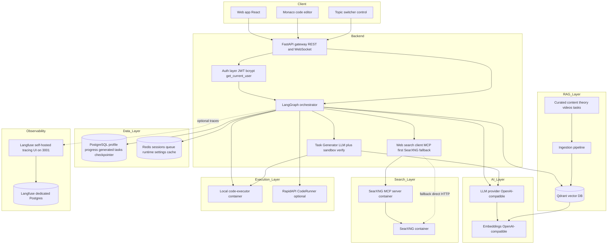
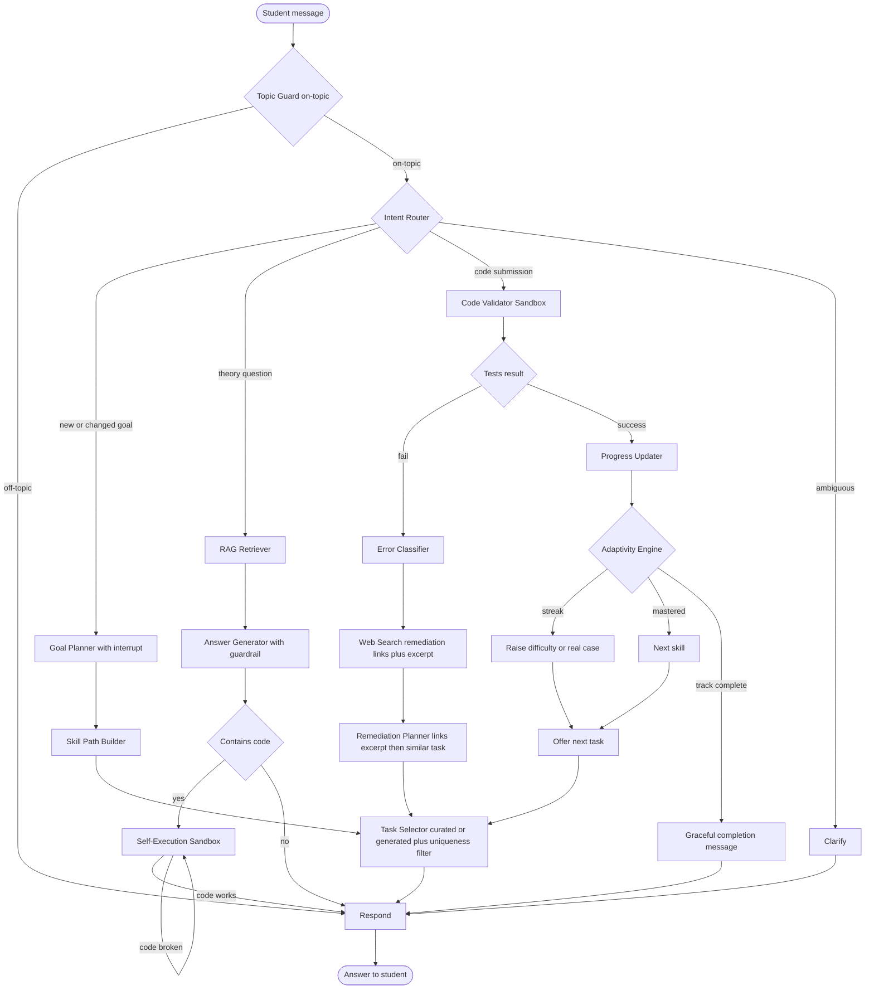
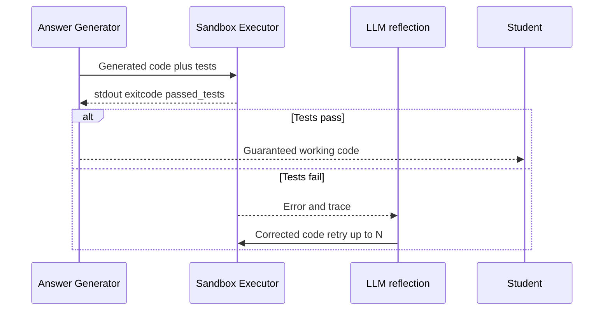
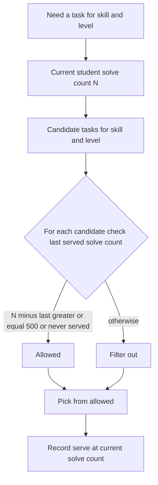
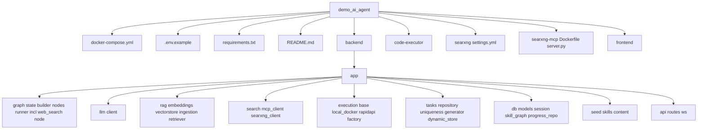

# 🎓 Adaptive AI Coding Tutor

> English version: [README.md](README.md)

> Персональный ментор по программированию, построенный на **LangGraph** + **RAG** + **исполнении кода в песочнице**. Студент формулирует учебную цель на естественном языке, выбирает язык (MVP: **Python** и **JavaScript**), опционально задаёт свободную **тематику (topic)**, и агент строит персональную траекторию навыков, которая **адаптируется в реальном времени**: при ошибке он направляет к целевому видеоразбору, **живым ссылкам из веб-поиска + краткому объяснению** и похожим практическим заданиям; при успехе подтверждает решение (не переформулируя только что решённую задачу) и явно **предлагает следующую задачу**, повышая сложность и предлагая реальные кейсы. Задачи могут **выдаваться из подготовленного контента или генерироваться на лету LLM с привязкой к веб-поиску** — и **каждый** фрагмент кода, который показывает тьютор, эталонное решение каждой сгенерированной задачи и каждое решение студента проверяются путём **реального запуска в изолированной песочнице**, что устраняет галлюцинированный, неработающий код.

---

## 1. Что делает агент

### Краткая версия
ИИ-тьютор, который обучает программированию, **адаптируясь к ошибкам и успехам каждого студента**, и **гарантирует работоспособность всего кода**, исполняя его в песочнице перед показом.

### Подробная версия
1. **Принимает цель на естественном языке** — например, *Хочу выучить Python, чтобы автоматизировать рутинную работу*. Если цель неполная, агент задаёт уточняющие вопросы (human-in-the-loop) вместо того, чтобы догадываться.
2. **Строит персональную траекторию** атомарных навыков из Skill Graph (переменные → условия → циклы → функции → коллекции → … → мини-проект). Навыки несут общий ключ **concept**, поэтому при смене языка студентом уже освоенные концепции переиспользуются, и обучается только синтаксическая разница (delta). **У каждого засеянного навыка в обоих языках (Python и JavaScript) есть хотя бы одно проверенное в песочнице практическое задание**, а выбор навыка теперь **учитывает контент** — агент выбирает самый ранний неосвоенный навык, у которого реально есть задания, поэтому новый студент всегда получает настоящую задачу, а не тупик.
3. **Адаптируется в реальном времени** — основной обучающий цикл:
   - Студент решает задачу; его код запускается на видимых **и** скрытых тестах в песочнице.
   - При **неудаче** Error Classifier диагностирует тип ошибки (off-by-one, ошибка типа, логика, таймаут, …); узел `web_search` подбирает **живые ссылки для устранения пробела** (видео/статьи по теме) плюс **краткое объяснение/выдержку на простом языке**, выведенную из этих ссылок; агент также извлекает **целевой видеоразбор** и предлагает **похожие практические задания** (не переформулируя проваленную задачу). Для продвижения дальше требуются два успеха подряд.
   - На **теоретические/программистские вопросы** агент возвращает запрошенную информацию **плюс follow-up практическое упражнение**, чтобы обучение оставалось практическим, а не заканчивалось простым ответом.
   - При **успехе** агент подтверждает прохождение **без переформулирования только что решённой задачи** и явно **предлагает следующую задачу** (`➡️ Следующая задача`); сложность растёт, устойчивая серия успехов выводит на **реальные кейсы** (рефакторинг, исправление багов, фичи), а при исчерпании траектории показывается аккуратное сообщение о завершении.
4. **Берёт задачи из подготовленного контента или из живого интернета** — помимо подготовленных задач, тьютор может **сгенерировать свежую задачу на лету с помощью LLM**, привязав её к **веб-поиску**, с **автоматически сгенерированными тестами, проверенными в песочнице** (цикл reflection/regeneration с переиспользованием `code-executor`), прежде чем задача будет выдана. Сгенерированные задачи подчиняются тому же cooldown уникальности в 500 решений + `task_serve_history` и адресуются по `task_id` (id вида `gen_<uuid>`). Весь путь **fail-open**: если поиск/LLM недоступны, происходит откат на подготовленный контент, и ход никогда не падает. Управляется флагом `INTERNET_TASKS_ENABLED` (по умолчанию `true`).
5. **Переключает тематику на лету** — свободная **тематика (`topic`)** (ортогональная языку/навыку; она **не** портит прогресс в skill-графе) задаёт тему сгенерированным задачам и поисковым запросам, поэтому один и тот же навык (например, циклы) можно практиковать в выбранной студентом области (анализ данных, веб-скрейпинг, геймдев, финансы, …). Пустая тематика = ровно то нейтральное поведение, что и сегодня.
6. **Гарантирует работоспособный код** — любой код, который генерирует агент, и эталонное решение каждой сгенерированной задачи сначала запускаются в песочнице; если падают, ошибка передаётся обратно в LLM для попытки повторной генерации (reflection loop) ещё до того, как студент это увидит.

---

## 2. Описание проекта, структура и диаграммы

### 2.1 Высокоуровневая архитектура



> **Веб-поиск + интернет-задачи (fail-open).** Узел `web_search` и Task Generator расширяют AI-слой. Поисковый клиент бэкенда ([`backend/app/search/`](backend/app/search/__init__.py:1)) сначала пробует **SearXNG MCP server** (инструмент `web_search` поверх Streamable HTTP на `http://searxng-mcp:8077/mcp`), затем откатывается на **прямой SearXNG JSON**, затем на пустой результат — **никогда не выбрасывая исключение**. Task Generator ([`backend/app/tasks/generator.py`](backend/app/tasks/generator.py:1)) генерирует LLM-задачи, эталонное решение которых **проверяется в песочнице** до выдачи. Каждая новая зависимость деградирует плавно: сбой поиска → remediation без ссылок/из подготовленного контента; сбой генерации → подготовленная задача; MCP недоступен → прямой SearXNG HTTP; SearXNG недоступен → пропускаем ссылки, оставляем объяснение от LLM. Управляется флагом `INTERNET_TASKS_ENABLED` и свойством конфигурации `search_enabled`.

> **Runtime-настройки графа.** Адаптивные параметры (`COOLDOWN_SOLVES`, `MAX_REGEN_ATTEMPTS`, `MASTERY_SUCCESS_STREAK`, `ADVANCED_SUCCESS_STREAK`) **и переключатель on-topic guardrail `TOPIC_GUARD_ENABLED`** редактируются в рантайме через `GET/PUT /api/graph/settings` и вкладку UI **Graph Settings** — применяются **без перезапуска бэкенда**. Источник истины — Postgres; Redis (`graph:settings`) — write-through кеш.

> **On-topic guardrail.** Узел `topic_guard` выполняется первым (сразу после входа, до Intent Router) и удерживает диалог в рамках программирования и текущего процесса обучения. Используется **гибридный классификатор**: быстрая детерминированная эвристика (ключевые слова программирования + активные `language`/`current_skill`/`learning_goal` студента) и, только для неоднозначных случаев, LLM-классификатор (`chat_json`). Поведение **fail-open**: если LLM недоступен — по умолчанию считаем on-topic (с логированием), чтобы временный сбой не блокировал обучение. Отправка кода (intent=code) всегда on-topic. Запросы не по теме вежливо отклоняются (без RAG и без исполнения). Гард управляется флагом `TOPIC_GUARD_ENABLED` (по умолчанию `true`); чтобы отключить — выставьте `false` (в env как seed или через UI Graph Settings / PUT settings) в рантайме.

> **Наблюдаемость (включена из коробки).** Прогоны LangGraph (узлы + вызовы LLM) трассируются в **self-hosted Langfuse** (со своим отдельным Postgres `langfuse-db`, UI на http://localhost:3001) через Langfuse `CallbackHandler`. `docker-compose` автоматически создаёт организацию, проект и **дефолтного пользователя admin** в Langfuse и пробрасывает **те же ключи проекта** в бэкенд, поэтому трейсинг работает без ручной настройки. Проверка релизов/обновлений Langfuse отключена (`LANGFUSE_UI_RELEASE_CHECK_ENABLED=false`), чтобы шумные, но некритичные ошибки `checkUpdate` не появлялись в офлайн-окружениях или средах с заблокированным egress. Это по-прежнему best-effort: если Langfuse недоступен — бэкенд работает нормально. Агрегированные метрики бэкенда (пользователи, попытки, доля успеха, средний mastery, …) доступны через `GET /api/metrics/summary` и показываются во вкладке **Graph Settings → Observability**.

### 2.2 Поток управления LangGraph



> **Выбор навыка с учётом контента.** Skill Path Builder ([`backend/app/graph/nodes/skill_path.py`](backend/app/graph/nodes/skill_path.py:1)) выбирает самый ранний неосвоенный навык, у которого реально есть задания (с аккуратным fallback), поэтому новый студент никогда не попадает на навык без контента. Task Selector ([`backend/app/graph/nodes/task_selector.py`](backend/app/graph/nodes/task_selector.py:1)) проходит по траектории skill-графа до следующего навыка, у которого есть задания, прежде чем сдаться, и выдаёт более понятное, действенное сообщение вместо прежнего тупика `No tasks available for this skill yet.`

> **Веб-поиск на пути неудачи.** При проваленной отправке новый узел `web_search` ([`backend/app/graph/nodes/web_search.py`](backend/app/graph/nodes/web_search.py:1)) выполняется **между** `error_classifier` и Remediation Planner (`error_classifier → web_search → remediation`). Он строит запрос из `language` + `concept` + `last_error_type` + (опц.) `topic`, подбирает `remediation_links` (топ 3–5) и выводит краткую `remediation_excerpt` (LLM-суммаризация сниппетов либо топовый сниппет(ы) / статическая подсказка как fallback). Remediation Planner ([`backend/app/graph/nodes/remediation.py`](backend/app/graph/nodes/remediation.py:1)) сообщает «❌ ваш код не решает задачу», показывает объяснение + ссылки и предлагает **похожую** задачу **без переформулирования проваленной**. Полностью **fail-open**: пустой поиск → ссылки опускаются, объяснение от LLM/из подготовленного контента сохраняется.

> **Путь сгенерированной задачи + предложение следующей.** Когда задана `topic`, фильтр cooldown не оставляет ничего свежего или включён `INTERNET_TASKS_ENABLED`, Task Selector вызывает Task Generator ([`backend/app/tasks/generator.py`](backend/app/tasks/generator.py:1)), чтобы сгенерировать проверенную в песочнице задачу (`task_source="generated"`, id `gen_<uuid>`), исключая только что решённый id. При успехе Adaptivity Engine ([`backend/app/graph/nodes/adaptivity.py`](backend/app/graph/nodes/adaptivity.py:1)) выставляет `offer_next_task=True`, и селектор добавляет явный префикс **➡️ Следующая задача**; при исчерпании траектории вместо этого возвращается аккуратное сообщение о завершении.

> **Теоретические ответы включают практику.** Answer Generator ([`backend/app/graph/nodes/answer_generator.py`](backend/app/graph/nodes/answer_generator.py:1)) добавляет после теоретического ответа follow-up практическое упражнение с учётом навыка, поэтому теоретический/программистский вопрос возвращает информацию **плюс** конкретное упражнение, которое можно попробовать следующим.

### 2.3 Поток исполнения кода (гарантия отсутствия галлюцинаций)



> **Самоописывающиеся отправки.** Отправка кода несёт собственный `task_id`: `CodeRequest` ([`backend/app/api/routes.py`](backend/app/api/routes.py:1)) принимает опциональный `task_id` (плюс опциональные `skill`/`language`), `run_turn` ([`backend/app/graph/runner.py`](backend/app/graph/runner.py:1)) прокидывает его в состояние как `current_task_id`, а фронтенд `submitCode` ([`frontend/src/api.js`](frontend/src/api.js:1)) / [`frontend/src/App.jsx`](frontend/src/App.jsx:1) отправляют текущий `task_id` при каждом **Run & Check**. Поэтому отправка проверяется против правильной задачи даже при отсутствии состояния чекпойнта. Id сгенерированных задач (`gen_<uuid>`) резолвятся через динамический стор ([`backend/app/tasks/dynamic_store.py`](backend/app/tasks/dynamic_store.py:1)), поэтому **Run & Check** против интернет-задачи проверяется ровно так же, как против подготовленной.

> **Сгенерированные задачи тоже проверяются в песочнице.** Task Generator ([`backend/app/tasks/generator.py`](backend/app/tasks/generator.py:1)) переиспользует ровно этот reflection-цикл: сгенерированная задача выдаётся только после того, как её автоматически сгенерированное **эталонное решение проходит все видимые + скрытые тесты** в `code-executor`; если нет — ошибка передаётся обратно в LLM (с ограничением `MAX_REGEN_ATTEMPTS`) для повторной генерации, а если проверка всё равно не проходит, система откатывается на подготовленный контент. Таким образом, гарантия отсутствия галлюцинаций распространяется и на интернет-задачи.

### 2.4 Cooldown уникальности заданий



> **Полное покрытие заданиями.** Подготовленный контент теперь включает задание `practice` для **каждого** засеянного навыка в **обоих** языках — `py_variables, py_io, py_conditions, py_loops, py_functions, py_collections, py_dicts, py_strings, py_errors, py_oop, py_comprehensions, py_recursion, py_modules, py_api, py_project` и JavaScript-эквиваленты (`js_*`) — все они определены в [`backend/app/seed/content/curated.py`](backend/app/seed/content/curated.py:1), и каждое эталонное решение проверено в песочнице (34/34 задания проходят свои видимые + скрытые тесты). В сочетании с выбором навыка с учётом контента у фильтра уникальности всегда есть реальный кандидат.

> **Сгенерированные задачи используют тот же cooldown.** Интернет-задачи (`gen_<uuid>`) проходят через **ту же** машинерию `task_serve_history` + фильтр уникальности + `record_serve` без изменений (она работает с любым `.id`). Поскольку сгенерированные задачи обычно уникальны для каждого запроса, они естественно проходят cooldown в 500 решений, а выдачи всё равно записываются для аудита — поэтому критерий эффективности «0% нарушений cooldown» выполняется и для подготовленных, и для сгенерированных задач.

### 2.5 Дерево каталогов



```
demo_ai_agent/
├── docker-compose.yml          # Brings up the whole stack
├── .env.example                # Environment template
├── requirements.txt            # Python dependencies (incl. mcp==1.12.4)
├── README.md
├── searxng/                    # SearXNG meta-search config (JSON output enabled)
│   └── settings.yml
├── searxng-mcp/                # In-repo SearXNG MCP server (web_search tool, Streamable HTTP)
│   ├── Dockerfile
│   ├── requirements.txt
│   └── server.py
├── backend/
│   ├── Dockerfile
│   └── app/
│       ├── main.py             # FastAPI entry (REST + WebSocket) + startup seeding/migration
│       ├── config.py           # Settings from .env (incl. SEARXNG_*, INTERNET_TASKS_ENABLED)
│       ├── api/                # routes.py, ws.py
│       ├── graph/              # state.py, builder.py, runner.py, nodes/ (incl. web_search.py)
│       ├── llm/                # client.py (OpenAI-compatible)
│       ├── rag/                # embeddings, vectorstore (Qdrant), ingestion, retriever
│       ├── search/             # __init__.py (fail-open orchestrator), mcp_client.py, searxng_client.py
│       ├── execution/          # base, local_docker, rapidapi, factory (Strategy)
│       ├── tasks/              # repository.py, uniqueness.py (cooldown 500), generator.py, dynamic_store.py
│       ├── db/                 # models (incl. GeneratedTask + users.topic), session, skill_graph, progress_repo
│       └── seed/               # skills.py, content/curated.py
├── code-executor/              # Isolated sandbox HTTP service (Python + Node)
│   ├── Dockerfile
│   └── runner.py
└── frontend/                   # React + Monaco editor
    ├── Dockerfile, nginx.conf, vite.config.js, package.json
    └── src/ (App.jsx, api.js, main.jsx, styles.css)
```

---

## 3. Для кого этот агент (гипотезы и предположения)

- **Новички**, которым нужен персональный темп и активное заполнение пробелов. *Гипотеза: отток на статичных курсах высок, потому что нет адаптации к индивидуальным ошибкам.*
- **Разработчики, переходящие на новый язык.** *Гипотеза: переиспользование уже освоенных концепций (циклы, функции) между языками существенно ускоряет обучение, поэтому мы обучаем только синтаксической разнице.*
- **Буткемпы и школы как white-label B2B-продукт.** *Гипотеза: B2B-покупатели готовы платить за снижение нагрузки на менторов при сохранении качества, потому что объективная проверка в песочнице масштабируется там, где ручная проверка — нет.*
- **Самоучки, обжёгшиеся на галлюцинирующих чат-ботах.** *Гипотеза: жёсткая гарантия того, что весь показанный код работает, — решающее отличие по доверию по сравнению с обычными LLM-тьюторами.*

---

## 4. Как запустить

Требования: **Docker** и **Docker Compose**.

1. Скопируйте шаблон окружения и укажите вашего LLM-провайдера:
   ```bash
   copy .env.example .env
   ```
   Задайте как минимум:
   ```
   OPENAI_API_KEY=sk-...
   OPENAI_BASE_URL=https://api.openai.com/v1   # or your provider / local vLLM/Ollama
   LLM_MODEL=gpt-4o-mini
   EMBEDDING_MODEL=text-embedding-3-small
   EMBEDDING_DIM=2560 
   ```
   Опционально включите онлайн-исполнение кода через RapidAPI, дополнительно задав `RAPIDAPI_KEY` и `RAPIDAPI_CODERUNNER_HOST` (иначе автоматически используется локальный контейнер `code-executor`).

   On-topic guardrail (задаёт начальное значение по умолчанию; также редактируется в рантайме):
   ```
   TOPIC_GUARD_ENABLED=true      # вежливо отклонять запросы не по теме; fail-open без LLM
   ```

   **Веб-поиск + интернет-задачи (опционально, fail-open).** Они обеспечивают ссылки/выдержку для remediation на пути неудачи и живую LLM-генерацию задач. Дефолты работают из коробки в сети compose; тьютор остаётся работоспособным, даже если эти сервисы недоступны:
   ```
   SEARXNG_URL=http://searxng:8080            # внутренний URL сервиса SearXNG
   SEARXNG_MCP_URL=http://searxng-mcp:8077    # внутренний URL сервера SearXNG MCP
   SEARXNG_MCP_PORT=8077                       # порт, на котором слушает MCP-сервер
   SEARXNG_SECRET=changeme-searxng-secret      # server.secret_key для SearXNG
   INTERNET_TASKS_ENABLED=true                 # мастер-переключатель LLM-генерации задач (false = только подготовленные)
   ```

   **Трейсинг Langfuse включён из коробки.** Оставьте ключи пустыми, чтобы
   использовать встроенные дефолты compose (`pk-lf-tutor-public-key` /
   `sk-lf-tutor-secret-key`), которыми также провижинится проект Langfuse;
   задайте свои значения, чтобы переопределить:
   ```
   LANGFUSE_PUBLIC_KEY=          # пусто → дефолт compose (pk-lf-tutor-public-key)
   LANGFUSE_SECRET_KEY=          # пусто → дефолт compose (sk-lf-tutor-secret-key)
   LANGFUSE_HOST=http://langfuse:3000   # внутренний адрес в сети compose
   # Дефолтный admin Langfuse (переопределяемо). Вход в UI: http://localhost:3001
   LANGFUSE_INIT_USER_EMAIL=admin@example.com
   LANGFUSE_INIT_USER_NAME=admin
   LANGFUSE_INIT_USER_PASSWORD=qwerty123456
   ```

   **Аутентификация приложения (JWT)** — у приложения-репетитора СВОЙ вход, отдельный от учётки admin в Langfuse. Дефолты работают «из коробки»; переопределяются в `.env`:
   ```
   JWT_SECRET=dev-insecure-change-me-in-production   # СМЕНИТЕ в продакшене
   JWT_EXPIRE_MINUTES=10080                           # время жизни токена (7 дней)
   # Дефолтный пользователь приложения, создаётся при старте бэкенда (вход в приложение):
   APP_DEFAULT_USER_EMAIL=admin@example.com
   APP_DEFAULT_USER_PASSWORD=qwerty123456
   APP_DEFAULT_USER_NAME=admin
   APP_DEFAULT_USER_LANGUAGE=python
   ```

2. Соберите образы и поднимите стек. Проверенный путь сборки обходит проблему DNS **EAI_AGAIN** в песочнице Docker-сборки (где `npm`/`PyPI` не могут резолвить реестры) за счёт использования BuildKit-сборщика с включённым DNS (конфигурация в [`buildkitd.toml`](buildkitd.toml:1)):

   ```bash
   copy .env.example .env

   # One-time: create a DNS-enabled BuildKit builder to work around the
   # EAI_AGAIN DNS issue in the Docker build sandbox (npm/PyPI cannot resolve)
   docker buildx create --name dnsbuilder --driver docker-container --config buildkitd.toml

   # Build images via the DNS-enabled builder
   docker buildx --builder dnsbuilder build --load -t demo_ai_agent-frontend:latest ./frontend
   docker buildx --builder dnsbuilder build --load -f backend/Dockerfile -t demo_ai_agent-backend:latest .
   docker buildx --builder dnsbuilder build --load -t demo_ai_agent-code-executor:latest ./code-executor
   docker buildx --builder dnsbuilder build --load -t demo_ai_agent-searxng-mcp:latest ./searxng-mcp

   # Start the whole stack
   docker compose up -d
   ```

   Это запускает: `postgres`, `qdrant`, `redis`, `code-executor`, **`searxng`** и встроенный в репозиторий сервер **`searxng-mcp`**, `backend`, `frontend`, а также **`langfuse`** и его отдельный Postgres **`langfuse-db`** — все с healthcheck'ами и упорядоченными `depends_on`. При первом запуске бэкенд создаёт таблицы, выполняет идемпотентный `ALTER TABLE users ADD COLUMN IF NOT EXISTS topic VARCHAR` (для обновлений «на месте»), заполняет Skill Graph (Python + JavaScript), создаёт строку runtime-настроек графа и индексирует подготовленный контент RAG. Образы Langfuse и его Postgres подтягиваются готовыми, образ **`searxng`** (**`searxng/searxng:2026.5.31-7159b8aed`**) также подтягивается — собирается только `searxng-mcp` (вместе с backend/frontend/code-executor). Бэкенд `depends_on` `searxng`/`searxng-mcp` с `condition: service_started` (не блокирующее), поэтому стек поднимается, даже когда поиск недоступен (fail-open); `searxng-mcp` зависит от `searxng: service_healthy`.

   > **Тег образа SearXNG.** Образ зафиксирован на **датированном теге** (`searxng/searxng:2026.5.31-7159b8aed`), а не `:latest`, для воспроизводимых офлайн-сборок. Изначально запланированный тег `2024.12.10-cc59cf0` больше не опубликован на Docker Hub (manifest unknown) и был перепиннен на ближайший доступный недавний стабильный датированный релиз, проверенный на шаге пересборки/верификации — это тег, который сейчас в [`docker-compose.yml`](docker-compose.yml:70).

3. Доступ к сервисам:
   - **Frontend:** http://localhost:3000 — сначала открывается **экран авторизации** (вход / регистрация). Войдите дефолтным пользователем `admin@example.com` / `qwerty123456`, после чего появится учебный интерфейс.
   - **API docs:** http://localhost:8000/docs
   - **Health:** http://localhost:8000/health
   - **Health поиска:** http://localhost:8000/api/search/health → `{"mcp":bool,"searxng":bool}` (диагностика; best-effort). На проверенной пересборке возвращает `{"mcp":true,"searxng":true}`.
   - **Langfuse (UI трейсинга):** http://localhost:3001
   - **SearXNG JSON API (debug, опционально):** по умолчанию только внутренний; раскомментируйте маппинг порта `8080:8080` в [`docker-compose.yml`](docker-compose.yml:79), чтобы напрямую запрашивать `http://localhost:8080/search?q=python+loops&format=json`.

### Аутентификация (вход в приложение)

У приложения-репетитора **собственная** JWT-аутентификация, полностью **отдельная от учётной записи admin в Langfuse** (у той свой вход, её мы не трогаем).

- **Открытая регистрация, без верификации почты.** Любой может создать аккаунт через `POST /api/auth/register` (email, пароль, опц. имя и язык). Пароли хешируются **bcrypt** (passlib); возвращается подписанный **JWT**.
- **Эндпоинты:**
  - `POST /api/auth/register` → создаёт пользователя, **сразу инициализирует учебный профиль**, возвращает JWT + пользователя. `409`, если email занят.
  - `POST /api/auth/login` → email + пароль → JWT + пользователь. `401` при неверных кредах.
  - `GET /api/auth/me` → текущий пользователь (нужен `Authorization: Bearer <token>`). `401` без токена или с битым токеном.
- **Защищённые эндпоинты.** `/api/goal`, `/api/chat`, `/api/submit_code`, `/api/resume`, `/api/progress/*` и WebSocket `/ws` требуют валидный токен. `user_id` всегда берётся из токена (поле `user_id` в теле запроса игнорируется), так что клиент не может действовать от чужого имени. WebSocket принимает токен через query-параметр `?token=` либо первое сообщение `{type:"auth",token}`.
- **Дефолтный пользователь приложения.** При старте бэкенд засевает дефолтного пользователя из `APP_DEFAULT_USER_*` (по умолчанию `admin@example.com` / `qwerty123456`, имя `admin`, язык `python`) с инициализированным профилем. Это и готовый вход, и страховка, гарантирующая наличие валидной строки `users`. Переопределяется в `.env`. Форма входа подставляет email-плейсхолдер и показывает демо-креды как подсказку (пароль **не** захардкожен в JS).
- **Инициализация профиля устраняет FK-ошибку skill_progress.** Регистрация/логин (и начало каждого хода графа) вызывают `ensure_user_profile(user_id, language)`, который get-or-create создаёт строку `users` и сеет первые записи skill_progress. В сочетании с get-or-create-семантикой в репозитории прогресса это значит, что чат/код работают **сразу после входа**, ещё до `/api/goal` — прежняя FK-ошибка `skill_progress` больше не возникает.
- **Поток на фронтенде.** Перед основным UI показывается экран **Вход / Регистрация**. При успехе JWT сохраняется в `localStorage` и прикрепляется как `Authorization: Bearer <token>` ко всем вызовам API. При старте имеющийся токен проверяется через `GET /api/auth/me`. Кнопка **Выйти** очищает токен; любой `401` автоматически разлогинивает и возвращает на экран авторизации.

### Runtime-настройки графа (без перезапуска)

Адаптивные параметры можно менять на лету:

- **UI:** откройте вкладку **Graph Settings** во фронтенде, отредактируйте значения (включая чекбокс **On-topic guard**) и нажмите Save. В этой же вкладке есть секция **Observability**: ссылка на UI трейсинга Langfuse и живая сводка метрик бэкенда.
- **API:**
  - `GET /api/graph/settings` → текущие значения (включая `TOPIC_GUARD_ENABLED`).
  - `PUT /api/graph/settings` с JSON-телом любого подмножества `COOLDOWN_SOLVES`, `MAX_REGEN_ATTEMPTS`, `MASTERY_SUCCESS_STREAK`, `ADVANCED_SUCCESS_STREAK` (положительные целые, валидируются) и/или `TOPIC_GUARD_ENABLED` (булево) → сохраняет в Postgres, обновляет Redis-кеш и возвращает новые значения. Изменения применяются сразу на следующем ходу графа — например, переключение `TOPIC_GUARD_ENABLED` включает/выключает гард в рантайме без перезапуска.

### On-topic guardrail (настраивается в рантайме)

Узел `topic_guard` ([`backend/app/graph/nodes/topic_guard.py`](backend/app/graph/nodes/topic_guard.py:1)) удерживает чат в рамках программирования и текущего процесса обучения. Он сочетает быструю эвристику по ключевым словам/контексту с LLM-классификатором для неоднозначных случаев и работает **fail-open**: при недоступности LLM по умолчанию считает запрос on-topic (с логированием), чтобы обучение не блокировалось. Запросы не по теме получают вежливый отказ (без RAG и без исполнения); отправка кода всегда on-topic. Отключить можно, выставив `TOPIC_GUARD_ENABLED=false` (env seed) либо через UI Graph Settings / `PUT /api/graph/settings` в рантайме.

### Переключение тематики (topic / theme)

Свободная **тематика (`topic`)** (например, *«анализ данных с pandas»*, *«веб-скрейпинг»*, *«основы геймдева»*, *«финансовые расчёты»*) задаёт тему сгенерированным задачам и поисковым запросам, поэтому один и тот же навык (например, циклы) можно практиковать в выбранной студентом области. Это **НОВАЯ ось, ортогональная `language` и дополняющая `skill`/`concept`**:

- `language` (python | javascript) — по-прежнему исполняемая цель. Без изменений.
- `current_skill` / `concept` — по-прежнему педагогическая ось, по которой идёт адаптивный цикл. Без изменений.
- **`topic`** — меняет только *оформление* (flavour) сгенерированных задач + поисковых запросов. Переключение тематики **не сбрасывает прогресс** и **не** портит skill-граф. Пустая тематика = ровно то нейтральное поведение, что и сегодня.

Она сохраняется по каждому пользователю (`users.topic`, добавляется идемпотентным `ALTER TABLE … ADD COLUMN IF NOT EXISTS topic VARCHAR` при старте) и прокидывается через `run_turn` как для REST, так и для WebSocket.

- **UI:** селектор **Тематика** на панели редактора — выпадающий список подсказок плюс свободный ввод *«своя тема»* и чип текущей тематики с кнопкой очистки.
- **API:**
  - `GET /api/topic` → `{ "topic": str }` — текущая тематика пользователя.
  - `PUT /api/topic` → задать/очистить тематику (auth; сохраняет `users.topic`). Очистка разрешена; тематика длиннее **120 символов** возвращает **400**.
  - `GET /api/topics` → `{ "topics": [str] }` — небольшой статический список предлагаемых тем для выпадающего списка (само поле остаётся свободным).
- **WebSocket:** ходы принимают опциональный `topic`; удобное сообщение `{type:"topic", topic}` сохраняет его и отвечает `{type:"topic_ok"}`.

### Интернет-задачи (LLM-генерация + проверка в песочнице)

Помимо подготовленного контента, тьютор может **сгенерировать свежую задачу на лету** с помощью LLM ([`backend/app/tasks/generator.py`](backend/app/tasks/generator.py:1)):

1. **(Опц.) веб-привязка:** когда задана `topic`, веб-поиск собирает 2–3 сниппета, чтобы задача выглядела актуальной/реалистичной (fail-open — пропускается, если пусто).
2. **LLM-генерация:** `chat_json` возвращает строгий payload задачи (условие, `entry_point`, `reference_solution`, видимые + скрытые тесты, сложность, concept) — чистая функция, без I/O, с темой `topic`.
3. **Проверка в песочнице:** сгенерированное **эталонное решение запускается на всех тестах** в `code-executor`; при неудаче ошибка передаётся обратно в LLM (reflection loop с ограничением `MAX_REGEN_ATTEMPTS`), пока не пройдёт — та же гарантия отсутствия галлюцинаций, что и у подготовленных задач.
4. **Сохранение + выдача:** проверенная задача сохраняется в динамическом сторе ([`backend/app/tasks/dynamic_store.py`](backend/app/tasks/dynamic_store.py:1)) (in-process кеш **плюс** таблица Postgres `GeneratedTask` для устойчивости к рестартам/воркерам), помечается `task_source="generated"` с id `gen_<uuid>` и становится резолвимой через `get_task(task_id)` для следующего **Run & Check**.

Генерация всегда **привязана к текущему навыку/concept**, выбранному адаптивным циклом, поэтому траектория сохраняется; `topic` меняет только оформление. Весь путь **fail-open** — если генерация/проверка не удаётся после ретраев, возвращается `None`, и тьютор откатывается на подготовленные `tasks_for_skill(...)`. Управляется мастер-переключателем **`INTERNET_TASKS_ENABLED`** (по умолчанию `true`; `false` для режима «только подготовленные») и свойством конфигурации `search_enabled`.

### Веб-поиск (SearXNG + MCP-сервер)

Веб-поиск обеспечивает и ссылки/выдержку для remediation на пути неудачи, и (опциональную) привязку сгенерированных задач. Его дают два отдельных контейнера, оба полностью **опциональны / fail-open**:

- **`searxng`** — self-hosted инстанс мета-поиска [SearXNG](https://github.com/searxng/searxng), образ **`searxng/searxng:2026.5.31-7159b8aed`**. Настраивается через [`searxng/settings.yml`](searxng/settings.yml:1) с **включённым форматом вывода JSON** (нужен для программного парсинга) и небольшим набором движков без API-ключей (duckduckgo, bing, brave, wikipedia). Только внутренний в сети compose (по умолчанию без публикуемого порта хоста); использует том `searxngdata`.
- **`searxng-mcp`** — крошечный **встроенный в репозиторий** Python MCP-сервер ([`searxng-mcp/server.py`](searxng-mcp/server.py:1), образ `demo_ai_agent-searxng-mcp:latest`), предоставляющий единственный инструмент **`web_search`** поверх **Streamable HTTP** на `http://searxng-mcp:8077/mcp` (health на `/health`). Он читает `SEARXNG_URL` и нормализует результаты в `{title, url, snippet}`. Зависит от `searxng: service_healthy`.

Поисковый клиент бэкенда ([`backend/app/search/`](backend/app/search/__init__.py:1)) сначала пробует **MCP** ([`mcp_client.py`](backend/app/search/mcp_client.py:1)), затем откатывается на **прямой SearXNG JSON** ([`searxng_client.py`](backend/app/search/searxng_client.py:1)), затем на пустой результат — и **никогда не выбрасывает исключение** вызывающему коду. `GET /api/search/health` сообщает о доступности `{mcp, searxng}` для диагностики. Новая зависимость `mcp==1.12.4` (в [`requirements.txt`](requirements.txt:1)) обеспечивает MCP-клиент бэкенда и образ MCP-сервера.

> **Живые веб-результаты требуют исходящего egress** к вышестоящим движкам (bing / duckduckgo / brave / wikipedia). В средах с заблокированным egress SearXNG может возвращать пустые результаты — система остаётся **работоспособной** и деградирует плавно (без ссылок, объяснение только от LLM, подготовленные задачи). Это зеркалит уже существующее примечание про офлайн-Langfuse.

### Трейсинг Langfuse (включён из коробки)

Трейсинг работает без ручной настройки: `docker-compose` автоматически создаёт организацию, проект, дефолтного пользователя **admin** и API-ключи проекта в Langfuse и пробрасывает **те же ключи** в бэкенд (`LANGFUSE_PUBLIC_KEY` / `LANGFUSE_SECRET_KEY`), поэтому `langfuse_enabled=True` с первого запуска. Прогоны графа (узлы, включая `topic_guard`, плюс вызовы LLM) появляются в UI Langfuse под проектом **tutor-project**.

Сервис `langfuse` также выставляет `LANGFUSE_UI_RELEASE_CHECK_ENABLED=false` (рядом с `TELEMETRY_ENABLED=false`) в `docker-compose.yml`, чтобы отключить встроенную проверку релизов/обновлений Langfuse. В офлайн-окружении или среде с заблокированным egress эта проверка не может достучаться до внешних GitHub-релизов и постоянно логирует некритичные ошибки `tRPC route failed on public.checkUpdate: Internal error` / `Failed to fetch or json parse the latest releases`; её отключение оставляет логи чистыми и не влияет на трейсинг.

- **UI Langfuse / вход admin:** http://localhost:3001 — email `admin@example.com`, пароль `qwerty123456` (имя пользователя `admin`). Переопределяется переменными `LANGFUSE_INIT_USER_*` в `.env`.
  > **Если вход admin не работает** (например, после изменения переменных `LANGFUSE_INIT_*`): эти переменные применяются Langfuse **только при первом старте с пустой базой** `langfuse-db`. На уже инициализированном томе они игнорируются. Выполните `docker compose down -v` (удалит том `langfusedbdata`) и затем `docker compose up -d` — INIT отработает на чистой БД, и пользователь admin будет создан заново.
- **Отключить трейсинг:** сделайте `LANGFUSE_PUBLIC_KEY` / `LANGFUSE_SECRET_KEY` бэкенда пустыми (и очистите дефолты в compose). Тогда бэкенд работает нормально и никогда не падает из-за Langfuse.

### Метрики бэкенда

`GET /api/metrics/summary` возвращает живые агрегаты из БД приложения: число пользователей, суммарные решения, попытки, число успехов/неудач, долю успеха, средний mastery, число выданных заданий, распределение по состояниям навыков и по типам ошибок, плюс статус/ссылку Langfuse. Они дополняют пер-трейсовые метрики latency/объёма/ошибок, которые уже даёт Langfuse. Сводка отображается во вкладке фронтенда **Graph Settings → Observability**.

4. Попробуйте сквозной сценарий: введите *I want to learn Python loops*, получите задачу, напишите решение в редакторе Monaco, нажмите **Run & Check**. Каждая отправка несёт свой `task_id`, поэтому проверяется против правильной задачи даже при отсутствии состояния чекпойнта. Неверный ответ запускает видеоразбор + **живые ссылки из веб-поиска и краткое объяснение** + *похожую* задачу (проваленная задача **не** переформулируется); прохождение подтверждается без переформулирования решённой задачи и явно **предлагает следующую задачу** (`➡️ Следующая задача`). Задайте **тематику**, чтобы получать тематические интернет-задачи. Простой теоретический вопрос возвращает объяснение плюс follow-up практическое упражнение.

### Чистая пересборка (`docker compose down -v`)

Чтобы пересобрать с нуля (проверенный путь): `docker compose down -v` удаляет именованные тома — теперь включая новый **`searxngdata`** наряду с `pgdata`, `qdrantdata` и `langfusedbdata` — затем пересоберите образы через buildx-сборщик `dnsbuilder` (который теперь также собирает **`demo_ai_agent-searxng-mcp:latest`**) и `docker compose up -d`. Это и была проверенная пересборка: все сервисы поднялись Up/healthy, и `curl http://localhost:8000/api/search/health` вернул `{"mcp":true,"searxng":true}`.

> **Примечание:** На хостах, где песочница Docker-сборки нормально резолвит DNS (npm/PyPI), достаточно стандартного `docker compose up --build` (DNS-сборщик не нужен). `docker-compose.yml` фиксирует имена `image:`, которые производит шаг buildx, поэтому после сборки образы переиспользуются командой `docker compose up` без пересборки.

> **Примечание:** Адаптивная петля и sandbox-гарантия кода работают end-to-end даже без реального LLM-ключа (graceful degradation — placeholder-ключ приводит к локальному fallback эмбеддингов, и граф не падает).

> Система деградирует плавно: если эндпоинт эмбеддингов недоступен, используется детерминированный локальный fallback, а если не удаётся инициализировать checkpointer на Postgres, происходит откат на in-memory checkpointer — так что демо всё равно работает.

---

## 5. Граничные случаи и как они обрабатываются

1. **Неполные данные о цели** — студент пишет *I want to learn*. **Goal Planner** использует LangGraph `interrupt` (human-in-the-loop), чтобы спросить, какой язык и цель, вместо того чтобы догадываться. UI показывает вопрос, а ответ возобновляет граф.
2. **Ошибки внешних API** — вызовы LLM/эмбеддингов/RapidAPI обёрнуты в **retry с экспоненциальной задержкой** (`tenacity`). Если **RapidAPI** падает во время выполнения, фабрика исполнителей прозрачно **откатывается на локальный исполнитель**. Если **LLM** недоступен, агент возвращает дружелюбное сообщение, а состояние сессии сохраняется для последующего возобновления.
3. **Неоднозначный запрос** — **Intent Router** возвращает оценку уверенности; ниже порога он направляет к узлу **Clarify** и просит студента уточнить, вместо того чтобы выбирать путь наугад.
4. **Таймаут кода студента (бесконечный цикл)** — песочница применяет **жёсткий лимит по реальному времени (wall-clock)** и ограничение по памяти; результат отмечается как `timed_out`, тьютор отвечает *execution timed out — check your loop exit condition* и направляет на remediation.
5. **Конфликтующие инструкции** — студент просит *just give me the answer* во время активной задачи. **Guardrail** в Answer Generator отказывает в полном решении и возвращает **подсказки**, объясняя педагогическую причину.
6. **Веб-поиск / MCP недоступны** — поисковый клиент **fail-open**: если **MCP-сервер** недоступен, он откатывается на **прямой SearXNG JSON**; если **SearXNG** недоступен (или egress заблокирован и он ничего не возвращает), ссылки опускаются, а объяснение остаётся **только от LLM** (или существующая статическая подсказка). Бэкенд `depends_on` поиск только с `condition: service_started`, поэтому весь стек поднимается и работает без поиска.
7. **Генерация задачи не проходит проверку** — если эталонное решение только что сгенерированной задачи не проходит все sandbox-тесты в пределах `MAX_REGEN_ATTEMPTS`, генерация ничего не возвращает, и тьютор прозрачно **откатывается на подготовленную задачу** для того же навыка — поэтому сломанная сгенерированная задача никогда не выдаётся.

---

## 6. Почему обычного детерминированного workflow недостаточно

- **Траектория не фиксирована.** Следующий шаг зависит от **типа ошибки**, истории студента и цели — это **циклический граф с ветвлением**, а не линейный pipeline.
- **Петли обратной связи незаменимы.** Повторная генерация кода до прохождения тестов (Self-Execution) и remediation до освоения — естественные **петли** в LangGraph, но неуклюжие и хрупкие в статичном workflow.
- **Маршрутизация зависит от семантики.** Классификация намерений и классификация ошибок требуют **семантического анализа LLM**, результат которого меняет маршрут — недетерминированное ветвление, которое фиксированный DAG не способен выразить.
- **Прерывания human-in-the-loop.** Пауза для уточнения цели у студента (и возобновление ровно с места остановки) требует **checkpointed, прерываемой** конечной машины состояний, чего однопроходный детерминированный pipeline предоставить не может.

---

## 7. Критерии эффективности и допустимые пороги

| Критерий | Что измеряет | Допустимый порог |
|-----------|------------------|----------------------|
| **Корректность показанного кода** | Доля показанного агентом кода, прошедшего тесты в песочнице до показа | **100% by design** (сломанный код никогда не показывается); повторная генерация успешна в **≥ 95%** случаев за **≤ 3** попытки |
| **Точность диагностики ошибок** | Доля корректно классифицированных ошибок студента | **≥ 85%** на размеченной выборке |
| **Уникальность заданий** | Доля выдач, нарушающих cooldown в 500 решений | **0%** нарушений |
| **Задержка ответа** | Медианное время ответа агента без видео | **≤ 5 s** медиана, **≤ 10 s** p95 |

Критерий уникальности напрямую проверяется через `GET /api/uniqueness/audit?user_id=...&task_id=...`.

---

## 8. Источники данных и интеграции

- **LLM API** — OpenAI-совместимый, провайдер настраивается в `.env` (`OPENAI_BASE_URL`, `OPENAI_API_KEY`, `LLM_MODEL`). Используется для классификации намерений, извлечения цели, генерации ответов, классификации ошибок и повторной генерации кода.
- **Embeddings API** — OpenAI-совместимый (`EMBEDDING_MODEL`) для векторизации контента и запросов, с детерминированным офлайн-fallback.
- **Qdrant** — векторная БД, хранящая подготовленную теорию, видеоразборы и условия задач с метаданными-фильтрами (language, concept, doc_type, error_type).
- **PostgreSQL** — профиль пользователя (включая per-user `topic`), прогресс по навыкам, попытки, **`task_serve_history`** (cooldown уникальности), таблица устойчивости **`generated_tasks`** для интернет-задач и **LangGraph checkpointer**.
- **Redis** — сессии, очередь песочницы, rate limiting и **кеш runtime-настроек графа** (`graph:settings`, источник истины — Postgres).
- **Langfuse (self-hosted, опционально)** — наблюдаемость/трейсинг LangGraph через `CallbackHandler`, с **собственным отдельным Postgres** (`langfuse-db`). UI на http://localhost:3001; включается только при заданных ключах, иначе трейсинг пропускается без влияния на бэкенд. Сервис запускается с `LANGFUSE_UI_RELEASE_CHECK_ENABLED=false`, чтобы подавить шумные, но некритичные ошибки `checkUpdate` в офлайн-окружениях или средах с заблокированным egress.
- **Контейнер code-executor** — изолированная локальная песочница (Python + Node) с лимитами по времени/памяти и эфемерной файловой системой. Отправки несут свой `task_id`, поэтому **Run & Check** проверяется против правильной задачи даже при отсутствии состояния чекпойнта.
- **RapidAPI CodeRunner** (опционально) — онлайн-исполнение кода при наличии конфигурации; фабрика откатывается на локальный при сбое.
- **SearXNG (self-hosted, опционально)** — self-hosted инстанс мета-поиска (образ `searxng/searxng:2026.5.31-7159b8aed`, конфигурация в [`searxng/settings.yml`](searxng/settings.yml:1) с включённым выводом JSON), используемый для ссылок remediation и привязки генерации интернет-задач. Только внутренний в сети compose; **fail-open** (тьютор работает и без него). Живые результаты требуют исходящего egress к вышестоящим движкам.
- **SearXNG MCP server (в репозитории, опционально)** — крошечный Python MCP-сервер ([`searxng-mcp/server.py`](searxng-mcp/server.py:1)), предоставляющий инструмент `web_search` поверх Streamable HTTP на `http://searxng-mcp:8077/mcp`; он связывает MCP-клиент бэкенда с SearXNG. Поисковый клиент бэкенда ([`backend/app/search/`](backend/app/search/__init__.py:1)) пробует MCP → прямой SearXNG JSON → пусто (никогда не выбрасывает исключение). Использует `mcp==1.12.4`.
- **Подготовленные документы** — заметки по теории, задачи по программированию (условие + видимые/скрытые тесты + проверенное в песочнице эталонное решение) и видеоразборы (с URL и тайм-кодами), заполняемые в [`backend/app/seed/content/curated.py`](backend/app/seed/content/curated.py:1). У каждого засеянного навыка в обоих языках есть хотя бы одно проверенное в песочнице задание `practice` (34/34 задания проходят свои видимые + скрытые тесты), поэтому у выбора навыка с учётом контента всегда есть реальная задача для выдачи.
- **Интернет-задачи (сгенерированные)** — задачи, генерируемые на лету LLM ([`backend/app/tasks/generator.py`](backend/app/tasks/generator.py:1)), опционально привязанные к веб-поиску, с автоматически сгенерированными тестами. Они **проверяются в песочнице** (эталонное решение должно пройти все тесты) до выдачи, сохраняются в динамическом сторе ([`backend/app/tasks/dynamic_store.py`](backend/app/tasks/dynamic_store.py:1)) + таблице `generated_tasks` и проходят через тот же cooldown уникальности.

---

## Соответствие ключевым требованиям

| # | Требование | Где |
|---|-------------|-------|
| 1 | Однокомандный `docker compose up` с healthcheck'ами + depends_on | [`docker-compose.yml`](docker-compose.yml:1) |
| 2 | `requirements.txt` со всеми Python-зависимостями | [`requirements.txt`](requirements.txt:1) |
| 3 | README со всеми разделами | этот файл |
| 4 | LLM через OpenAI-совместимый протокол, провайдер в `.env` | [`backend/app/llm/client.py`](backend/app/llm/client.py:1), [`.env.example`](.env.example:1) |
| 5 | Уникальность заданий, cooldown 500 + `task_serve_history` | [`backend/app/tasks/uniqueness.py`](backend/app/tasks/uniqueness.py:1), [`backend/app/db/models.py`](backend/app/db/models.py:1) |
| 6 | Опциональный RapidAPI CodeRunner через паттерн Strategy | [`backend/app/execution/`](backend/app/execution/base.py:1) (base/local_docker/rapidapi/factory) |
| 7 | Полное покрытие заданиями (каждый засеянный навык, оба языка) + выбор навыка/задания с учётом контента, чтобы новый пользователь всегда получал настоящую задачу | [`backend/app/seed/content/curated.py`](backend/app/seed/content/curated.py:1), [`backend/app/graph/nodes/skill_path.py`](backend/app/graph/nodes/skill_path.py:1), [`backend/app/graph/nodes/task_selector.py`](backend/app/graph/nodes/task_selector.py:1) |
| 8 | Самоописывающиеся отправки (`task_id` прокидывается end-to-end), чтобы **Run & Check** проверялся надёжно | [`backend/app/api/routes.py`](backend/app/api/routes.py:1), [`backend/app/graph/runner.py`](backend/app/graph/runner.py:1), [`frontend/src/api.js`](frontend/src/api.js:1) |
| 9 | Де-дупликация Run & Check: успех = без переформулирования + явное предложение следующей задачи; неудача = «не решает» + ссылки из веб-поиска + краткая выдержка | [`backend/app/graph/nodes/code_validator.py`](backend/app/graph/nodes/code_validator.py:1), [`backend/app/graph/nodes/web_search.py`](backend/app/graph/nodes/web_search.py:1), [`backend/app/graph/nodes/remediation.py`](backend/app/graph/nodes/remediation.py:1), [`backend/app/graph/nodes/adaptivity.py`](backend/app/graph/nodes/adaptivity.py:1) |
| 10 | Интернет-задачи через живую LLM-генерацию + веб-поиск, проверенные в песочнице; `INTERNET_TASKS_ENABLED` | [`backend/app/tasks/generator.py`](backend/app/tasks/generator.py:1), [`backend/app/tasks/dynamic_store.py`](backend/app/tasks/dynamic_store.py:1), [`backend/app/db/models.py`](backend/app/db/models.py:1) (`GeneratedTask`) |
| 11 | Бэкенд веб-поиска = SearXNG + SearXNG MCP server (Streamable HTTP `web_search`), fail-open MCP → прямой → пусто; `GET /api/search/health` | [`searxng/settings.yml`](searxng/settings.yml:1), [`searxng-mcp/server.py`](searxng-mcp/server.py:1), [`backend/app/search/`](backend/app/search/__init__.py:1), [`docker-compose.yml`](docker-compose.yml:64) |
| 12 | Переключение тематики (`topic` ортогональна языку/навыку); `GET/PUT /api/topic`, `GET /api/topics` | [`backend/app/api/routes.py`](backend/app/api/routes.py:1), [`backend/app/db/models.py`](backend/app/db/models.py:1) (`users.topic`), [`frontend/src/App.jsx`](frontend/src/App.jsx:1) |
