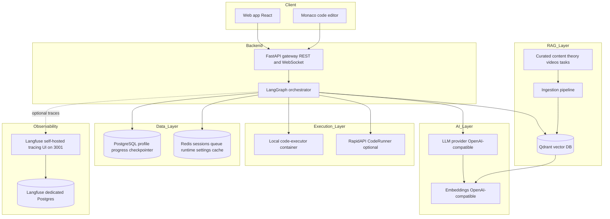
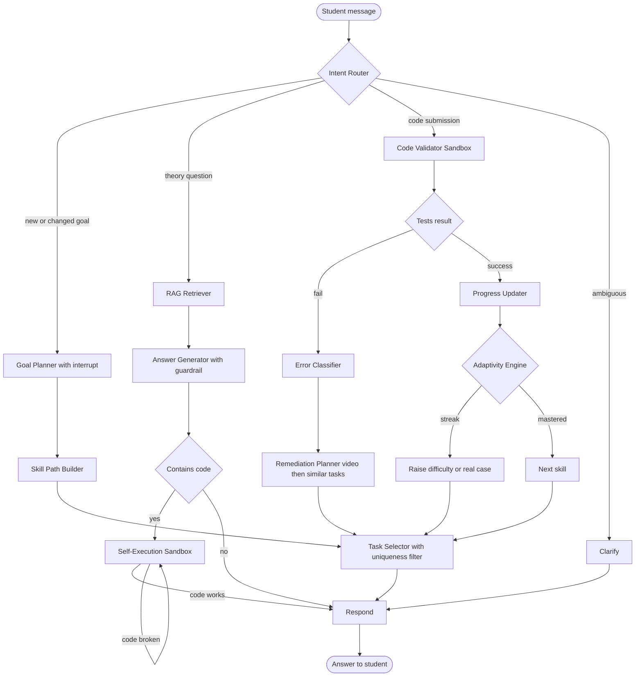
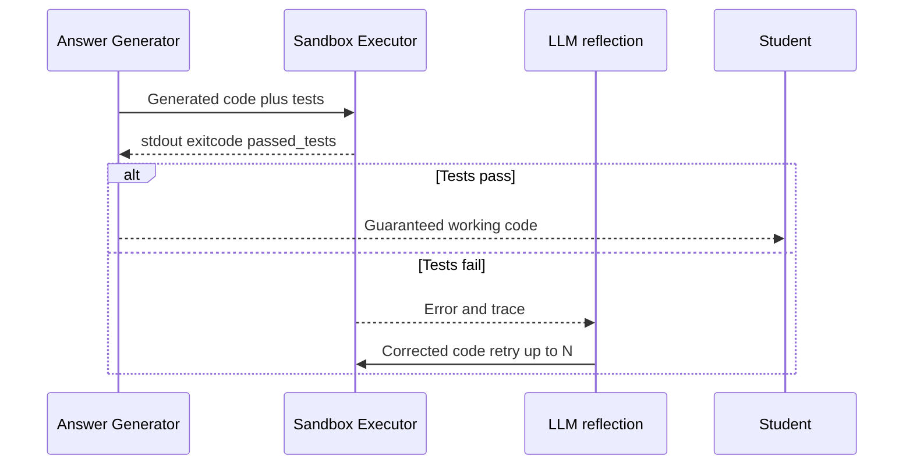
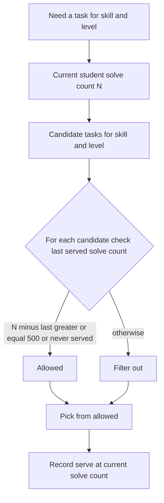
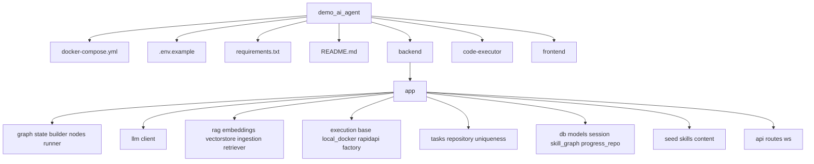

# 🎓 Adaptive AI Coding Tutor

> English version: [README.md](README.md)

> Персональный ментор по программированию, построенный на **LangGraph** + **RAG** + **исполнении кода в песочнице**. Студент формулирует учебную цель на естественном языке, выбирает язык (MVP: **Python** и **JavaScript**), и агент строит персональную траекторию навыков, которая **адаптируется в реальном времени**: при ошибке он направляет к целевому видеоразбору и похожим практическим заданиям; при успехе — повышает сложность и предлагает реальные кейсы. **Каждый** фрагмент кода, который показывает тьютор, — и каждое решение студента — проверяется путём **реального запуска в изолированной песочнице**, что устраняет галлюцинированный, неработающий код.

---

## 1. Что делает агент

### Краткая версия
ИИ-тьютор, который обучает программированию, **адаптируясь к ошибкам и успехам каждого студента**, и **гарантирует работоспособность всего кода**, исполняя его в песочнице перед показом.

### Подробная версия
1. **Принимает цель на естественном языке** — например, *Хочу выучить Python, чтобы автоматизировать рутинную работу*. Если цель неполная, агент задаёт уточняющие вопросы (human-in-the-loop) вместо того, чтобы догадываться.
2. **Строит персональную траекторию** атомарных навыков из Skill Graph (переменные → условия → циклы → функции → коллекции → … → мини-проект). Навыки несут общий ключ **concept**, поэтому при смене языка студентом уже освоенные концепции переиспользуются, и обучается только синтаксическая разница (delta).
3. **Адаптируется в реальном времени** — основной обучающий цикл:
   - Студент решает задачу; его код запускается на видимых **и** скрытых тестах в песочнице.
   - При **неудаче** Error Classifier диагностирует тип ошибки (off-by-one, ошибка типа, логика, таймаут, …); агент извлекает **целевой видеоразбор** для этой ошибки и предлагает **похожие практические задания**. Для продвижения дальше требуются два успеха подряд.
   - При **успехе** сложность растёт; устойчивая серия успехов выводит на **реальные кейсы** (рефакторинг, исправление багов, фичи).
4. **Гарантирует работоспособный код** — любой код, который генерирует агент, сначала запускается в песочнице; если он падает, ошибка передаётся обратно в LLM для попытки повторной генерации (reflection loop) ещё до того, как студент его увидит.

---

## 2. Описание проекта, структура и диаграммы

### 2.1 Высокоуровневая архитектура



> **Runtime-настройки графа.** Четыре адаптивных параметра (`COOLDOWN_SOLVES`, `MAX_REGEN_ATTEMPTS`, `MASTERY_SUCCESS_STREAK`, `ADVANCED_SUCCESS_STREAK`) редактируются в рантайме через `GET/PUT /api/graph/settings` и вкладку UI **Graph Settings** — применяются **без перезапуска бэкенда**. Источник истины — Postgres; Redis (`graph:settings`) — write-through кеш.

> **Наблюдаемость (опционально).** Прогоны LangGraph трассируются в **self-hosted Langfuse** (со своим отдельным Postgres `langfuse-db`, UI на http://localhost:3001) через Langfuse `CallbackHandler`. Трейсинг полностью опционален: без заданных ключей бэкенд работает обычным образом и никогда не зависит от Langfuse.

### 2.2 Поток управления LangGraph



### 2.3 Поток исполнения кода (гарантия отсутствия галлюцинаций)



### 2.4 Cooldown уникальности заданий



### 2.5 Дерево каталогов



```
demo_ai_agent/
├── docker-compose.yml          # Brings up the whole stack
├── .env.example                # Environment template
├── requirements.txt            # Python dependencies
├── README.md
├── backend/
│   ├── Dockerfile
│   └── app/
│       ├── main.py             # FastAPI entry (REST + WebSocket) + startup seeding
│       ├── config.py           # Settings from .env
│       ├── api/                # routes.py, ws.py
│       ├── graph/              # state.py, builder.py, runner.py, nodes/
│       ├── llm/                # client.py (OpenAI-compatible)
│       ├── rag/                # embeddings, vectorstore (Qdrant), ingestion, retriever
│       ├── execution/          # base, local_docker, rapidapi, factory (Strategy)
│       ├── tasks/              # repository.py, uniqueness.py (cooldown 500)
│       ├── db/                 # models, session, skill_graph, progress_repo
│       └── seed/               # skills.py, content/curated.py
├── code-executor/              # Isolated sandbox HTTP service (Python + Node)
│   ├── Dockerfile
│   └── runner.py
└── frontend/                   # React + Monaco editor
    ├── Dockerfile, nginx.conf, vite.config.js, package.json
    └── src/ (App.jsx, api.js, main.jsx, styles.css)
```

---

## 3. Для кого этот агент (гипотезы и предположения)

- **Новички**, которым нужен персональный темп и активное заполнение пробелов. *Гипотеза: отток на статичных курсах высок, потому что нет адаптации к индивидуальным ошибкам.*
- **Разработчики, переходящие на новый язык.** *Гипотеза: переиспользование уже освоенных концепций (циклы, функции) между языками существенно ускоряет обучение, поэтому мы обучаем только синтаксической разнице.*
- **Буткемпы и школы как white-label B2B-продукт.** *Гипотеза: B2B-покупатели готовы платить за снижение нагрузки на менторов при сохранении качества, потому что объективная проверка в песочнице масштабируется там, где ручная проверка — нет.*
- **Самоучки, обжёгшиеся на галлюцинирующих чат-ботах.** *Гипотеза: жёсткая гарантия того, что весь показанный код работает, — решающее отличие по доверию по сравнению с обычными LLM-тьюторами.*

---

## 4. Как запустить

Требования: **Docker** и **Docker Compose**.

1. Скопируйте шаблон окружения и укажите вашего LLM-провайдера:
   ```bash
   copy .env.example .env
   ```
   Задайте как минимум:
   ```
   OPENAI_API_KEY=sk-...
   OPENAI_BASE_URL=https://api.openai.com/v1   # or your provider / local vLLM/Ollama
   LLM_MODEL=gpt-4o-mini
   EMBEDDING_MODEL=text-embedding-3-small
   EMBEDDING_DIM=1536
   ```
   Опционально включите онлайн-исполнение кода через RapidAPI, дополнительно задав `RAPIDAPI_KEY` и `RAPIDAPI_CODERUNNER_HOST` (иначе автоматически используется локальный контейнер `code-executor`).

   Опционально включите **трейсинг Langfuse** (по умолчанию выключен) — оставьте пустым, чтобы отключить:
   ```
   LANGFUSE_PUBLIC_KEY=          # из проекта в Langfuse UI (http://localhost:3001)
   LANGFUSE_SECRET_KEY=
   LANGFUSE_HOST=http://langfuse:3000   # внутренний адрес в сети compose
   ```

2. Соберите образы и поднимите стек. Проверенный путь сборки обходит проблему DNS **EAI_AGAIN** в песочнице Docker-сборки (где `npm`/`PyPI` не могут резолвить реестры) за счёт использования BuildKit-сборщика с включённым DNS (конфигурация в [`buildkitd.toml`](buildkitd.toml:1)):

   ```bash
   copy .env.example .env

   # One-time: create a DNS-enabled BuildKit builder to work around the
   # EAI_AGAIN DNS issue in the Docker build sandbox (npm/PyPI cannot resolve)
   docker buildx create --name dnsbuilder --driver docker-container --config buildkitd.toml

   # Build images via the DNS-enabled builder
   docker buildx --builder dnsbuilder build --load -t demo_ai_agent-frontend:latest ./frontend
   docker buildx --builder dnsbuilder build --load -f backend/Dockerfile -t demo_ai_agent-backend:latest .
   docker buildx --builder dnsbuilder build --load -t demo_ai_agent-code-executor:latest ./code-executor

   # Start the whole stack
   docker compose up -d
   ```

   Это запускает: `postgres`, `qdrant`, `redis`, `code-executor`, `backend`, `frontend`, а также **`langfuse`** и его отдельный Postgres **`langfuse-db`** — все с healthcheck'ами и упорядоченными `depends_on`. При первом запуске бэкенд создаёт таблицы, заполняет Skill Graph (Python + JavaScript), создаёт строку runtime-настроек графа и индексирует подготовленный контент RAG. Образы Langfuse и его Postgres подтягиваются готовыми (pull, сборка не нужна).

3. Доступ к сервисам:
   - **Frontend:** http://localhost:3000
   - **API docs:** http://localhost:8000/docs
   - **Health:** http://localhost:8000/health
   - **Langfuse (UI трейсинга):** http://localhost:3001

### Runtime-настройки графа (без перезапуска)

Адаптивные параметры можно менять на лету:

- **UI:** откройте вкладку **Graph Settings** во фронтенде, отредактируйте значения и нажмите Save. Здесь же есть ссылка на UI трейсинга Langfuse.
- **API:**
  - `GET /api/graph/settings` → текущие значения.
  - `PUT /api/graph/settings` с JSON-телом любого подмножества `COOLDOWN_SOLVES`, `MAX_REGEN_ATTEMPTS`, `MASTERY_SUCCESS_STREAK`, `ADVANCED_SUCCESS_STREAK` (положительные целые, валидируются) → сохраняет в Postgres, обновляет Redis-кеш и возвращает новые значения. Изменения применяются сразу на следующем ходу графа.

### Включение трейсинга Langfuse (опционально)

Трейсинг выключен по умолчанию. Чтобы включить: откройте http://localhost:3001, создайте проект, скопируйте его **public** и **secret** ключи в `.env` как `LANGFUSE_PUBLIC_KEY` / `LANGFUSE_SECRET_KEY` (оставьте `LANGFUSE_HOST=http://langfuse:3000` для сети compose), затем выполните `docker compose up -d backend`. Без ключей бэкенд работает нормально и никогда не падает из-за Langfuse.

4. Попробуйте сквозной сценарий: введите *I want to learn Python loops*, получите задачу, напишите решение в редакторе Monaco, нажмите **Run & Check**. Неверный ответ запускает видеоразбор + похожие задания; два верных ответа продвигают вас к следующему навыку.

> **Примечание:** На хостах, где песочница Docker-сборки нормально резолвит DNS (npm/PyPI), достаточно стандартного `docker compose up --build` (DNS-сборщик не нужен). `docker-compose.yml` фиксирует имена `image:`, которые производит шаг buildx, поэтому после сборки образы переиспользуются командой `docker compose up` без пересборки.

> **Примечание:** Адаптивная петля и sandbox-гарантия кода работают end-to-end даже без реального LLM-ключа (graceful degradation — placeholder-ключ приводит к локальному fallback эмбеддингов, и граф не падает).

> Система деградирует плавно: если эндпоинт эмбеддингов недоступен, используется детерминированный локальный fallback, а если не удаётся инициализировать checkpointer на Postgres, происходит откат на in-memory checkpointer — так что демо всё равно работает.

---

## 5. Граничные случаи и как они обрабатываются

1. **Неполные данные о цели** — студент пишет *I want to learn*. **Goal Planner** использует LangGraph `interrupt` (human-in-the-loop), чтобы спросить, какой язык и цель, вместо того чтобы догадываться. UI показывает вопрос, а ответ возобновляет граф.
2. **Ошибки внешних API** — вызовы LLM/эмбеддингов/RapidAPI обёрнуты в **retry с экспоненциальной задержкой** (`tenacity`). Если **RapidAPI** падает во время выполнения, фабрика исполнителей прозрачно **откатывается на локальный исполнитель**. Если **LLM** недоступен, агент возвращает дружелюбное сообщение, а состояние сессии сохраняется для последующего возобновления.
3. **Неоднозначный запрос** — **Intent Router** возвращает оценку уверенности; ниже порога он направляет к узлу **Clarify** и просит студента уточнить, вместо того чтобы выбирать путь наугад.
4. **Таймаут кода студента (бесконечный цикл)** — песочница применяет **жёсткий лимит по реальному времени (wall-clock)** и ограничение по памяти; результат отмечается как `timed_out`, тьютор отвечает *execution timed out — check your loop exit condition* и направляет на remediation.
5. **Конфликтующие инструкции** — студент просит *just give me the answer* во время активной задачи. **Guardrail** в Answer Generator отказывает в полном решении и возвращает **подсказки**, объясняя педагогическую причину.

---

## 6. Почему обычного детерминированного workflow недостаточно

- **Траектория не фиксирована.** Следующий шаг зависит от **типа ошибки**, истории студента и цели — это **циклический граф с ветвлением**, а не линейный pipeline.
- **Петли обратной связи незаменимы.** Повторная генерация кода до прохождения тестов (Self-Execution) и remediation до освоения — естественные **петли** в LangGraph, но неуклюжие и хрупкие в статичном workflow.
- **Маршрутизация зависит от семантики.** Классификация намерений и классификация ошибок требуют **семантического анализа LLM**, результат которого меняет маршрут — недетерминированное ветвление, которое фиксированный DAG не способен выразить.
- **Прерывания human-in-the-loop.** Пауза для уточнения цели у студента (и возобновление ровно с места остановки) требует **checkpointed, прерываемой** конечной машины состояний, чего однопроходный детерминированный pipeline предоставить не может.

---

## 7. Критерии эффективности и допустимые пороги

| Критерий | Что измеряет | Допустимый порог |
|-----------|------------------|----------------------|
| **Корректность показанного кода** | Доля показанного агентом кода, прошедшего тесты в песочнице до показа | **100% by design** (сломанный код никогда не показывается); повторная генерация успешна в **≥ 95%** случаев за **≤ 3** попытки |
| **Точность диагностики ошибок** | Доля корректно классифицированных ошибок студента | **≥ 85%** на размеченной выборке |
| **Уникальность заданий** | Доля выдач, нарушающих cooldown в 500 решений | **0%** нарушений |
| **Задержка ответа** | Медианное время ответа агента без видео | **≤ 5 s** медиана, **≤ 10 s** p95 |

Критерий уникальности напрямую проверяется через `GET /api/uniqueness/audit?user_id=...&task_id=...`.

---

## 8. Источники данных и интеграции

- **LLM API** — OpenAI-совместимый, провайдер настраивается в `.env` (`OPENAI_BASE_URL`, `OPENAI_API_KEY`, `LLM_MODEL`). Используется для классификации намерений, извлечения цели, генерации ответов, классификации ошибок и повторной генерации кода.
- **Embeddings API** — OpenAI-совместимый (`EMBEDDING_MODEL`) для векторизации контента и запросов, с детерминированным офлайн-fallback.
- **Qdrant** — векторная БД, хранящая подготовленную теорию, видеоразборы и условия задач с метаданными-фильтрами (language, concept, doc_type, error_type).
- **PostgreSQL** — профиль пользователя, прогресс по навыкам, попытки, **`task_serve_history`** (cooldown уникальности) и **LangGraph checkpointer**.
- **Redis** — сессии, очередь песочницы, rate limiting и **кеш runtime-настроек графа** (`graph:settings`, источник истины — Postgres).
- **Langfuse (self-hosted, опционально)** — наблюдаемость/трейсинг LangGraph через `CallbackHandler`, с **собственным отдельным Postgres** (`langfuse-db`). UI на http://localhost:3001; включается только при заданных ключах, иначе трейсинг пропускается без влияния на бэкенд.
- **Контейнер code-executor** — изолированная локальная песочница (Python + Node) с лимитами по времени/памяти и эфемерной файловой системой.
- **RapidAPI CodeRunner** (опционально) — онлайн-исполнение кода при наличии конфигурации; фабрика откатывается на локальный при сбое.
- **Подготовленные документы** — заметки по теории, задачи по программированию (условие + видимые/скрытые тесты + проверенное в песочнице эталонное решение) и видеоразборы (с URL и тайм-кодами), заполняемые в [`backend/app/seed/content/curated.py`](backend/app/seed/content/curated.py:1).

---

## Соответствие ключевым требованиям

| # | Требование | Где |
|---|-------------|-------|
| 1 | Однокомандный `docker compose up` с healthcheck'ами + depends_on | [`docker-compose.yml`](docker-compose.yml:1) |
| 2 | `requirements.txt` со всеми Python-зависимостями | [`requirements.txt`](requirements.txt:1) |
| 3 | README со всеми разделами | этот файл |
| 4 | LLM через OpenAI-совместимый протокол, провайдер в `.env` | [`backend/app/llm/client.py`](backend/app/llm/client.py:1), [`.env.example`](.env.example:1) |
| 5 | Уникальность заданий, cooldown 500 + `task_serve_history` | [`backend/app/tasks/uniqueness.py`](backend/app/tasks/uniqueness.py:1), [`backend/app/db/models.py`](backend/app/db/models.py:1) |
| 6 | Опциональный RapidAPI CodeRunner через паттерн Strategy | [`backend/app/execution/`](backend/app/execution/base.py:1) (base/local_docker/rapidapi/factory) |
