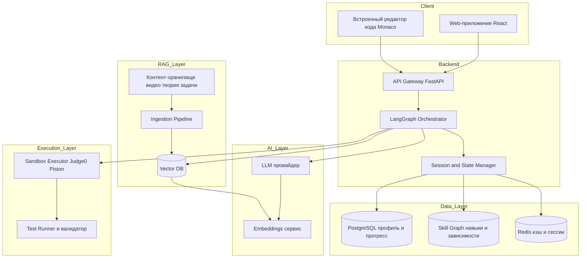
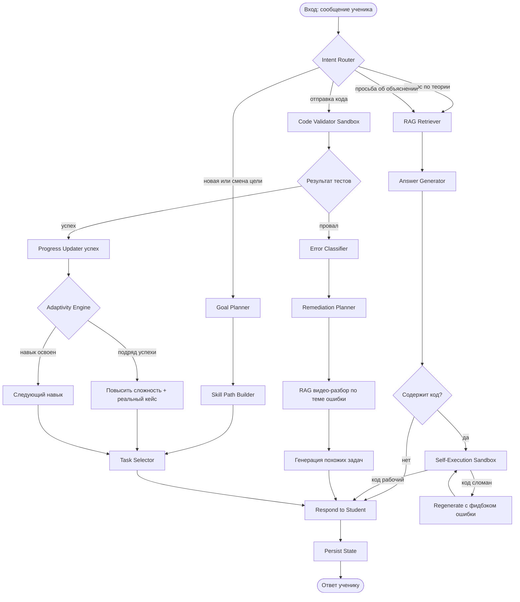
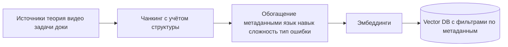
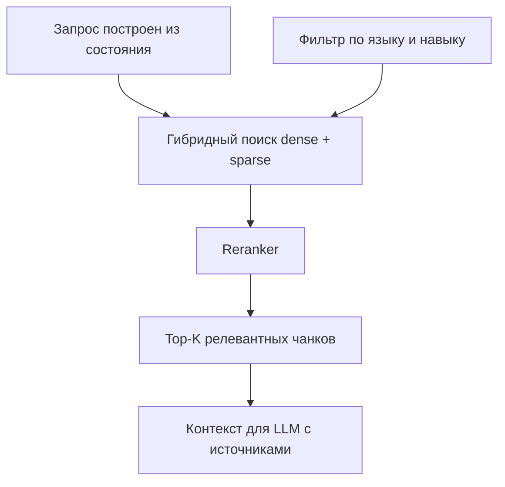
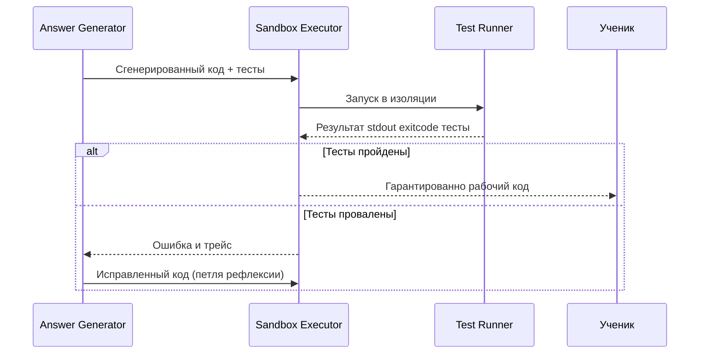
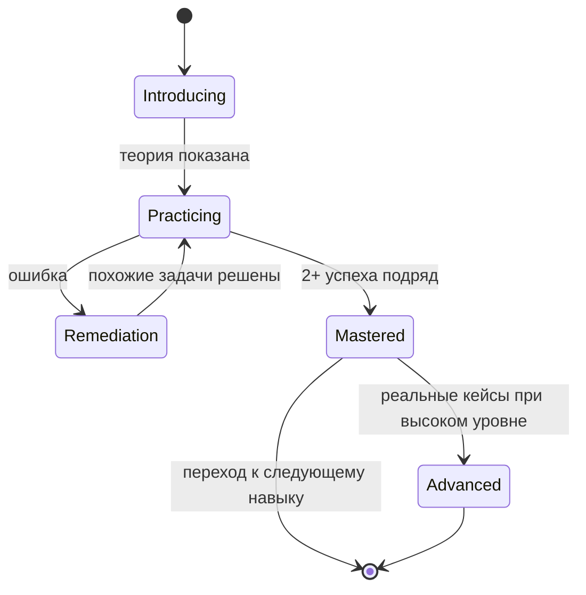
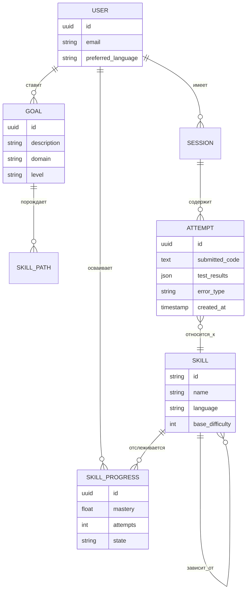

# Адаптивный AI-репетитор по программированию — Техническая архитектура

> AI-агент на **LangGraph** с **RAG** и **sandbox-исполнением кода**, который обучает программированию, адаптируясь под выбранный учеником язык и цель обучения. Курс динамически перестраивается на основе ошибок и успехов студента, а весь выдаваемый код гарантированно проверяется запуском в изолированной среде.

---

## 1. Расширенное описание продукта (идея №13)

### 1.1 Суть

Это не статичный курс, а **персональный наставник**, который:

1. **Принимает цель от ученика на естественном языке** — «хочу научиться писать backend на Python», «хочу делать игры на JavaScript», «готовлюсь к собеседованию по алгоритмам». Агент сам выбирает язык, если ученик не определился, либо подстраивается под явный выбор.
2. **Строит персональную траекторию** из атомарных навыков (переменные → условия → циклы → функции → структуры данных → ООП → работа с API → проект). Траектория не линейна: она ветвится в зависимости от целей и текущего уровня.
3. **Адаптируется в реальном времени.** Ключевая петля обучения:
   - Ученик решает задачу.
   - Если **ошибается** (например, в задаче на циклы) → граф предлагает **видео-разбор** именно этой темы (из RAG-базы), затем **тест с похожими примерами** для закрепления.
   - Если **успешно справляется** → граф повышает сложность и выдаёт **реальные кейсы из настоящих проектов** (рефакторинг, отладка, фичи).
4. **Гарантирует работоспособность кода.** Любой код или решение, которое агент показывает ученику (примеры, эталонные решения, проверка задач), **сначала исполняется в sandbox** и проходит автотесты. Ученик никогда не получает неработающий код — это центральное отличие от обычных LLM-репетиторов, склонных к галлюцинациям.

### 1.2 Пользовательские сценарии

**Сценарий A — постановка цели и старт.**
Новичок пишет: «Хочу научиться Python, чтобы автоматизировать рутину на работе». Агент задаёт 2-3 уточняющих вопроса (опыт, доступное время), определяет стартовую точку через короткий диагностический мини-тест и формирует первый модуль. Цель сохраняется в профиле и влияет на подбор примеров (автоматизация Excel/файлов, а не геймдев).

**Сценарий B — обучение через ошибку.**
Ученик решает задачу на циклы и допускает off-by-one ошибку. Агент запускает его код в sandbox, видит проваленные тесты, **классифицирует тип ошибки** (граница диапазона), вместо простого ответа выдаёт целевой видео-разбор по циклам и границам из RAG, затем — серию из 3 похожих микро-задач. Только при 2 успешных подряд граф разрешает двигаться дальше.

**Сценарий C — рост сложности.**
Ученик уверенно решает базовые задачи. Граф фиксирует высокий success rate и подгружает из RAG реальный кейс: «вот фрагмент open-source проекта с багом в цикле обработки данных — найди и исправь». Эталонное исправление предварительно прогоняется через sandbox с тестами, чтобы подсказка-проверка была корректной.

**Сценарий D — смена/добавление цели.**
Ученик, освоив основы Python, говорит: «теперь хочу JavaScript для фронтенда». Агент переиспользует общие навыки (циклы, функции уже освоены — отмечены в knowledge graph), фокусируясь только на дельте (синтаксис JS, DOM, асинхронность), экономя время ученика.

---

## 2. Высокоуровневая архитектура системы



### Компоненты

| Слой | Компонент | Назначение |
|------|-----------|------------|
| Клиент | React + Monaco Editor | UI обучения, редактор кода, проигрывание видео-разборов |
| Backend | FastAPI Gateway | REST/WebSocket API, аутентификация, стриминг ответов |
| Backend | LangGraph Orchestrator | Ядро принятия решений и адаптивная петля обучения |
| AI | LLM + Embeddings | Генерация объяснений/задач, векторизация контента и запросов |
| RAG | Vector DB + Ingestion | Хранение и поиск релевантного учебного контента |
| Execution | Sandbox Executor | Гарантия работоспособности кода через реальный запуск |
| Data | PostgreSQL + Skill Graph + Redis | Профиль, прогресс, карта навыков, кэш сессий |

---

## 3. Ядро: граф LangGraph

### 3.1 Состояние графа (TutorState)

```python
class TutorState(TypedDict):
    # Идентификация и цель
    user_id: str
    session_id: str
    language: str                 # python | javascript (MVP)
    learning_goal: str            # цель ученика на естественном языке
    goal_profile: dict            # извлечённые параметры цели (домен, уровень, темп)

    # Текущая позиция в обучении
    current_skill: str            # активный навык (например loops)
    skill_state: str              # introducing | practicing | remediation | mastered
    difficulty_level: int         # 1..5

    # Взаимодействие
    user_message: str             # ввод ученика (текст или код)
    submitted_code: str | None    # код, отправленный на проверку
    retrieved_context: list       # результаты RAG
    execution_result: dict | None # результат sandbox (stdout, tests, errors)

    # Диагностика
    last_error_type: str | None   # классификация ошибки (off_by_one, type_error, ...)
    consecutive_successes: int
    consecutive_failures: int

    # Вывод
    agent_response: str           # финальный ответ ученику
    next_action: str              # маршрутизация
    messages: Annotated[list, add_messages]  # история диалога
```

### 3.2 Узлы и поток управления



### 3.3 Описание узлов

| Узел | Роль |
|------|------|
| **Intent Router** | Классифицирует ввод: постановка цели / вопрос / отправка кода / просьба объяснить. Условный edge LangGraph. |
| **Goal Planner** | Извлекает из NL-цели параметры (язык, домен, уровень, темп), задаёт уточняющие вопросы (human-in-the-loop через `interrupt`). |
| **Skill Path Builder** | Строит персональную траекторию навыков из Skill Graph под цель. |
| **Task Selector** | Подбирает задачу из RAG под текущий навык и уровень сложности. |
| **RAG Retriever** | Гибридный поиск релевантного контента (теория/видео/примеры). |
| **Answer Generator** | LLM генерирует объяснение/решение на основе retrieved_context (с цитированием источника). |
| **Self-Execution** | **КРИТИЧНО**: любой сгенерированный код прогоняется в sandbox. Если падает — цикл регенерации с передачей ошибки обратно в LLM (рефлексия). |
| **Code Validator** | Запускает код ученика против скрытых и видимых тестов в sandbox. |
| **Error Classifier** | LLM + правила: определяет тип ошибки (синтаксис, off-by-one, тип данных, логика, производительность). |
| **Remediation Planner** | Решает стратегию исправления пробела: видео-разбор → похожие задачи. |
| **Adaptivity Engine** | На основе серий успехов/провалов решает: remediation / повысить сложность / следующий навык. |
| **Progress Updater** | Обновляет профиль, прогресс, mastery-уровни в Skill Graph. |
| **Persist State** | Чекпоинт состояния через LangGraph checkpointer (PostgreSQL). |

### 3.4 Ключевые механизмы LangGraph

- **Условные рёбра (conditional edges)** — маршрутизация по `intent` и результатам тестов.
- **Циклы (loops)** — петля регенерации кода в Self-Execution и петля remediation до достижения mastery.
- **Human-in-the-loop (`interrupt`)** — уточнение цели, ожидание решения ученика.
- **Checkpointer (PostgresSaver)** — персистентность состояния сессии, возможность продолжить обучение с любого места.
- **Streaming** — потоковая выдача объяснений в UI.

---

## 4. RAG-пайплайн

### 4.1 Источники контента

| Тип | Содержимое | Метаданные |
|-----|-----------|-----------|
| Теория | Конспекты по темам (markdown) | язык, навык, уровень |
| Видео-разборы | Транскрипты + тайм-коды + ссылки | навык, тип ошибки, длительность |
| Задачи | Условие + тесты + эталон | навык, сложность 1-5, домен |
| Реальные кейсы | Фрагменты open-source с задачами | навык, язык, тип (рефакторинг/баг/фича) |
| Документация | Официальная дока Python/JS | язык, тема |

### 4.2 Конвейер индексации (Ingestion)



- **Чанкинг**: семантический по разделам; код хранится целыми блоками (не рвём функции).
- **Метаданные** обязательны для фильтрации — поиск всегда ограничен текущим языком и навыком.

### 4.3 Стратегия извлечения (Retrieval)

- **Гибридный поиск**: dense (векторный) + sparse (BM25/ключевые слова) с reranking.
- **Метаданные-фильтрация**: `language == state.language AND skill IN target_skills`.
- **Контекстно-зависимые запросы**: при remediation запрос строится из `last_error_type` → подтягивается именно видео-разбор по этой ошибке.
- **Цитирование источника** в ответе — для доверия и возможности углубиться.



---

## 5. Подсистема гарантии кода (Sandbox)

> Центральное требование: ученик **никогда** не получает неработающий код, и его решения проверяются объективно — реальным исполнением, а не «мнением» LLM.

### 5.1 Два режима использования

1. **Self-Execution (исходящий код агента).** Перед показом любого примера/решения код запускается в sandbox с автотестами. При падении — ошибка возвращается в LLM для регенерации (до N попыток). Только зелёный прогон попадает к ученику.
2. **Validation (входящий код ученика).** Код ученика прогоняется против набора тестов (видимых + скрытых) — объективная оценка вместо догадок LLM.



### 5.2 Технологический выбор sandbox

| Вариант | Плюсы | Минусы | Рекомендация |
|---------|-------|--------|--------------|
| **Judge0** | Self-host, 60+ языков, готовый API, лимиты ресурсов | Требует инфраструктуры | **Рекомендуется для MVP** (быстрый старт, многоязычность из коробки) |
| **Piston** | Лёгкий, open-source, простой | Меньше контроля над лимитами | Хорошая альтернатива/бэкап |
| **Кастомный Docker-per-run** | Полный контроль, изоляция | Сложнее поддерживать, холодный старт | Для production-масштаба позже |

**Меры безопасности**: запуск без сети, лимиты CPU/RAM/времени, неперсистентная FS, gVisor/seccomp профили, очередь задач, пул прогретых контейнеров для снижения латентности.

---

## 6. Модель адаптивности

### 6.1 Конечный автомат состояния навыка



### 6.2 Логика движка адаптивности

| Сигнал | Решение графа |
|--------|---------------|
| Ошибка в задаче | Классифицировать → видео-разбор по теме ошибки → 3 похожих задачи |
| 2 успеха подряд | Навык засчитан как mastered → следующий навык |
| Серия успехов на mastered | Эскалация: реальные кейсы из проектов (повышенная сложность) |
| Повторные провалы одного типа | Понизить сложность, сменить формат объяснения, предложить базовый prerequisite |

### 6.3 Классификация ошибок

Гибрид: статический анализ/парсинг трейса (детерминированно) + LLM-классификатор (семантика логических ошибок). Тип ошибки → ключ для RAG-запроса релевантного видео-разбора.

---

## 7. Модель данных

### 7.1 Профиль и прогресс (PostgreSQL)



### 7.2 Skill Graph (карта навыков)

Граф зависимостей навыков (переменные → циклы → функции → ...). Общие навыки переиспользуются между языками: при добавлении нового языка mastered-навыки засчитываются, обучается только дельта синтаксиса.

---

## 8. Технологический стек

| Слой | Технология | Обоснование |
|------|-----------|-------------|
| Оркестрация | **LangGraph** | Циклы, условная маршрутизация, checkpointing, human-in-the-loop — точно ложится на адаптивную петлю |
| Backend | **FastAPI (Python)** | Async, WebSocket-стриминг, нативная интеграция с LangGraph |
| LLM | Сильная code-модель (через провайдер/локально) | Качество генерации и понимания кода критично |
| Embeddings | Code-aware эмбеддинги | Точный поиск по коду и технической теории |
| Vector DB | **Qdrant** (или pgvector для старта) | Фильтрация по метаданным, гибридный поиск, self-host |
| Sandbox | **Judge0** (self-host) | Многоязычность, готовый API, лимиты ресурсов |
| Реляционная БД | **PostgreSQL** | Профиль, прогресс, LangGraph checkpointer |
| Кэш/сессии | **Redis** | Сессии, очередь sandbox-задач, rate limiting |
| Frontend | **React + Monaco Editor** | Профессиональный редактор кода в браузере |
| Деплой | Docker Compose → Kubernetes | От MVP к масштабированию |

---

## 9. Монетизация и MVP

### 9.1 Модель монетизации

- **Freemium**: базовый язык, ограниченное число задач/день — бесплатно.
- **Subscription (B2C)**: безлимит, все языки, видео-разборы, реальные кейсы, трекинг прогресса — основной доход.
- **B2B-лицензирование**: white-label для буткемпов, школ, корпоративного обучения (цена за обучаемого).
- **Marketplace кейсов**: продвинутые наборы реальных проектов как платные паки.

Конкурентное преимущество для продаж: **гарантия работоспособности кода** (sandbox) + **истинная персонализация** (адаптивная петля) — то, чего не дают статичные курсы и обычные чат-боты.

### 9.2 MVP-скоуп

**Входит:**
- 2 языка: **Python + JavaScript**.
- Постановка цели на NL + базовый Skill Graph (10-15 навыков на язык).
- Полная адаптивная петля: ошибка → видео-разбор → похожие задачи → эскалация.
- Sandbox-исполнение (Judge0) для гарантии кода и проверки решений.
- RAG по курируемой базе теории/видео/задач.
- Веб-интерфейс с редактором кода и трекингом прогресса.

**Вне MVP (следующие итерации):**
- Дополнительные языки (расширение через Judge0 минимально).
- Интеграция внешних источников (YouTube, реальные репозитории GitHub).
- Геймификация, сертификаты, командное обучение.
- Мобильное приложение.

---

## 10. Риски и решения

| Риск | Решение |
|------|---------|
| Латентность sandbox | Пул прогретых контейнеров, кэш результатов, асинхронная очередь |
| Безопасность исполнения чужого кода | Сетевая изоляция, лимиты ресурсов, gVisor/seccomp, эфемерная FS |
| Галлюцинации в коде | Обязательный self-execution перед выдачей + петля регенерации |
| Качество RAG-контента | Курируемая база на старте, метаданные, reranking, цитирование источников |
| Стоимость LLM-вызовов | Кэширование, маршрутизация простых задач на дешёвые модели |
```
