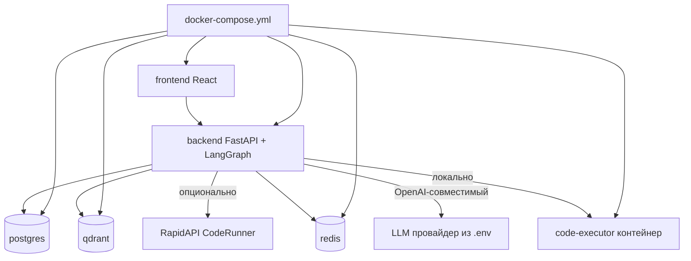
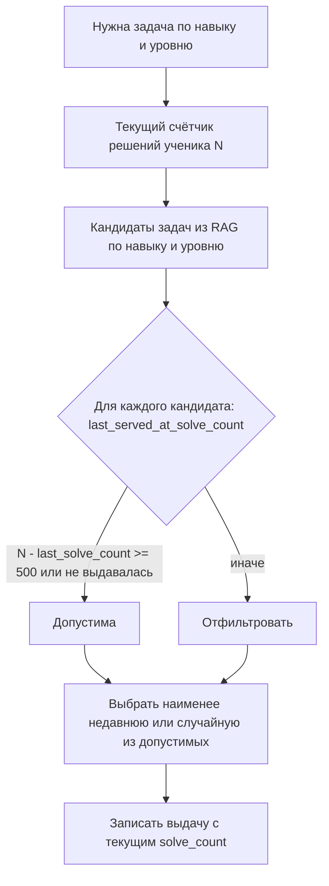
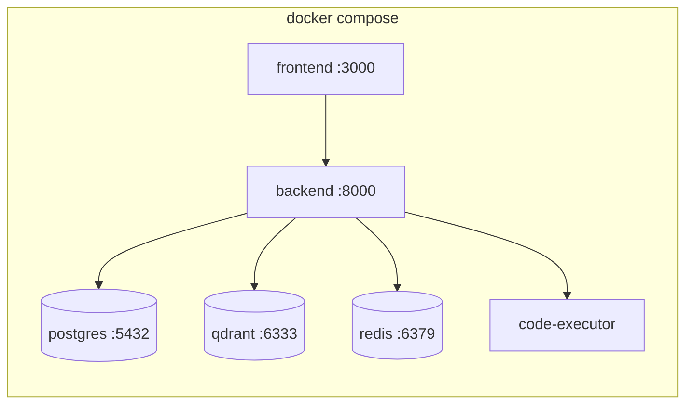

# План реализации — Адаптивный AI-репетитор по программированию

> Детальный план работ для реализации MVP. Дополняет [`adaptive-coding-tutor-architecture.md`](adaptive-coding-tutor-architecture.md) конкретными инженерными решениями с учётом дополнительных требований.

---

## 1. Дополнительные требования (учтены)

| № | Требование | Как реализуется |
|---|-----------|-----------------|
| 1 | Старт всего проекта через **docker compose** | `docker-compose.yml` поднимает: backend, postgres, qdrant, redis, code-executor, frontend |
| 2 | **requirements.txt** для зависимостей | Полный файл со всеми Python-зависимостями |
| 3 | **README** — что делает агент и как запустить | Развёрнутый README со всеми требуемыми разделами |
| 4 | LLM через **OpenAI-совместимый протокол**, провайдер в `.env` | Единый клиент `openai` SDK, `OPENAI_BASE_URL` + `OPENAI_API_KEY` + `LLM_MODEL` в `.env` |
| 5 | **Проверка уникальности задач** (не чаще 1 раза на 500 решений ученика) | Таблица истории выдач + фильтр-кулдаун на основе счётчика решений |
| 6 | Опциональная интеграция **RapidAPI CodeRunner** | Если заданы `RAPIDAPI_KEY` и `RAPIDAPI_CODERUNNER_HOST` — онлайн-проверка, иначе локальный Docker-контейнер |

---

## 2. Структура проекта

```
demo_ai_agent/
├── docker-compose.yml          # Старт всего стека
├── .env.example                # Шаблон переменных окружения
├── README.md                   # Главная документация
├── requirements.txt            # Python-зависимости
├── backend/
│   ├── Dockerfile
│   ├── app/
│   │   ├── main.py             # FastAPI входная точка (REST + WebSocket)
│   │   ├── config.py           # Загрузка .env, настройки
│   │   ├── api/
│   │   │   ├── routes.py       # Эндпоинты (chat, submit_code, goal)
│   │   │   └── ws.py           # WebSocket стриминг ответов
│   │   ├── graph/
│   │   │   ├── state.py        # TutorState (TypedDict)
│   │   │   ├── builder.py      # Сборка LangGraph графа
│   │   │   └── nodes/          # Узлы графа (отдельный файл на узел)
│   │   │       ├── router.py
│   │   │       ├── goal_planner.py
│   │   │       ├── skill_path.py
│   │   │       ├── task_selector.py
│   │   │       ├── retriever.py
│   │   │       ├── answer_generator.py
│   │   │       ├── self_execution.py
│   │   │       ├── code_validator.py
│   │   │       ├── error_classifier.py
│   │   │       ├── remediation.py
│   │   │       ├── adaptivity.py
│   │   │       └── progress.py
│   │   ├── llm/
│   │   │   └── client.py        # OpenAI-совместимый клиент (провайдер из .env)
│   │   ├── rag/
│   │   │   ├── embeddings.py    # Эмбеддинги (OpenAI-совместимые)
│   │   │   ├── vectorstore.py   # Обёртка над Qdrant
│   │   │   ├── ingestion.py     # Индексация контента
│   │   │   └── retriever.py     # Гибридный поиск + фильтры
│   │   ├── execution/
│   │   │   ├── base.py          # Интерфейс CodeExecutor
│   │   │   ├── local_docker.py  # Локальный запуск в контейнере
│   │   │   ├── rapidapi.py      # RapidAPI CodeRunner
│   │   │   └── factory.py       # Выбор executor по .env
│   │   ├── tasks/
│   │   │   └── uniqueness.py    # Проверка уникальности задач (кулдаун 500)
│   │   ├── db/
│   │   │   ├── models.py        # SQLAlchemy модели
│   │   │   ├── session.py       # Подключение к PostgreSQL
│   │   │   └── skill_graph.py   # Карта навыков и зависимостей
│   │   └── seed/
│   │       ├── skills.py        # Сид навыков (Python, JS)
│   │       └── content/         # Курируемый контент (теория, задачи, видео-ссылки)
│   └── tests/
│       └── ...                  # Unit-тесты ключевых узлов
├── code-executor/
│   ├── Dockerfile               # Образ с Python + Node для sandbox
│   └── runner.py                # Изолированный запуск кода с лимитами
├── frontend/
│   ├── Dockerfile
│   ├── package.json
│   └── src/
│       ├── App.jsx              # UI: чат + Monaco редактор + прогресс
│       └── api.js               # Клиент к backend
└── plans/
    ├── adaptive-coding-tutor-architecture.md
    └── implementation-plan.md
```



---

## 3. Реализация ключевых требований

### 3.1 OpenAI-совместимая интеграция LLM (треб. №4)

Единый клиент через официальный `openai` SDK с настраиваемым `base_url`. Это позволяет подключить любой совместимый провайдер (OpenAI, локальный vLLM/Ollama, OpenRouter, Together и т.п.) без изменения кода.

```python
# backend/app/llm/client.py
from openai import OpenAI
from app.config import settings

def get_llm_client() -> OpenAI:
    return OpenAI(
        api_key=settings.OPENAI_API_KEY,
        base_url=settings.OPENAI_BASE_URL,  # напр. https://api.openai.com/v1 или http://ollama:11434/v1
    )

def chat(messages: list, model: str | None = None, **kwargs) -> str:
    client = get_llm_client()
    resp = client.chat.completions.create(
        model=model or settings.LLM_MODEL,
        messages=messages,
        **kwargs,
    )
    return resp.choices[0].message.content
```

`.env`:
```
OPENAI_API_KEY=sk-...
OPENAI_BASE_URL=https://api.openai.com/v1
LLM_MODEL=gpt-4o-mini
EMBEDDING_MODEL=text-embedding-3-small
```

### 3.2 Слой исполнения кода: локально или через RapidAPI (треб. №6)

Паттерн «Стратегия» — общий интерфейс, выбор реализации по наличию переменных окружения.

```python
# backend/app/execution/factory.py
from app.config import settings
from app.execution.local_docker import LocalDockerExecutor
from app.execution.rapidapi import RapidApiCodeRunner

def get_executor():
    if settings.RAPIDAPI_KEY and settings.RAPIDAPI_CODERUNNER_HOST:
        return RapidApiCodeRunner()   # онлайн-проверка
    return LocalDockerExecutor()      # локальный контейнер (по умолчанию)
```

```python
# backend/app/execution/base.py
from abc import ABC, abstractmethod
from dataclasses import dataclass

@dataclass
class ExecutionResult:
    success: bool
    stdout: str
    stderr: str
    exit_code: int
    passed_tests: int
    total_tests: int
    duration_ms: int

class CodeExecutor(ABC):
    @abstractmethod
    def run(self, language: str, code: str, tests: list) -> ExecutionResult: ...
```

`.env` (опционально):
```
# Если заданы — проверка кода идёт онлайн через RapidAPI, иначе локально
RAPIDAPI_KEY=
RAPIDAPI_CODERUNNER_HOST=
```

**Локальный executor** запускает код в `code-executor` контейнере с лимитами (CPU, RAM, timeout, без сети, эфемерная FS).

### 3.3 Проверка уникальности задач (треб. №5)

Задача не должна повторяться у ученика чаще, чем 1 раз на 500 его решений. Реализация через таблицу истории + счётчик решений.



```python
# backend/app/tasks/uniqueness.py
COOLDOWN_SOLVES = 500

def filter_unique_tasks(user_id, candidates, current_solve_count, history):
    """Возвращает задачи, не выдававшиеся в последних 500 решениях ученика."""
    allowed = []
    for task in candidates:
        last = history.get(task.id)  # solve_count на момент последней выдачи
        if last is None or (current_solve_count - last) >= COOLDOWN_SOLVES:
            allowed.append(task)
    # если все на кулдауне — берём самую давнюю
    if not allowed:
        allowed = sorted(candidates, key=lambda t: history.get(t.id, -1))[:5]
    return allowed
```

Модель данных:
```python
# Таблица task_serve_history
# user_id | task_id | served_at_solve_count | served_at (timestamp)
```

---

## 4. docker-compose (треб. №1)



Сервисы: `frontend`, `backend`, `postgres`, `qdrant`, `redis`, `code-executor`. Healthchecks и `depends_on` для корректного порядка старта. Один `docker compose up` поднимает всё.

---

## 5. Содержание README (треб. №3 + расширенные пункты)

README будет включать:

1. **Что делает агент** — краткое и развёрнутое описание.
2. **Описание и структура проекта с диаграммами** — Mermaid: архитектура, граф LangGraph, поток исполнения кода, структура каталогов.
3. **Кому подойдёт агент (гипотезы)** — целевые сегменты и предположения.
4. **Как запустить** — `.env` из `.env.example`, `docker compose up`, доступ к UI.
5. **Edge cases (3+)** — неполные данные, ошибки внешних API, неоднозначные запросы, таймауты.
6. **Почему недостаточно обычного workflow/детерминированного пайплайна.**
7. **Критерии оценки результативности (3-4)** с приемлемыми порогами.
8. **Источники данных и интеграции** — API, БД, документы, очереди, внутренние сервисы.

### 5.1 Заготовки контента README

**Кому подойдёт (гипотезы):**
- Начинающие, которым нужен персональный темп и борьба с пробелами (гипотеза: отсев на статичных курсах высок из-за отсутствия адаптации).
- Переключающиеся на новый язык разработчики (гипотеза: переиспользование навыков ускоряет обучение).
- Буткемпы и校 школы как white-label (гипотеза: B2B готов платить за снижение нагрузки на менторов).

**Edge cases:**
1. **Неполные данные о цели** — ученик пишет «хочу учиться». → Goal Planner через human-in-the-loop (`interrupt`) задаёт уточняющие вопросы вместо догадок.
2. **Ошибка внешнего API (LLM/RapidAPI недоступен)** — retry с backoff; при отказе RapidAPI — fallback на локальный executor; при отказе LLM — дружелюбное сообщение и сохранение состояния для продолжения.
3. **Неоднозначный запрос** — Intent Router при низкой уверенности классификации запрашивает уточнение, а не выбирает наугад.
4. **Таймаут исполнения кода (бесконечный цикл ученика)** — жёсткий лимит времени в sandbox, корректное сообщение «превышено время выполнения».
5. **Конфликтующие инструкции** (ученик просит «дай ответ» при задаче на самостоятельное решение) — guardrail-политика: подсказки вместо готового решения с объяснением педагогической причины.

**Почему недостаточно детерминированного пайплайна:**
- Траектория обучения **не фиксирована**: следующий шаг зависит от типа ошибки, истории и цели — это циклический граф с ветвлением, а не линейный pipeline.
- Нужны **петли с обратной связью** (регенерация кода до успеха, remediation до mastery), что естественно выражается в LangGraph и громоздко в статичном workflow.
- **Классификация ошибок и интент** требуют семантического анализа LLM, результат которого меняет маршрут — недетерминированное ветвление.
- **Human-in-the-loop** прерывания (уточнение цели) не вписываются в одноходовый детерминированный pipeline.

**Критерии оценки результативности (приемлемые пороги):**
1. **Корректность выдаваемого кода** — доля примеров/решений агента, прошедших sandbox-тесты перед выдачей. Приемлемо: **100%** (по дизайну — иначе не выдаётся; контролируем долю успешной регенерации ≥ 95% за ≤ 3 попытки).
2. **Точность диагностики ошибок** — доля верно классифицированных ошибок ученика. Приемлемо: **≥ 85%** на размеченной выборке.
3. **Уникальность задач** — доля выдач, нарушающих правило кулдауна 500. Приемлемо: **0%** нарушений.
4. **Скорость ответа** — медианное время ответа агента (без видео). Приемлемо: **≤ 5 c** медиана, **≤ 10 c** p95.

**Источники данных и интеграции:**
- **LLM API** (OpenAI-совместимый, провайдер из `.env`) — генерация и классификация.
- **Embeddings API** (OpenAI-совместимый) — векторизация.
- **Qdrant** (vector DB) — RAG-контент.
- **PostgreSQL** — профиль, прогресс, история задач, LangGraph checkpointer.
- **Redis** — сессии, очередь sandbox-задач, rate limiting.
- **Code-executor контейнер** — локальное исполнение кода.
- **RapidAPI CodeRunner** (опционально) — онлайн-исполнение кода.
- **Курируемые документы** — теория, задачи (условие+тесты+эталон), ссылки на видео-разборы с тайм-кодами.

---

## 6. Порядок реализации (для режима Code)

1. Каркас проекта: директории, `config.py`, `.env.example`, `requirements.txt`.
2. `docker-compose.yml` + Dockerfile-ы (backend, code-executor, frontend) — поднять пустой стек.
3. Слой данных: SQLAlchemy модели, миграции/инициализация, Skill Graph + сиды навыков.
4. LLM-клиент (OpenAI-совместимый) + embeddings.
5. Слой исполнения кода: интерфейс, локальный executor, RapidAPI executor, factory.
6. RAG: vectorstore (Qdrant), ingestion, retriever; сид курируемого контента.
7. Уникальность задач: таблица истории + фильтр.
8. Граф LangGraph: state, узлы, сборка, checkpointer.
9. FastAPI: REST + WebSocket стриминг.
10. Frontend: чат + Monaco + прогресс.
11. README со всеми разделами и диаграммами.
12. Прогон `docker compose up`, smoke-тест сквозного сценария.

---

## 7. Делегирование

Реализация кода (`.py`, `.yml`, `Dockerfile`, `.txt`, `.jsx`) выходит за рамки прав режима Architect (только markdown). Реализация будет делегирована режиму **Code** с этим планом и документом архитектуры в качестве спецификации.
