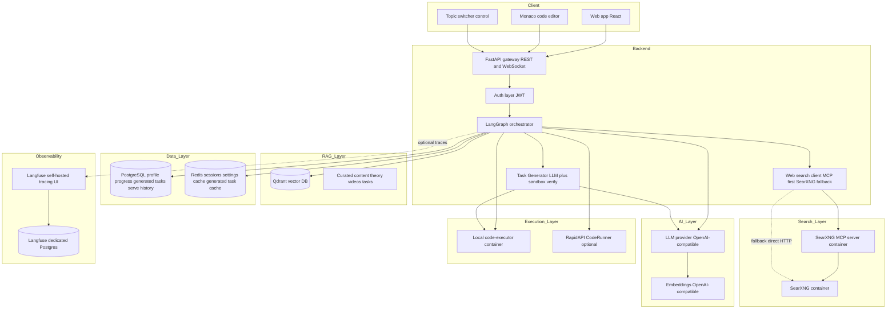

# Internet Tasks & Web-Search Enhancement — Design & Implementation Plan

> **Scope.** Enhancement to the existing **Adaptive AI Coding Tutor** (LangGraph + RAG + sandbox execution). This is a *design + plan* document only — no application code is written here. A later set of coding/DevOps/docs subtasks will implement each grouping.

> **Status of decisions.** All open choices below are *decided* (the user picked live LLM generation + web search via a **SearXNG container** reached through a **SearXNG MCP server container**). Where a library has no single dominant option, a concrete primary + fallback is named.

---

## 0. Requirements → design mapping (at a glance)

| # | Requirement | Where it lands |
|---|-------------|----------------|
| 1 | De-dupe task restatement on Run & Check; pass = no restatement; fail = "does not solve" + remediation **links** + **excerpt** | `code_validator` → `adaptivity`/`remediation`; new `web_search` + `remediation` changes; new state fields; runner/WS/REST payload carries `links`+`excerpt` |
| 2 | Offer the **next task** after a success | `adaptivity_engine` already routes to `task_selector`; make the success message explicit + add `offer_next_task` flag + frontend "Next task" affordance |
| 3 | Internet tasks via **live LLM generation + web search**, sandbox-verified; SearXNG container + SearXNG MCP server container | New `app/search/` (MCP client + SearXNG fallback), `app/tasks/generator.py`, new `task_generator` graph node, dynamic task store, compose services |
| 4 | Topic/theme switching ("тематика") | New `topic`/`theme` state + API + frontend control; drives task generation |
| 5 | Rebuild with `down -v`; compose changes for SearXNG + MCP | `docker-compose.yml` + `.env.example`; verification steps |
| 6 | Update both READMEs | Section-by-section checklist incl. Mermaid diagrams + buildx steps |

### Terminology decision — what "тематика" (topic/theme) maps to
The existing model has **language** (python/javascript) and **skill/concept** (`loops`, `dicts`, …). "Тематика"/theme is introduced as a **NEW, free-form `topic` string** (e.g. *"data analysis with pandas"*, *"game dev basics"*, *"web scraping"*, *"financial calculations"*). It is **orthogonal** to language and complementary to skill:

- `language` — still the executable target (python | javascript). Unchanged.
- `current_skill` / `concept` — still the pedagogical axis the adaptive loop walks. Unchanged.
- **`topic`** (new) — a thematic *flavour* that biases **task generation** and **web-search queries** so the same skill (`loops`) can be practised in the student's chosen domain (e.g. "sum daily sales" instead of "sum 1..n"). When `topic` is empty the system behaves exactly as today (curated/neutral tasks).

This keeps the skill-graph + uniqueness machinery intact while satisfying "switch between topics/themes".

---

## 1. High-level architecture (updated Mermaid)



> **Fail-open philosophy preserved.** Every new external dependency (MCP server, SearXNG, LLM generation) degrades gracefully: search failure → curated/no-link remediation; generation failure → curated task; MCP down → direct SearXNG HTTP; SearXNG down → skip links, keep an LLM-written textual explanation.

---

## 2. SearXNG + SearXNG MCP server — chosen approach

### 2.1 SearXNG service
- **Image:** `searxng/searxng:latest` (official, well-known). Pin to a dated tag at implementation time (e.g. `searxng/searxng:2024.x`) for reproducibility.
- **Config:** a mounted `searxng/settings.yml` (new repo dir `searxng/`) that:
  - sets a `server.secret_key` (from `SEARXNG_SECRET`),
  - **enables the JSON output format** (`search.formats: [html, json]`) — required so the MCP server / fallback client can parse results,
  - limits engines to fast, no-API-key general engines (e.g. duckduckgo, bing, brave, wikipedia) and disables rate-limit-prone ones,
  - sets `general.instance_name: "tutor-search"`.
- **Network:** internal compose network only; host port optional (`8080:8080`) for debugging.
- **No volume strictly required** (stateless); a small `searxng/settings.yml` bind-mount is the only persistence. (Optionally a named volume for `/etc/searxng` if we let it generate state.)

### 2.2 SearXNG MCP server (the LLM↔SearXNG integration)
**Primary recommendation:** **`isokoliuk/mcp-searxng`** (a.k.a. the community **`mcp-searxng`** server, available as an npm/`npx`-runnable Node package and a small container). It exposes a single `search` tool over MCP, takes `SEARXNG_URL` via env, and supports HTTP/SSE transport — ideal for a container the Python backend can reach over the compose network.

> Rationale: it is the most widely referenced SearXNG MCP server, is tiny, has no external API keys, and maps 1:1 to "search the web via SearXNG".

**Decided container strategy — build a tiny in-repo MCP server (`searxng-mcp/`).** Because (a) public SearXNG MCP images are not consistently published to Docker Hub, (b) we need a guaranteed-pinned, offline-buildable artifact consistent with the repo's existing DNS-builder workflow, and (c) the surface area is trivial, we ship a **small custom MCP server in the repo** that wraps the chosen package OR implements the one `search` tool directly:

- **Dir:** `searxng-mcp/` with `Dockerfile`, `package.json`, `server.js` (Node) **or** `server.py` (Python `mcp` SDK).
- **Transport:** **Streamable HTTP / SSE** on an internal port (e.g. `8077`), so the backend's MCP client connects over the compose network at `http://searxng-mcp:8077`. (stdio transport is avoided because the backend runs in a separate container.)
- **Tool exposed:** `web_search(query: str, max_results: int = 5, language: str = "en") -> [{title, url, snippet}]` — internally calls `${SEARXNG_URL}/search?q=...&format=json`.
- The container reads `SEARXNG_URL=http://searxng:8080`.

> If, at implementation time, `isokoliuk/mcp-searxng` (or an equivalently maintained server) is confirmed to publish a usable pinned image, the `searxng-mcp/` Dockerfile may simply `FROM` / `npx` that package instead of hand-rolling the tool — the rest of the design (transport, env, fallback) is unchanged.

### 2.3 Backend search client (`app/search/`)
A thin abstraction so the graph never talks to MCP directly:

- **`app/search/mcp_client.py`** — connects to the SearXNG MCP server using the official **`mcp` Python SDK** (`pip install mcp`) over the **Streamable HTTP** transport at `SEARXNG_MCP_URL`. Calls the `web_search` tool. Wrapped in `tenacity` retry + short timeout.
- **`app/search/searxng_client.py`** — **direct HTTP fallback**: `GET ${SEARXNG_URL}/search?format=json` parsed into the same result shape. Used when the MCP server is unreachable.
- **`app/search/__init__.py`** — `web_search(query, *, max_results, language) -> list[SearchResult]` orchestrating: try MCP → fall back to direct SearXNG → fall back to `[]` (empty, logged). **Never raises** to callers (fail-open).
- **`SearchResult`** dataclass: `title`, `url`, `snippet`.

> **Why both MCP and a direct fallback?** The requirement is explicitly MCP-mediated, so MCP is the primary path (and what the README/diagram advertise). The direct client guarantees the fail-open contract even if the MCP container is down — consistent with the project's existing executor/Langfuse/Redis degradation patterns.

---

## 3. New & changed graph state fields (`backend/app/graph/state.py`)

Add to `TutorState` (all `total=False`, backward-compatible):

| Field | Type | Purpose |
|-------|------|---------|
| `topic` | `str` | Active free-form theme; biases generation + search. Empty = neutral. |
| `remediation_links` | `list` | `[{title, url, snippet}]` fetched via web search on failure (req. 1). |
| `remediation_excerpt` | `str` | Short LLM/snippet-derived error explanation (req. 1). |
| `offer_next_task` | `bool` | True when a success should explicitly offer the next task (req. 2). |
| `generated_task` | `dict \| None` | The just-generated, sandbox-verified task payload (req. 3). |
| `task_source` | `str` | `"curated"` \| `"generated"` — provenance for UI/logging. |
| `last_passed` | `bool \| None` | Whether the last code submission passed (drives dedup, req. 1). |

> These are surfaced through `runner._interpret()` `state` dict and through the WS `final` payload (see §8).

---

## 4. Requirement 1 — Run & Check de-duplication + failure remediation

### 4.1 The current behaviour (root cause of the restatement)
On Run & Check the frontend posts code → `code_validator` runs tests → on **pass** routes to `progress_updater` → `adaptivity_engine` (success message) → `task_selector` (**which restates a brand-new task**). On **fail** → `error_classifier` → `remediation_planner` → `task_selector` (also restates a task). The "task restatement repeated" is the `task_selector` prompt appended after the result message. The frontend also adds its own `🧪 Sandbox: x/y` line.

### 4.2 Desired behaviour
- **PASS:** response = success confirmation **+ explicit offer of the next task** (req. 2). The *next* task prompt should be a clean, single statement — **not** a re-statement of the just-solved task. We keep serving the next task but make the message clearly "next", and ensure the **just-solved** task text is not echoed.
- **FAIL:** response = "your code does not solve the task" + **diagnosis** + **(a) web links** (videos/articles) + **(b) a short textual excerpt/summary** (concise error explanation derived from the links). It must **not** restate the original task verbatim (the task is already on screen); instead it offers a *similar* practice nudge.

### 4.3 Changes

**`backend/app/graph/nodes/code_validator.py`**
- Set `last_passed` in the returned dict (`True`/`False`).
- Keep recording attempts/solve count as today.

**New node `backend/app/graph/nodes/web_search.py`** (`web_search_node`)
- Runs **only on failure**, inserted **between `error_classifier` and `remediation_planner`** (new edge: `error_classifier → web_search_node → remediation_planner`).
- Builds a query from `language` + `concept` + `last_error_type` + (optional) `topic`, e.g. `"python loops off_by_one error explanation tutorial video"`.
- Calls `app.search.web_search(...)` → sets `remediation_links` (top 3–5).
- Derives `remediation_excerpt`: prefer an LLM summary (`chat`) of the snippets ("In 2–3 sentences explain the {error_type} the student likely made and how to fix it, grounded in these snippets"); if LLM unavailable, fall back to concatenating the top snippet(s). **Fail-open:** if search returns nothing, `remediation_links=[]` and excerpt = LLM-only explanation (or the existing static hint).

**`backend/app/graph/nodes/remediation.py`**
- Stop implying a verbatim task restatement. Compose the failure message as:
  1. `"❌ Your code does not solve the task — passed X/Y tests."`
  2. `"Diagnosed issue: <error_type>."` (+ timeout hint as today).
  3. **Excerpt block:** the `remediation_excerpt` (concise explanation).
  4. **Links block:** render `remediation_links` (web) **and** the existing curated `videos[0]` if present — clearly labelled "📺 Watch / 📖 Read".
  5. `"When you're ready, try again or ask me for a similar task."` (no full task restatement here).
- Keep updating failure streak/progress as today.
- Still route to `task_selector` **but** with a new flag so the selector knows to produce a *similar* task **without re-printing the solved one** (it already picks a different candidate via the cooldown; we additionally suppress echoing the previous prompt). Add `skill_state="remediation"` (unchanged) and pass `remediation_links`/`remediation_excerpt` through so the API can surface them structurally too.

**`backend/app/graph/nodes/task_selector.py`**
- Accept the new context: when arriving from remediation, prefix the served task with `"Here's a similar task to practise:"` and ensure it is a *different* task id than `current_task_id` where possible (extend the existing uniqueness/`random.choice` to exclude the just-solved id).
- This removes the "same task restated" effect.

**`backend/app/graph/builder.py`**
- Register `web_search_node`.
- Replace edge `error_classifier → remediation_planner` with `error_classifier → web_search_node → remediation_planner`.

### 4.4 Carrying links + excerpt to the frontend
- `runner._interpret()` adds `remediation_links`, `remediation_excerpt`, `last_passed`, `offer_next_task`, `task_source`, `topic` to the returned `state` dict.
- REST `/api/submit_code` already returns `run_turn(...)` verbatim → the new state fields ride along automatically.
- WS `final` payload includes them in `state` (already forwards `result.get("state")`).
- Frontend renders links as clickable bullets + an "Explanation" panel (see §7).

---

## 5. Requirement 2 — Offer the next task after success

**`backend/app/graph/nodes/adaptivity.py`**
- In all success branches set `offer_next_task=True` and make the message phrasing explicit: e.g. append `"\n\n➡️ Here's your next task:"` before the `task_selector` output (the selector then appends the new task). For the "track complete" branch, set `offer_next_task=False`.
- No structural routing change — `adaptivity_engine → task_selector` already exists; we just label it.

**`backend/app/graph/nodes/task_selector.py`**
- When `offer_next_task` is set (success path) prefix `"**Next task** ..."` so the student sees a clear progression, distinct from the remediation "similar task" wording.

**Frontend** (§7): when `state.offer_next_task` is true, optionally show a subtle "Next task ready ↓" cue; the task text already appears in chat.

---

## 6. Requirement 3 — Internet-sourced tasks (LLM generation + web search, sandbox-verified)

### 6.1 Generation pipeline (`backend/app/tasks/generator.py`)
A new module `generate_task(language, skill_id, concept, difficulty, topic, *, kind) -> Task | None`:

1. **(Optional) web context:** if `topic` set, call `app.search.web_search(f"{topic} {concept} {language} example problem")` to gather 2–3 snippets used to ground the prompt (so generated tasks feel current/real-world). Fail-open: skip if empty.
2. **LLM generation:** `chat_json` with a strict system prompt asking for:
   ```json
   {
     "prompt": "...task statement...",
     "entry_point": "function_name",
     "reference_solution": "def ...",
     "visible_tests": [{"args": [...], "expected": ...}],
     "hidden_tests": [{"args": [...], "expected": ...}],
     "difficulty": 2,
     "concept": "loops"
   }
   ```
   Prompt instructs: pure function, JSON-serialisable args/return, no I/O, matches `concept`+`difficulty`, themed by `topic` if provided.
3. **Sandbox verification (reuse self-execution/reflection pattern):**
   - Build a `Task` and run `reference_solution` against `all_test_cases()` via `get_executor()` (the existing `code-executor`).
   - If it does **not** pass all tests, feed the failure back to the LLM (reflection loop, bounded by `MAX_REGEN_ATTEMPTS` from runtime settings) to regenerate — identical philosophy to `self_execution.py`.
   - Only a task whose reference solution passes **all** visible+hidden tests is accepted (the anti-hallucination guarantee extended to generated tasks).
4. **Persist + register:** store the verified task (see §6.3) and return a `Task` object compatible with `app/tasks/repository.py`.
5. **Fail-open:** if generation/verification fails after retries, return `None`; callers fall back to curated `tasks_for_skill(...)`.

### 6.2 New graph node `backend/app/graph/nodes/task_generator.py` (`task_generator`)
- Sits **in front of / inside** task selection. Wiring: `task_selector` first tries curated candidates **honouring the cooldown**; if the cooldown filter leaves nothing fresh **or** a `topic` is set (so the student wants themed practice) **or** an env/flag `INTERNET_TASKS_ENABLED` is on, it calls `task_generator` to mint a fresh task.
- Decision: implement as a **helper invoked by `task_selector`** rather than a separate routed node, to avoid reworking many edges — `task_selector` calls `app.tasks.generator.generate_task(...)` when appropriate. (A standalone node is documented as an alternative but the helper keeps the graph simple.)
- Sets `generated_task`, `task_source="generated"`, `current_task_id=<new id>`.

### 6.3 Dynamic task store + uniqueness/skill-graph integration
The current repository is **in-memory over a static `TASKS` list** keyed by id. Generated tasks must be:
- **Addressable by `get_task(task_id)`** for the next Run & Check. Two-tier store:
  - **`backend/app/tasks/dynamic_store.py`** — a process-level dict cache **plus** a Postgres table for durability (so a restart / second worker can still validate a served generated task).
  - **New ORM model `GeneratedTask`** (`backend/app/db/models.py`): `id` (e.g. `gen_<uuid>`), `language`, `concept`, `skill_id`, `difficulty`, `kind`, `entry_point`, `prompt`, `reference_solution`, `visible_tests` (JSON), `hidden_tests` (JSON), `topic`, `created_by` (user_id), `created_at`.
  - **`app/tasks/repository.get_task()`** updated to check the static `_TASKS` first, then the dynamic store (DB-backed) so generated ids resolve.
- **Uniqueness cooldown:** generated task ids flow through the **existing** `task_serve_history` + `filter_unique_tasks` + `record_serve` unchanged (they operate on any `.id`). Because generated tasks are typically unique per request, they naturally pass the cooldown; we still `record_serve` for auditability.
- **Skill-graph selection:** generation is always **scoped to the current `skill_id`/`concept`** chosen by the existing `skill_path_builder`/`adaptivity` logic, so the adaptive trajectory is preserved; `topic` only changes the *flavour*, not the *skill order*.

### 6.4 Config flags
- `INTERNET_TASKS_ENABLED` (bool, default `true`) — master switch; when false, behaves exactly like today (curated only).
- `GENERATED_TASK_MAX_ATTEMPTS` — reuse `MAX_REGEN_ATTEMPTS` runtime setting (no new knob needed) for the verify/reflect loop.

---

## 7. Requirement 4 — Topic/theme switching

### 7.1 Backend
- **State:** new `topic` field (§3); persisted per user so it survives turns.
- **New ORM column** on `User`: `topic` (`String`, nullable) — current theme. (Lightweight `ADD COLUMN IF NOT EXISTS` migration in startup, mirroring `settings_store._ensure_schema()`.)
- **New endpoint `PUT /api/topic`** (`backend/app/api/routes.py`):
  - Request: `{ "session_id": str, "topic": str }` (user from token).
  - Effect: persists `User.topic`, writes `topic` into the next turn's state (via `run_turn` threading — add a `topic` param to `run_turn`, analogous to `language`/`task_id`).
  - Response: `{ "topic": str }`.
- **`GET /api/topic`** → current `{ "topic": str }` for the user.
- **`run_turn(...)`** (`backend/app/graph/runner.py`) — add optional `topic` param; thread into `state_in["topic"]`; also load persisted `User.topic` if not supplied.
- **Optional curated topic suggestions:** `GET /api/topics` returns a small static list of suggested themes (e.g. automation, data analysis, web, games, finance) for the UI dropdown — but the field stays free-form.

> **No skill-graph change.** Switching topic does not reset progress; it only changes how the next generated task is themed. Switching **language** remains the existing flow (goal/profile) and continues to reuse mastered concepts.

### 7.2 Frontend (`frontend/src/App.jsx`, `frontend/src/api.js`)
- **`api.js`:** add `setTopic(sessionId, topic)`, `getTopic()`, `getTopics()`.
- **`App.jsx`:** add a **Topic** control in the editor toolbar / sidebar — a `<select>` of suggested topics plus a free-text input ("custom theme"). On change → `setTopic(...)`, store in component state, show a confirmation chip ("Theme: data analysis"). New generated tasks then reflect the theme.
- Render `task_source` badge ("internet" vs "curated") on served task messages when present.
- Render `remediation_links` as clickable links and `remediation_excerpt` as an "Explanation" block on failure (req. 1 surfacing).

---

## 8. API & payload shapes (summary of additions/changes)

### New / changed endpoints (`backend/app/api/routes.py`)
| Method | Path | Body | Response |
|--------|------|------|----------|
| `PUT` | `/api/topic` | `{session_id, topic}` | `{topic}` |
| `GET` | `/api/topic` | — | `{topic}` |
| `GET` | `/api/topics` | — | `{topics: [str]}` (suggested themes) |
| `GET` | `/api/search/health` | — | `{mcp: bool, searxng: bool}` (diagnostic; best-effort) |

### Changed response `state` (REST `submit_code`/`chat`/`goal`, WS `final`)
`runner._interpret()` adds: `topic`, `task_source`, `last_passed`, `offer_next_task`, `remediation_links`, `remediation_excerpt`. (All optional; existing clients keep working.)

### WS (`backend/app/api/ws.py`)
- Accept an optional `topic` on `goal`/`chat`/`code` messages and pass to `run_turn`.
- `final.state` already forwards the runner state → new fields flow through automatically. Add a `topic` message type `{type:"topic", topic}` as a convenience (optional).

---

## 9. Requirement 5 — docker-compose + .env changes

### 9.1 New compose services (`docker-compose.yml`)
```yaml
  searxng:
    image: searxng/searxng:latest            # pin a dated tag at impl time
    environment:
      SEARXNG_BASE_URL: http://searxng:8080/
      SEARXNG_SECRET: ${SEARXNG_SECRET:-changeme-searxng-secret}
    volumes:
      - ./searxng/settings.yml:/etc/searxng/settings.yml:ro
      - searxngdata:/var/cache/searxng         # optional
    # host port optional for debugging:
    # ports: ["8080:8080"]
    healthcheck:
      test: ["CMD-SHELL", "wget -qO- http://127.0.0.1:8080/healthz || exit 1"]
      interval: 10s
      timeout: 5s
      retries: 15
      start_period: 20s

  searxng-mcp:
    image: demo_ai_agent-searxng-mcp:latest    # built from ./searxng-mcp via buildx
    build:
      context: ./searxng-mcp
    environment:
      SEARXNG_URL: ${SEARXNG_URL:-http://searxng:8080}
      MCP_HTTP_PORT: ${SEARXNG_MCP_PORT:-8077}
    depends_on:
      searxng:
        condition: service_healthy
    # internal only; expose for debugging if desired:
    # ports: ["8077:8077"]
    healthcheck:
      test: ["CMD-SHELL", "wget -qO- http://127.0.0.1:8077/health || exit 1"]
      interval: 10s
      timeout: 5s
      retries: 12
      start_period: 15s
```

### 9.2 `backend` service changes
- Add env:
  ```yaml
      SEARXNG_URL: http://searxng:8080
      SEARXNG_MCP_URL: http://searxng-mcp:8077
      INTERNET_TASKS_ENABLED: ${INTERNET_TASKS_ENABLED:-true}
  ```
- Add `depends_on` (best-effort, **not** `service_healthy`-blocking to preserve fail-open — use `condition: service_started` so the backend still boots if search is down):
  ```yaml
      searxng:
        condition: service_started
      searxng-mcp:
        condition: service_started
  ```
  > Rationale: search is optional/fail-open, so we must **not** make the backend hard-depend on healthy search (would break the "stack still runs without search" guarantee).

### 9.3 New volume
```yaml
volumes:
  pgdata:
  qdrantdata:
  langfusedbdata:
  searxngdata:          # NEW (optional cache)
```

### 9.4 New repo dirs / files
- `searxng/settings.yml` (SearXNG config; JSON format enabled).
- `searxng-mcp/Dockerfile`, `searxng-mcp/package.json` (+ `server.js`) **or** `searxng-mcp/server.py` + minimal requirements.

### 9.5 `.env.example` additions (with defaults)
```ini
# --------------------------------------------------------------------------
# Web search (SearXNG via SearXNG MCP server) — used for remediation links and
# grounding internet-sourced task generation. Fully OPTIONAL and fail-open:
# if these services are down the tutor still works (no links / curated tasks).
# --------------------------------------------------------------------------
SEARXNG_URL=http://searxng:8080
SEARXNG_MCP_URL=http://searxng-mcp:8077
SEARXNG_MCP_PORT=8077
SEARXNG_SECRET=changeme-searxng-secret
# Master switch for live LLM task generation (sandbox-verified). When false the
# tutor serves only curated tasks (exactly today's behaviour).
INTERNET_TASKS_ENABLED=true
```

### 9.6 `backend/app/config.py` additions
Add settings fields: `SEARXNG_URL`, `SEARXNG_MCP_URL`, `INTERNET_TASKS_ENABLED: bool = True`, (`SEARXNG_SECRET` not needed by backend). Add a `search_enabled` convenience property if useful.

### 9.7 Rebuild & verification steps (for the DevOps subtask)
1. `docker compose down -v` (removes `pgdata`, `qdrantdata`, `langfusedbdata`, `searxngdata`).
2. Build new image via the DNS-enabled buildx builder:
   ```bash
   docker buildx --builder dnsbuilder build --load -t demo_ai_agent-searxng-mcp:latest ./searxng-mcp
   ```
   (Backend/frontend/code-executor rebuilt as today; `searxng/searxng` is pulled.)
3. `docker compose up -d`.
4. **Verify:**
   - `searxng` healthy: `curl "http://localhost:8080/search?q=python+loops&format=json"` (if port exposed) returns JSON.
   - `searxng-mcp` healthy: `/health` 200.
   - `GET /api/search/health` → `{mcp:true, searxng:true}`.
   - Fail a task on purpose → response includes links + excerpt.
   - Set a topic, request a task → served task reflects theme; `task_source:"generated"`; reference solution was sandbox-verified (check logs).
   - Kill `searxng-mcp` → backend still serves curated tasks and remediation degrades gracefully (fail-open check).

---

## 10. Requirement 6 — README updates (checklist for the docs subtask)

Update **both** `README.md` and `README_RU.md`. Specific edits:

1. **Section 1 (What the agent does):** add bullets for (a) internet-sourced, sandbox-verified tasks, (b) themed practice via topic switching, (c) failure remediation now includes live web links + a concise explanation, (d) explicit next-task offer + de-duplicated Run & Check.
2. **Section 2.1 (High-level architecture Mermaid):** replace with the updated diagram from §1 (adds `Search_Layer` with SearXNG + SearXNG MCP server, the Task Generator, and search/generation edges).
3. **Section 2.2 (LangGraph control flow Mermaid):** insert `Error Classifier → Web Search → Remediation` and note the generated-task path inside Task Selector.
4. **Section 2.3 (Code execution flow):** add a note that **generated tasks' reference solutions** are sandbox-verified via the same reflection loop before being served.
5. **Section 2.4 (Task-uniqueness):** note generated tasks flow through the same cooldown + `task_serve_history`.
6. **Section 2.5 (Directory tree):** add `searxng/`, `searxng-mcp/`, `backend/app/search/`, `backend/app/tasks/generator.py`, `dynamic_store.py`, new graph node `web_search.py` (and `task_generator.py` if added).
7. **Section 4 (How to run):**
   - Add the new env vars block (SearXNG / MCP / `INTERNET_TASKS_ENABLED`).
   - Add the **buildx build step** for `demo_ai_agent-searxng-mcp:latest` using the DNS-enabled `dnsbuilder`.
   - Update the "This starts: …" service list to include `searxng` and `searxng-mcp`.
   - Add the SearXNG debug URL (if port exposed) and `GET /api/search/health`.
   - Document `docker compose down -v` rebuild flow including the new `searxngdata` volume.
8. **Section 5 (Edge cases):** add: search unavailable → fail-open (no links, LLM/curated explanation); generation fails verification → fall back to curated task; MCP down → direct SearXNG fallback.
9. **Section 8 (Data sources & integrations):** add **SearXNG** (self-hosted meta-search) and the **SearXNG MCP server** (LLM↔search bridge) entries; note the optional/fail-open status.
10. **New short subsection "Topic / theme switching"** in both READMEs explaining the `PUT /api/topic` control and the UI selector, and clarifying topic vs language vs skill.
11. **New short subsection "Internet-sourced tasks"** explaining live generation + sandbox verification + the master switch.
12. **README_RU.md:** mirror all of the above in Russian, using "тематика" for topic/theme; keep Mermaid diagrams identical (diagrams are language-neutral; only surrounding prose translated). Respect the existing Mermaid constraint: no `"`/`()` inside `[]`.

---

## 11. Files to create / modify — grouped by later coding subtask

### Group A — Compose / config / new containers (DevOps + config)
- **Create** `searxng/settings.yml` — SearXNG config with JSON format + curated engines.
- **Create** `searxng-mcp/Dockerfile`, `searxng-mcp/package.json`, `searxng-mcp/server.js` (or `server.py` + reqs) — HTTP/SSE MCP server exposing `web_search` over `SEARXNG_URL`.
- **Modify** `docker-compose.yml` — add `searxng`, `searxng-mcp` services, `searxngdata` volume, backend env + non-blocking `depends_on`.
- **Modify** `.env.example` — add SearXNG/MCP/`INTERNET_TASKS_ENABLED` vars (§9.5).
- **Modify** `backend/app/config.py` — add `SEARXNG_URL`, `SEARXNG_MCP_URL`, `INTERNET_TASKS_ENABLED` (§9.6).

### Group B — Web search + internet task generation
- **Create** `backend/app/search/__init__.py` — `web_search(...)` fail-open orchestrator + `SearchResult`.
- **Create** `backend/app/search/mcp_client.py` — MCP (Streamable HTTP) client calling the `web_search` tool.
- **Create** `backend/app/search/searxng_client.py` — direct SearXNG JSON HTTP fallback.
- **Create** `backend/app/tasks/generator.py` — `generate_task(...)` with LLM generation + sandbox-verify/reflect loop.
- **Create** `backend/app/tasks/dynamic_store.py` — DB-backed + in-process cache for generated tasks.
- **Modify** `backend/app/db/models.py` — add `GeneratedTask` model; add `User.topic` column.
- **Modify** `backend/app/tasks/repository.py` — `get_task()` resolves dynamic/generated ids; helper to build a `Task` from a generated record.
- **Modify** `backend/app/graph/nodes/task_selector.py` — invoke generator when topic set / cooldown-empty / `INTERNET_TASKS_ENABLED`; exclude just-solved id; set `task_source`.
- *(Optional)* **Create** `backend/app/graph/nodes/task_generator.py` if a standalone node is preferred over the helper.
- **Add** dependency `mcp` (Python SDK) to `requirements.txt`.
- **Add** `GET /api/search/health` to `backend/app/api/routes.py`.

### Group C — Remediation links/excerpt + Run & Check de-duplication
- **Create** `backend/app/graph/nodes/web_search.py` — failure-path node setting `remediation_links` + `remediation_excerpt` (fail-open).
- **Modify** `backend/app/graph/state.py` — add `topic`, `remediation_links`, `remediation_excerpt`, `offer_next_task`, `generated_task`, `task_source`, `last_passed`.
- **Modify** `backend/app/graph/nodes/code_validator.py` — set `last_passed`.
- **Modify** `backend/app/graph/nodes/remediation.py` — new failure message (no task restatement), render links + excerpt.
- **Modify** `backend/app/graph/builder.py` — insert `error_classifier → web_search → remediation_planner`; register node.
- **Modify** `backend/app/graph/runner.py` — surface new state fields in `_interpret()`; add `topic` param to `run_turn`.

### Group D — Next task on success
- **Modify** `backend/app/graph/nodes/adaptivity.py` — set `offer_next_task`, explicit "next task" phrasing in all success branches.
- **Modify** `backend/app/graph/nodes/task_selector.py` — "**Next task**" prefix when `offer_next_task` (coordinated with Group B edit on the same file).

### Group E — Topic / theme switching (API + frontend)
- **Modify** `backend/app/api/routes.py` — `GET/PUT /api/topic`, `GET /api/topics`; thread topic.
- **Modify** `backend/app/api/ws.py` — accept/forward optional `topic`.
- **Modify** `backend/app/graph/runner.py` — load/persist `User.topic`; thread `topic` (shared with Group C edit).
- **Modify** `frontend/src/api.js` — `setTopic`, `getTopic`, `getTopics`.
- **Modify** `frontend/src/App.jsx` — topic selector + custom input, theme chip, `task_source` badge, remediation links + explanation rendering.
- **Modify** `frontend/src/styles.css` — styles for topic control, links list, explanation block, badges.

### Group F — Documentation
- **Modify** `README.md` — all edits in §10.
- **Modify** `README_RU.md` — Russian mirror of §10 ("тематика").

---

## 12. Risks, fallbacks & consistency notes
- **Fail-open everywhere** (matches existing project philosophy): search/MCP/LLM/generation failures never break a turn; they degrade to curated content + LLM-only explanations.
- **Backend must not hard-depend on healthy search** → `depends_on: condition: service_started` only.
- **Generated-task durability:** persisting to Postgres avoids "no active task" if a different worker/restart handles the next Run & Check.
- **SearXNG JSON format must be enabled** in `settings.yml`, otherwise both MCP and the direct client get HTML — this is the single most common SearXNG-integration pitfall; call it out in the DevOps subtask.
- **Image pinning:** pin `searxng/searxng` to a dated tag and the MCP base image for reproducible offline builds via the DNS builder.
- **Uniqueness audit (effectiveness criterion) stays at 0% violations** because generated tasks still record serves and pass through `filter_unique_tasks`.
```
